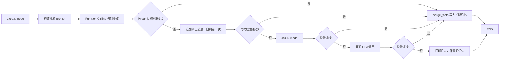

# DeepSeek 长期记忆提取 Bug 修复详解

> 本文记录 test2 长期记忆提取阶段返回 DSML/非 JSON 内容，导致 `[memory] 长期记忆提取失败: Expecting value...` 的问题，以及最终采用的“关闭 thinking + Function Calling + Pydantic 校验 + 自纠错 + 回退链”方案。

## 一、问题背景与现象

test2 在每次 Agent 完成最终回复后，会执行 `extract` 节点做项目级长期记忆提取。

实际使用中曾出现：

```text
[memory] 长期记忆提取失败: Expecting value: line 1 column 1 (char 0)
```

用户同时在下一轮对话里发现模型仍记得“小黑”等名字，因此看起来像是“提取成功了，只是日志报错”。这个判断只对了一半：

- 数据库里确实存在“小黑”等长期记忆。
- 这些记忆来自**更早一次成功的提取**。
- 本次失败不会删除旧记忆，所以旧记忆仍然生效。

也就是说，“还记得名字”和“这次提取失败”并不矛盾。

## 二、根因分析

### 2.1 真实失败不是空内容

早期代码只做了“空内容跳过”的保护：

```python
if not response.content or not str(response.content).strip():
    print("[memory] 长期记忆提取跳过：LLM 返回空内容")
    return {}
data = parse_memory_json(response.content)
```

这个保护能挡住 `None` 或空字符串，但挡不住“非空、非 JSON”的内容。

### 2.2 模型返回了 DSML 工具调用文本

在包含工具调用历史的真实会话中，DeepSeek 曾返回类似内容：

```text
<||DSML||tool_calls>
<||DSML||invoke name="weather">
<||DSML||parameter name="city" string="true">乌鲁木齐</||DSML||parameter>
</||DSML||invoke>
</||DSML||tool_calls>
```

这段文本不是 JSON。`json.loads()` 在第一个字符就无法解析，所以报：

```text
Expecting value: line 1 column 1 (char 0)
```

### 2.3 旧记忆为什么没有丢

`LongTermMemoryStore.merge_facts()` 只做合并写入，不负责删除。提取失败时 `extract_memory_facts` 返回空 dict，不会清空 `long_term_memory`，所以旧记忆会继续保留。

## 三、架构设计取舍

### 3.1 为什么不用 strict JSON Schema

DeepSeek 官方 JSON mode 只支持：

```json
{"type": "json_object"}
```

最终消息输出的 `response_format={"type":"json_schema", ...}` 在当前 DeepSeek 环境会返回 400：

```text
This response_format type is unavailable now
```

因此不能把 strict JSON Schema 作为第一层依赖。

### 3.2 为什么不用 `with_structured_output`

实测发现：

- 默认 `with_structured_output()` 在 DeepSeek 上会触发不支持的 `response_format`。
- `method="json_mode"` 在简单 prompt 上可用，但在真实长会话上仍可能输出空/非 JSON，导致 `OutputParserException`。

所以 LangChain 的结构化输出封装在当前组合下不够稳定，项目改为在函数调用层自己拿结构化参数，再用 Pydantic 校验。

### 3.3 为什么要关闭 DeepSeek thinking mode

DeepSeek V4 默认开启 thinking mode。开启时：

- `tool_choice="required"` 会被拒绝。
- 指定具体函数名的强制 `tool_choice` 也会被拒绝。
- 普通 prompt 又可能返回 DSML 工具调用文本。

实测在构造 `ChatOpenAI` 时传入：

```python
extra_body={"thinking": {"type": "disabled"}}
```

之后强制 Function Calling 可以稳定返回 `save_long_term_memory` 参数。

### 3.4 为什么单独建一个提取 LLM

关闭 thinking mode 只应该影响长期记忆提取，不应该影响正常最终回答。

因此 `build_graph()` 里使用：

- `llm`：普通回复和摘要，保持原有行为。
- `llm_with_tools`：ReAct 工具调用，保持原有行为。
- `extract_llm`：长期记忆提取专用，DeepSeek 关闭 thinking mode。

## 四、当前代码流程

### 4.1 创建提取专用 LLM

`config.py` 新增 `get_memory_extraction_llm()`：

```python
def get_memory_extraction_llm(provider: str | None = None):
    """
    将供应商名称解析为长期记忆提取专用的 LLM 实例。
    DeepSeek V4 默认开启 thinking mode，会拒绝强制 tool_choice；
    因此 DeepSeek 使用 extra_body 关闭 thinking，其他供应商保持 get_llm 原行为。

    Args:
        provider: 供应商名称，通常来自 .env 的 LLM_PROVIDER；
            可为 None 或空字符串，此时自动读取环境变量。

    Returns:
        LangChain ChatModel: 可用于长期记忆 Function Calling 提取的模型实例。

    Raises:
        ValueError: provider 为空、provider 不在 providers.toml、
            protocol 不支持，或 LLM_TEMPERATURE 不是合法数字时触发。
    """
    provider = (provider or os.getenv("LLM_PROVIDER", "")).strip().lower()
    if provider == "deepseek":
        return get_llm(provider, extra_body={"thinking": {"type": "disabled"}})
    return get_llm(provider)
```

### 4.2 结构化模型与工具 Schema

`MemoryExtraction` 是长期记忆提取结果的结构化模型：

```python
class MemoryExtraction(BaseModel):
    """
    长期记忆提取结果的结构化模型。
    字段与 CATEGORIES 保持一致，用于 Function Calling 参数和 JSON 返回的强类型校验。
    """

    user_preferences: list[str] = Field(default_factory=list)
    project_facts: list[str] = Field(default_factory=list)
    entities: list[str] = Field(default_factory=list)
    key_decisions: list[str] = Field(default_factory=list)
    unfinished_tasks: list[str] = Field(default_factory=list)
```

提取工具固定为 `save_long_term_memory`：

```python
MEMORY_EXTRACTION_TOOL = {
    "type": "function",
    "function": {
        "name": MEMORY_EXTRACTION_TOOL_NAME,
        "description": "把值得长期记住的用户偏好、项目事实、实体、关键决策和未完成任务保存下来",
        "parameters": MEMORY_EXTRACTION_SCHEMA,
    },
}

MEMORY_EXTRACTION_TOOL_CHOICE = {
    "type": "function",
    "function": {"name": MEMORY_EXTRACTION_TOOL_NAME},
}
```

### 4.3 提取 prompt

`EXTRACT_PROMPT` 会：

- 明确要求调用 `save_long_term_memory`。
- 禁止输出 DSML、`tool_calls` 标签和普通文本。
- 注入参数 JSON Schema。
- 给出 3 个正例，覆盖用户偏好、项目事实、实体、关键决策和未完成事项。

示例：

```text
例 1：
user: 以后叫我小明
save_long_term_memory 参数：{"user_preferences": ["用户希望被称为小明"], "project_facts": [], "entities": ["用户：小明"], "key_decisions": [], "unfinished_tasks": []}

例 2：
user: 这个项目叫 AI 金融助手，优先做天气查询和金融计算
save_long_term_memory 参数：{"user_preferences": [], "project_facts": ["项目名称是 AI 金融助手"], "entities": [], "key_decisions": ["优先开发天气查询和金融计算"], "unfinished_tasks": []}

例 3：
user: 明天记得提醒我继续写记忆文档
save_long_term_memory 参数：{"user_preferences": [], "project_facts": [], "entities": [], "key_decisions": [], "unfinished_tasks": ["明天提醒用户继续写记忆文档"]}
```

### 4.4 提取主流程

`extract_memory_facts` 的完整回退链：

```text
Function Calling
  -> Pydantic 校验
  -> 失败：追加纠正消息，自纠错一次
  -> 仍失败：JSON mode
  -> 仍失败：普通 LLM 调用
  -> 全部失败：打印日志，保留旧记忆
```

完整流程如下：



### 4.5 图核心接入

`graph.py` 的 `build_graph()` 为 extract 节点创建独立 LLM：

```python
llm = get_llm(provider)
llm_with_tools = llm.bind_tools(TOOLS)
extract_llm = get_memory_extraction_llm(provider)

graph.add_node(
    "extract",
    lambda state: extract_memory_facts(state, extract_llm, memory_store),
)
```

## 五、边界与失败模式

| 场景 | 行为 |
| --- | --- |
| 不支持 Function Calling | `_try_function_calling` 返回 None，进入 JSON mode |
| 第一次没有调用工具 | 追加纠正消息，自纠错一次 |
| Function Calling 参数非法 | Pydantic 校验失败，继续走 JSON mode |
| JSON mode 返回空内容 | 跳过提取，不调用后续路径 |
| JSON mode 返回非 JSON | 继续走普通调用 |
| 所有路径都失败 | 打印日志，保留旧记忆，不中断对话 |

当前实现的特点：

- 提取失败不会删除 `long_term_memory` 旧数据。
- 提取专用 LLM 关闭 thinking mode，不影响正常最终回答。
- 失败日志会记录响应内容前 200 字符，便于定位是空内容、普通文本还是工具调用标签。

## 六、验证方式

运行：

```bash
uv run pytest
uv run python -m compileall -q src/test2 tests
git diff --check
```

真实复现建议：

1. 把 `data/memory.db` 复制到临时目录，避免污染真实数据库。
2. 用 `get_memory_extraction_llm("deepseek")` 构造提取 LLM。
3. 读取原失败会话的 checkpoint 状态。
4. 调用 `extract_memory_facts`。
5. 确认不再出现 `Expecting value`，并且临时 store 收到 5 类记忆写入。

## 七、经验总结

1. DeepSeek 的 `json_object` 是官方 JSON mode，strict `json_schema` 不能当作通用依赖。
2. DeepSeek V4 默认 thinking mode 会限制强制 `tool_choice`，记忆提取场景可以单独关闭。
3. 结构化输出不一定只能靠 `with_structured_output`；Function Calling + Pydantic 校验是更可控的方式。
4. 失败的长期记忆提取不应该破坏旧记忆，项目采用“失败保留旧数据、不中断对话”的策略。
