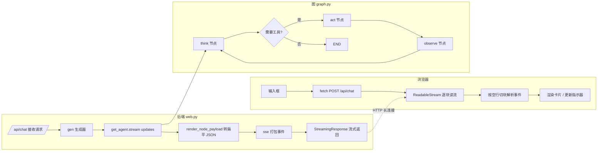
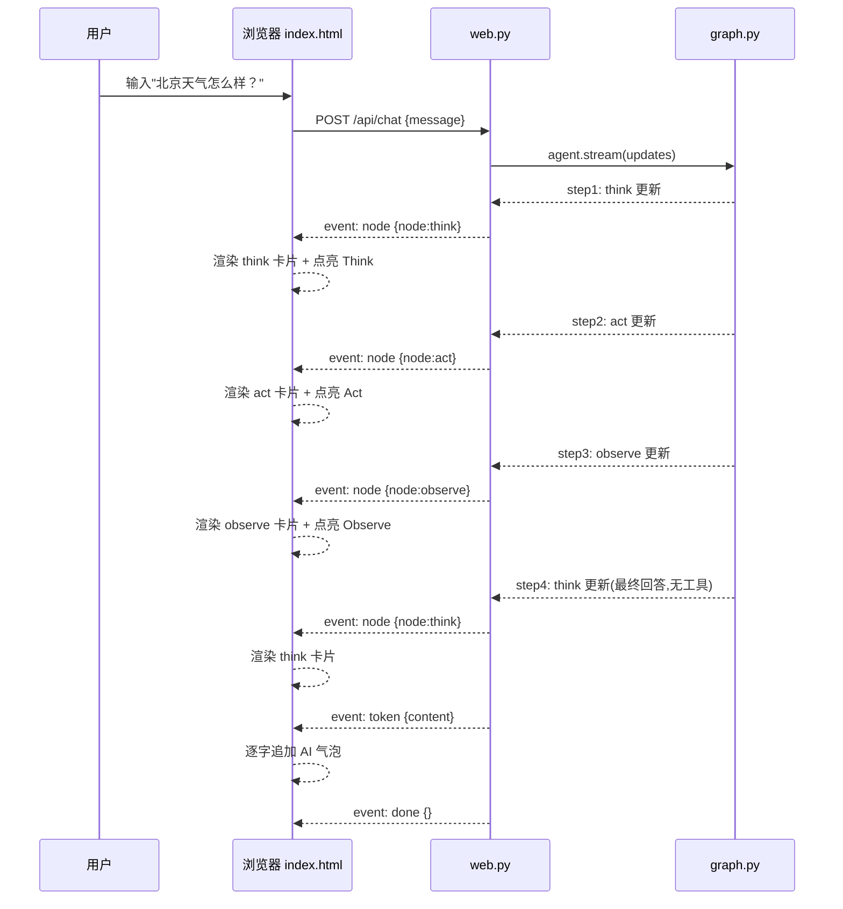

# FastAPI + SSE + 前端可视化解析（test2 Web 篇）

> 本文档是 `docs/wiki.md` 的**姊妹篇**。wiki.md 讲 CLI（终端）入口，本文档讲 Web（浏览器）入口。
>
> 两条入口**共用同一个 LangGraph 图**（`graph.py`），区别只在输出方式：CLI 用 `print` 把每一步打出来，Web 用 SSE 把每一步推送给浏览器渲染成可视化卡片。
>
> 目标读者：已看懂 wiki.md，想理解 FastAPI 如何把 Agent 的思考过程实时"直播"到网页的学习者。

---

## 目录

- **一、Web 可视化概览**
  - 1.1 这个 Web 入口做什么？
  - 1.2 CLI vs Web：同一个图，两种出口
  - 1.3 技术栈
  - 1.4 文件结构
- **二、三条技术各负责什么**
  - 2.1 三角色分工
  - 2.2 一条消息的完整旅程（先看全局）
- **三、FastAPI 服务骨架**
  - 3.1 导入与 `.env` 统一加载
  - 3.2 `get_agent()` — Agent 懒加载
  - 3.3 路由 `/` — 返回页面
  - 3.4 路由 `/api/chat` — 处理对话
  - 3.5 静态资源挂载
  - 3.6 骨架层的设计意图
- **四、SSE 协议层实现**
  - 4.1 SSE vs WebSocket：为什么用 SSE
  - 4.2 `sse()` — 一条事件的打包格式
  - 4.3 五种事件类型设计
  - 4.4 `StreamingResponse` — 流式响应容器
  - 4.5 `gen()` — 事件生成器逐行拆解
  - 4.6 异常处理 → `error` 事件
- **五、数据转换层**
  - 5.1 为什么要扁平化
  - 5.2 `render_node_payload()` 逐行拆解
  - 5.3 转换前后 JSON 对比
- **六、前端 SSE 解析与渲染**
  - 6.1 为什么不用 `EventSource`
  - 6.2 `fetch` + `ReadableStream` 手动解析
  - 6.3 buffer 按空行切块的边界处理
  - 6.4 `handleEvent` 事件分发
  - 6.5 三色节点卡片渲染
  - 6.6 节点状态指示器
  - 6.7 `escapeHtml` 防 XSS
- **七、前后端全链路数据流**
  - 7.1 Mermaid 时序图
  - 7.2 一次天气查询的真实事件流
- **八、运行调试与常见问题**
  - 8.1 启动命令
  - 8.2 如何验证
  - 8.3 常见问题 Q&A

---

## 一、Web 可视化概览

### 1.1 这个 Web 入口做什么？

`web.py` 给 test2 项目**加了一个浏览器界面**。它做三件事：

1. **起一个本地 Web 服务**（FastAPI + uvicorn），在浏览器打开 `http://127.0.0.1:8000` 就能看到一个聊天页面。
2. 用户输入问题后，后端调用同一个 ReAct Agent 跑 `think → act → observe` 循环。
3. 把循环中**每一步的状态变化**实时推送到浏览器，渲染成"思考 / 行动 / 观察"三种颜色的节点卡片。

```
浏览器                          web.py                        graph.py
  │  输入"北京天气怎么样？"          │                               │
  │ ────────── POST /api/chat ────▶ │ ── stream_agent_events() ──▶ │
  │                                │ ◀── step1(think) ─────────── │
  │ ◀── event: node (think) ────── │                               │
  │ ◀── event: node (act)   ────── │ ◀── step2(act) ───────────── │
  │ ◀── event: node (observe) ──── │ ◀── step3(observe) ───────── │
  │ ◀── event: token ────────────── │                               │
  │ ◀── event: done ────────────── │                               │
```

### 1.2 CLI vs Web：同一个图，两种出口

这是理解本项目的**最核心洞察**：

| | CLI（`__main__.py`） | Web（`web.py`） |
|---|---|---|
| 启动方式 | `python -m test2` | `uvicorn test2.web:app` |
| 交互 | 终端 `input()` | 浏览器输入框 |
| 驱动 Agent | `app.stream(...)` | `agent_session.stream_agent_events()` |
| 获取流 | `stream_mode="updates"` | `stream_mode=["updates", "messages"]` |
| 处理每步 | `print_state_changes()` 打印 | `render_node_payload()` 转 JSON 推送 |
| 最终回复 | `all_messages[-1]` 打印 | `token` 事件逐字推送 |
| 输出对象 | 终端文本 | 浏览器卡片 |

`web.py` **复用了 `agent_session.stream_agent_events()`**，同时消费 LangGraph 的节点更新和 LLM token，再分别打包成 SSE 推送给浏览器。CLI 只需要最终打印，Web 还需要逐字显示 AI 回复。

### 1.3 技术栈

- **后端**：FastAPI + uvicorn（ASGI 异步服务器）
- **流式协议**：SSE（Server-Sent Events，服务器推送事件）
- **前端**：纯原生 HTML + CSS + JavaScript，**零框架、零构建工具**
- **业务**：LangChain / LangGraph（复用 wiki.md 已讲过的 ReAct 图）

### 1.4 文件结构

```
test2/
├── src/test2/
│   ├── __init__.py
│   ├── __main__.py        # CLI 入口（wiki.md 已讲）
│   ├── graph.py           # ReAct 图（CLI 和 Web 共用）
│   ├── config.py          # LLM 供应商配置
│   ├── tools.py           # 工具（calculator / weather）
│   ├── web.py             # ★ FastAPI + SSE 后端（本文档核心）
│   ├── docs/
│   │   ├── wiki.md                    # CLI 篇
│   │   └── fastapi-sse-前端可视化.md   # ★ Web 篇（本文档）
│   └── static/
│       └── index.html     # ★ 前端页面（SSE 解析 + 渲染）
```

新增部分只有三个：`web.py`（后端）、`static/index.html`（前端）、本文档。

---

## 二、三条技术各负责什么

### 2.1 三角色分工

一条消息从你输入到渲染成卡片，被三条技术切成了三个清晰的分工：

| 技术 | 负责什么 | 扮演的角色 |
|---|---|---|
| **FastAPI** | 搭起 HTTP 服务、定义路由、处理请求/响应 | "餐厅门口"：接客、点单、传菜 |
| **SSE** | 定义"事件"的格式，把多步数据流式推送出去 | "传菜机制"：一道菜一道菜端上桌 |
| **前端 JS** | 收流、按事件类型分发、渲染成卡片 | "食客"：一边吃一边看到菜一道道上来 |

- **FastAPI 决定"怎么接"**：`/` 返回页面，`/api/chat` 接收消息。
- **SSE 决定"怎么传"**：把 Agent 的每一步包成 `event: xxx` + `data: {...}` 的文本块，用一条不断开的 HTTP 连接推过去。
- **前端决定"怎么显示"**：解析事件流，把 `node` 事件画成 think/act/observe 三色卡片，把 `token` 事件逐字追加到最终回答气泡。

### 2.2 一条消息的完整旅程（先看全局）

> 这一节先给宏观图景，后面每一节再落到具体代码。



后端每 `yield` 一次 `sse(...)`，`StreamingResponse` 就把这一小块文本推到浏览器；浏览器每读到一块，就切块、解析、渲染。整个循环是一个**生产者-消费者**模型：Agent 是生产者，浏览器是消费者，SSE 是两者之间的传送带。

---

## 三、FastAPI 服务骨架

`web.py` 顶部到路由定义之间的部分，负责把服务"支棱起来"。

### 3.1 导入与 `.env` 统一加载

```python
import json
import os

from fastapi import FastAPI, Request
from fastapi.responses import HTMLResponse, StreamingResponse
from fastapi.staticfiles import StaticFiles
from langchain_core.messages import HumanMessage

# 环境变量由 config.py 在导入 test2.graph 时从项目根目录统一加载
from test2.graph import build_graph, MAX_ITERATIONS
```

关键点：**`.env` 不再由 web.py 自己加载**。

`web.py` 导入 `test2.graph` 时，会先执行 `test2.config`；`config.py` 使用 `__file__` 定位项目根目录：

```python
PROJECT_ROOT = Path(__file__).resolve().parents[2]
load_dotenv(PROJECT_ROOT / ".env")
```

其中：

- `config.py` 位于 `src/test2/`
- `parents[0]` 是 `src/test2`
- `parents[1]` 是 `src`
- `parents[2]` 就是项目根目录

所以即使 uvicorn 从其他目录启动，`.env` 也会从项目根目录加载，不依赖运行时 cwd。

CLI 入口同样不再重复调用 `load_dotenv()`，统一由 `config.py` 负责环境变量加载。


### 3.2 `get_agent()` — Agent 懒加载

```python
# 本文件所在目录（static 与此同级）
BASE_DIR = os.path.dirname(os.path.abspath(__file__))
STATIC_DIR = os.path.join(BASE_DIR, "static")

app = FastAPI(title="test2 ReAct 可视化")

# Agent 懒加载：首次请求时才构建。
_agent = None


def get_agent():
    global _agent
    if _agent is None:
        provider = os.getenv("LLM_PROVIDER", "anthropic").strip().lower()
        _agent = build_graph(provider)
    return _agent
```

设计意图：

- **模块级 `_agent = None`** 是一个"缓存位"。第一次调用 `get_agent()` 时才真正 `build_graph`，之后复用同一个实例。
- **`global _agent`**：因为要给模块级变量赋值，必须声明 global，否则 Python 会当作局部变量。
- **provider 从环境变量读**：`os.getenv("LLM_PROVIDER", "anthropic")` 取不到就用默认 `"anthropic"`，和 CLI 逻辑一致。

**为什么懒加载？** 核心是为了**容错**：

> 如果模块一加载就 `build_graph`，那么当 `.env` 没配好 API Key 时，服务**连启动都启动不了**（import 阶段直接抛异常），页面根本打不开。改成懒加载后，服务先起来、页面先显示，**直到用户真的发消息才去构建 Agent**，此时若 Key 没配好，就返回一个友好的 `error` 事件，而不是整个服务 500。

这就是"页面能打开"与"请求能成功"解耦的设计。

### 3.3 路由 `/` — 返回页面

```python
@app.get("/", response_class=HTMLResponse)
async def index():
    with open(os.path.join(STATIC_DIR, "index.html"), encoding="utf-8") as f:
        return HTMLResponse(f.read())
```

- `@app.get("/")` 声明根路径的路由。
- `response_class=HTMLResponse` 告诉 FastAPI 返回类型是 HTML。
- 打开 `static/index.html`（**用 `encoding="utf-8"`，否则中文会乱码**），把整个文件内容返回。

**为什么不直接挂载静态文件然后跳转？** 这里选择用代码读取文件内容再返回，好处是 `index.html` 始终作为"应用首页"精确掌控，且不依赖静态挂载顺序。

### 3.4 路由 `/api/chat` — 处理对话

这是后端核心路由，稍后在第四、五章详细拆。这里先看骨架：

```python
@app.post("/api/chat")
async def chat(request: Request):
    body = await request.json()
    user_input = body.get("message", "").strip()
    if not user_input:
        return StreamingResponse(
            iter([sse("error", {"message": "消息不能为空"})]),
            media_type="text/event-stream",
        )
    # ... 构造 gen() 生成器，返回 StreamingResponse(gen(), ...)
```

- `@app.post("/api/chat")`：只接受 POST（有请求体）。
- `await request.json()`：异步读取 JSON body，取出 `message` 字段并 `strip()` 去空白。
- **空消息拦截**：如果 `message` 为空，直接返回一条 `error` 事件（`iter([...])` 把单条事件包装成可迭代对象）。这样前端不会收到"空白请求"，体验更好。

### 3.5 静态资源挂载

```python
# 静态资源（如果存在 static 目录则挂载）
if os.path.isdir(STATIC_DIR):
    app.mount("/static", StaticFiles(directory=STATIC_DIR), name="static")
```

- `os.path.isdir(STATIC_DIR)`：先确认 static 目录存在，避免挂载报错。
- `app.mount("/static", ...)`：把 `static/` 目录挂到 `/static` 前缀下，供浏览器加载 CSS/JS/图片等静态资源。
- 注意：**`index.html` 不从这里加载**，它由 `/` 路由直接返回。

### 3.6 骨架层的设计意图

汇总一下骨架层体现的几个设计原则：

| 设计 | 解决的问题 |
|---|---|
| `.env` 由 config.py 从项目根目录统一加载 | uvicorn 工作目录不确定，也能稳定找到配置 |
| Agent 懒加载 | Key 没配好服务也能启动，把错误推迟到请求时 |
| `encoding="utf-8"` 读 HTML | 避免中文页面乱码 |
| 空消息拦截 | 减少无意义的 Agent 调用 |
| 条件挂载 static | 目录缺失不至于崩溃 |

---

## 四、SSE 协议层实现

这一章是"传菜机制"：定义了事件怎么打包、有哪些事件、怎么流式送出。

### 4.1 SSE vs WebSocket：为什么用 SSE

| | SSE | WebSocket |
|---|---|---|
| 方向 | 服务器 → 客户端（单向） | 双向 |
| 底层 | HTTP（简单） | 独立 TCP 协议（复杂） |
| 自动重连 | 内置 | 需手动实现 |
| 传输格式 | 纯文本（好解析） | 二进制/文本帧 |
| 适用场景 | 服务器主动推送、状态更新 | 聊天、游戏等强交互双向通信 |

本项目只需要**后端单向推送**（Agent 逐步状态 → 浏览器），不需要浏览器往同一连接里回数据（用户输入通过独立 POST 走 `/api/chat`），所以 **SSE 是更简单的选择**——HTTP 长连接、自动重连、纯文本易解析。

### 4.2 `sse()` — 一条事件的打包格式

```python
def sse(event: str, data: dict) -> str:
    """打包一条 SSE 事件"""
    return (
        f"event: {event}\n"
        f"data: {json.dumps(data, ensure_ascii=False, default=str)}\n\n"
    )
```

这是整个协议层的**最小单元**。一条标准 SSE 事件长这样：

```
event: node
data: {"node":"think","iteration":0,"thought":"我需要查询天气..."}

```

关键点逐行看：

- `event: {event}\n`：事件类型字段。`event:` 是 SSE 规定的关键字，后面跟类型名，浏览器端可用 `addEventListener("node", ...)` 监听。**注意结尾要 `\n`**。
- `data: {json.dumps(...)}\n\n`：事件数据字段。把 `dict` 用 `json.dumps` 序列化成 JSON 字符串。**`\n\n`（两个换行）是 SSE 事件的分隔符**——一条事件必须以空行结束，浏览器端据此切块。
- `ensure_ascii=False`：**保留中文不转成 `\uXXXX`**，否则前端拿到的是乱码转义。这是本项目最容易踩的坑之一。
- `default=str`：兜底序列化。如果 `data` 里混入了无法 JSON 序列化的对象（如自定义类），就交给 `str()` 转成字符串，避免 `TypeError`。

所以 `sse("node", {...})` 输出的是**一段以 `\n\n` 结尾的文本**。把它 yield 给 `StreamingResponse`，浏览器就收到一条完整事件。

### 4.3 五种事件类型设计

项目定义了五种事件，形成一套"对话生命周期"：

| 事件类型 | 时机 | 前端做什么 |
|---|---|---|
| `user` | 请求开始 | 渲染用户气泡 |
| `node` | 每跑完一个节点 | 渲染 think/act/observe 卡片 + 更新指示器 |
| `token` | LLM 输出过程中 | 逐字追加最终回答气泡 |
| `done` | 流程结束 | 收尾（可省略，表示正常结束） |
| `error` | 抛异常 / 空消息 | 渲染错误气泡 |

**为什么要细分事件类型？** 因为前端**需要区分"这段数据是什么"**才能决定怎么渲染：

- `node` 数据是节点状态（要画卡片、动指示器）；
- `token` 数据是最终文本片段（要追加到气泡）；
- `error` 是异常（要红字提示）。

如果把所有数据都塞进一个 `message` 事件，前端就得靠猜数据结构来分辨，脆弱且混乱。**用 `event:` 字段显式标注类型**，前端 `switch` 一下就能干净地分发。

### 4.4 `StreamingResponse` — 流式响应容器

```python
return StreamingResponse(gen(), media_type="text/event-stream")
```

- `gen()` 是一个**生成器**（后面 4.5 讲）。
- `StreamingResponse` 会把生成器每次 `yield` 的内容，**逐块推给客户端**，而不是等全部算完再一次性返回。
- `media_type="text/event-stream"`：这是 **SSE 的 MIME 类型**，浏览器识别到这个类型就知道该按 SSE 规则解析，且**不会缓冲整个响应**（某些中间件对普通类型会攒满才发）。

**为什么用生成器而不是先收集成列表再返回？**

- 生成器是**惰性**的：Agent 每产出一步，立刻推送一步，浏览器实时看到思考过程。
- 如果收集成列表，用户必须等 Agent 全部跑完（可能几十秒）才看到第一个字，体验倒退成"转圈圈"。

这就是"流式"的本质——**边算边发**。

### 4.5 `gen()` — 事件生成器逐行拆解

这是后端**最核心的生成器**，负责把 Agent 的步骤流转换成 SSE 事件流。

```python
def gen():
    yield sse("user", {"content": user_input})          # ① 先推用户消息
    try:
        for event in stream_agent_events(                # ② 驱动共享事件流
            get_agent(),
            user_input,
            session_id,
        ):
            if event[0] == "node":                       # ③ node 事件
                _, node_name, update = event
                yield sse("node", render_node_payload(node_name, update))
            elif event[0] == "token":                    # ④ token 事件
                _, content = event
                yield sse("token", {"content": content})
        yield sse("done", {})                            # ⑤ 推 done
    except Exception as e:
        yield sse("error", {"message": str(e)})          # ⑥ 异常 → error
```

逐行拆解：

**① `yield sse("user", ...)`**：先把用户输入推给前端渲染用户气泡。这一步不依赖 Agent，纯回显。

**② `stream_agent_events(...)`**：共享 runner 同时请求 `updates` 和 `messages` 两种流。`updates` 产出节点状态，`messages` 产出 LLM token。

**③ `node` 事件**：`render_node_payload()` 把 LangChain 对象转成前端友好的 JSON，前端立即渲染一张 ReAct 卡片。

**④ `token` 事件**：LLM 每输出一段文本就立即推送，前端把内容追加到同一个 assistant 气泡，形成逐字显示效果。

**⑤ `done`**：流程正常结束后推一个空事件。

**⑥ `except` → `error`**：整个 Agent 运行包裹在 try 里，任何异常（如 API Key 无效）都被捕获并转成 `error` 事件推给前端。**关键：不会让连接崩溃，而是优雅地告知前端**。

### 4.6 异常处理 → `error` 事件

```python
except Exception as e:
    yield sse("error", {"message": str(e)})
```

设计意图：**把异常也变成"一种正常的事件流"**。前端无论收到 `node`/`token`/`error`，走的是同一条连接、同一种解析逻辑。这让前端代码更统一——只要监听事件类型即可，不用额外处理"连接中途断开"的情况（当然，非 SSE 层的异常仍会断连，那归 8.3 的"连接错误"处理）。

---

## 五、数据转换层

这一章解决一个问题：**Agent 吐出来的 Python 对象，浏览器根本用不了，必须先转成 JSON。**

### 5.1 为什么要扁平化

`graph.py` 的节点返回的是 **LangChain 消息对象**（`HumanMessage` / `AIMessage` / `ToolMessage`），它们：

1. **无法 JSON 序列化**：`json.dumps` 直接抛 `TypeError`。
2. **前端不该依赖 LangChain 结构**：浏览器不懂 `AIMessage.tool_calls` 的内部结构，耦合越深越难维护。
3. **字段太多太杂**：LangChain 对象有大量内部字段，前端只需要类型、内容、工具调用三样。

所以必须有一个"翻译层"，把 LangChain 对象**抽取出前端要的字段，压成纯 dict**，再走 `sse()` 序列化。

### 5.2 `render_node_payload()` 逐行拆解

```python
def render_node_payload(node: str, update: dict) -> dict:
    messages = []
    for msg in update.get("messages", []):
        entry = {"type": msg.__class__.__name__, "content": str(msg.content)}
        tool_calls = getattr(msg, "tool_calls", None)
        if tool_calls:
            entry["tool_calls"] = [
                {"name": tc["name"], "args": tc["args"]} for tc in tool_calls
            ]
        messages.append(entry)

    return {
        "node": node,
        "messages": messages,
        "thought": update.get("thought", ""),
        "should_act": update.get("should_act", False),
        "tool_calls": update.get("tool_calls", []),
        "iteration": update.get("iteration", 0),
    }
```

逐行拆解：

**消息扁平化循环：**
```python
for msg in update.get("messages", []):
    entry = {"type": msg.__class__.__name__, "content": str(msg.content)}
```
- 遍历该节点 update 里的所有消息。
- `msg.__class__.__name__`：取类名字符串（如 `"AIMessage"`），**这是给前端区分消息类型的关键**（前端靠它过滤 `ToolMessage`）。
- `str(msg.content)`：把消息内容强转字符串（LangChain 的 content 可能是 list，比如多段内容，`str()` 统一压成文本）。

```python
    tool_calls = getattr(msg, "tool_calls", None)
    if tool_calls:
        entry["tool_calls"] = [
            {"name": tc["name"], "args": tc["args"]} for tc in tool_calls
        ]
```
- `getattr(msg, "tool_calls", None)`：**安全取属性**。不是所有消息都有 `tool_calls`（`ToolMessage` 就没有），用 `getattr` 加默认值避免 `AttributeError`。
- 如果有工具调用，再**二次扁平化**：只保留 `name` 和 `args` 两个字段（LangChain 的 `tool_calls` 每条是一个 dict，含 `id`、`name`、`args` 等，前端只需要 name + args）。

**组装返回 dict：**
```python
return {
    "node": node,
    "messages": messages,
    "thought": update.get("thought", ""),
    "should_act": update.get("should_act", False),
    "tool_calls": update.get("tool_calls", []),
    "iteration": update.get("iteration", 0),
}
```
- 把节点名和各字段用 `update.get(key, 默认值)` 取出来（**给默认值**，因为不同节点 update 的字段不全——比如 `observe` 节点只有 `iteration`，`act` 节点只有 `messages`）。
- 输出一个**结构统一、全部可 JSON 序列化**的 dict。

### 5.3 转换前后 JSON 对比

**转换前**（LangChain 对象，无法直接序列化）：
```python
AIMessage(
    content="我需要查询北京天气",
    tool_calls=[
        {"name": "weather", "args": {"city": "北京"}, "id": "call_1"},
    ],
    # 还有一堆内部字段...
)
```

**转换后**（纯 dict，`sse()` 可序列化）：
```json
{
  "node": "think",
  "messages": [
    {
      "type": "AIMessage",
      "content": "我需要查询北京天气",
      "tool_calls": [
        {"name": "weather", "args": {"city": "北京"}}
      ]
    }
  ],
  "thought": "我需要查询北京天气",
  "should_act": true,
  "tool_calls": [{"name": "weather", "args": {"city": "北京"}}],
  "iteration": 0
}
```

前端拿到这个 JSON，就能直接渲染卡片，完全不用关心 LangChain 长什么样。

---

## 六、前端 SSE 解析与渲染

这一章讲 `static/index.html` 里的 JavaScript。前端零框架、纯原生 JS，教学价值在于理解"浏览器如何手搓 SSE 解析"。

### 6.1 为什么不用 `EventSource`

浏览器原生有 `EventSource` 可以做 SSE，但**它只支持 GET 请求**。而本项目需要把用户输入通过 **POST + JSON body** 发给后端。`EventSource` 无法携带 body，所以必须改用 `fetch` + `ReadableStream` 手动解析。

```js
const resp = await fetch("/api/chat", {
  method: "POST",
  headers: { "Content-Type": "application/json" },
  body: JSON.stringify({ message }),
});
```

### 6.2 `fetch` + `ReadableStream` 手动解析

```js
const reader = resp.body.getReader();     // 拿到流读取器
const decoder = new TextDecoder();        // 字节 → 文本解码器
let buf = "";                             // 跨块缓冲
while (true) {
  const { done, value } = await reader.read();   // 读一块字节
  if (done) break;                                // 流结束
  buf += decoder.decode(value, { stream: true }); // 解码并追加到缓冲
  const blocks = buf.split("\n\n");               // 按空行切块
  buf = blocks.pop();                             // 最后一段可能不完整，留到下次
  for (const block of blocks) { ... }             // 处理完整的事件块
}
```

关键点：

- **`resp.body.getReader()`**：把响应体变成可读流，`await reader.read()` 每次取一块 `Uint8Array`（字节）。
- **`TextDecoder`**：把字节转成 UTF-8 文本。`{ stream: true }` 表示这是流式解码——如果某个字符的 UTF-8 字节被切到两块里，`stream: true` 会缓存不完整字节，等下一块拼齐再解码，**避免乱码**。
- **`buf` 是"跨块缓冲"**：网络包边界 ≠ SSE 事件边界，所以必须把新数据追加到 `buf` 再切块。

### 6.3 buffer 按空行切块的边界处理

```js
const blocks = buf.split("\n\n");   // 按 SSE 分隔符切
buf = blocks.pop();                 // ★ 最后一段不完整，留到下次
```

`\n\n` 是 SSE 的事件分隔符（回忆 4.2，`sse()` 以 `\n\n` 结尾）。但**网络可能把一个事件切碎成多块**：

```
第 1 块到达: "event: node\ndata: {\"node\":\"th"     ← 只有半条！
第 2 块到达: "ink\",...}\n\n"
```

- 第 1 块 `split("\n\n")` 后只有一段，没有完整事件——此时 `blocks` 为空，`buf = blocks.pop()` 把这段留在 `buf` 等下一块。
- 第 2 块追加后 `buf` 变成完整事件，`split` 出一个完整块，处理它；最后 `buf` 又可能剩下半条……如此循环，**保证事件切碎也能正确拼接**。

这就是 `buf = blocks.pop()` 的精髓：**"最后一个不完整块永远留给下一次"**。

### 6.4 `handleEvent` 事件分发

```js
function handleEvent(event, data, spans, getActiveIdx) {
  if (event === "node") {
    const map = { think: 0, act: 1, observe: 2 };
    const idx = map[data.node];
    if (typeof idx === "number" && idx >= 0) {
      const cur = getActiveIdx();
      if (cur >= 0 && cur !== idx) spans[cur].classList.remove("active");
      spans[idx].classList.add("active");
    }
    renderNode(data);
  } else if (event === "token") {
    if (!assistantEl) {
      assistantEl = document.createElement("div");
      assistantEl.className = "bubble assistant";
      append(assistantEl);
    }
    assistantEl.textContent += data.content;
  } else if (event === "done") {
    statusEl.textContent = "就绪";
  } else if (event === "error") {
    bubble("❌ " + data.message, "assistant");
  }
}
```

逐段看：

- **`event === "node"`**：收到节点事件，先更新顶部状态指示器（6.6 详讲），再调 `renderNode(data)` 渲染卡片。
- **`event === "token"`**：收到最终回答片段，追加到同一个 assistant 气泡；首次收到时创建气泡。
- **`event === "error"`**：收到错误，渲染红色错误气泡。

这个 `if/else` 就是**事件分发的核心**——根据 `event:` 字段（4.2 打包的那个）决定走哪个渲染分支。`done` 事件用于把状态栏复位为“就绪”。

### 6.5 三色节点卡片渲染

```js
function renderNode(data) {
  const label = { think: "🤔 Think", act: "⚡ Act", observe: "👁️ Observe" }[data.node] || data.node;
  const div = document.createElement("div");
  div.className = "card " + (data.node || "think");   // ← 决定颜色
  let html = `<span class="tag">${label}</span>`;

  if (data.node === "think") {
    const thought = data.thought || "(AI 请求调用工具)";
    html += escapeHtml(thought);
    const tcs = data.tool_calls || [];
    if (tcs.length) {
      html += `<div class="detail">计划调用：`;
      tcs.forEach(tc => {
        html += `<span class="tool">${escapeHtml(tc.name)}(${escapeHtml(JSON.stringify(tc.args))})</span>`;
      });
      html += `</div>`;
    }
  }
  else if (data.node === "act") { ... }
  else if (data.node === "observe") { ... }
  div.innerHTML = html;
  append(div);
}
```

**三色卡片的设计**：

| 节点 | class | 背景色 | 边框色 | 展示内容 |
|---|---|---|---|---|
| `think` | `card think` | 浅黄 `#fff8e1` | 橙 `#f39c12` | 思考文本 + 计划调用的工具 |
| `act` | `card act` | 浅红 `#ffebee` | 红 `#e74c3c` | 实际执行的工具调用 |
| `observe` | `card observe` | 浅绿 `#e8f5e9` | 绿 `#27ae60` | 工具返回结果 + 第几轮 |

- `div.className = "card " + data.node`：**CSS 决定颜色**，JS 只负责打 class。`.card.think`、`.card.act`、`.card.observe` 三套样式分别在 CSS 里定义。
- think 分支：显示 `data.thought`（AI 的思考），再遍历 `data.tool_calls`，把"计划调用"的工具名和参数渲染成小标签。
- act 分支：遍历 `data.messages` 里带 `tool_calls` 的消息，渲染实际调用的工具。
- observe 分支：过滤 `m.type === "ToolMessage"` 的消息，显示工具返回内容（截断到 200 字符），并显示"第 N 轮"。

### 6.6 节点状态指示器

页面顶部有三个小圆点（Think / Act / Observe），当前处于哪个阶段就高亮哪个：

```js
function indicator() {
  const div = document.createElement("div");
  div.className = "indicator";
  div.innerHTML = '<span class="think">Think</span><span class="act">Act</span><span class="observe">Observe</span>';
  append(div);
  return div.querySelectorAll("span");
}
```

配合 `handleEvent` 里的逻辑：
```js
const map = { think: 0, act: 1, observe: 2 };  // 节点名 → 圆点下标
const idx = map[data.node];
if (cur >= 0 && cur !== idx) spans[cur].classList.remove("active");  // 关掉上一个
spans[idx].classList.add("active");                                  // 点亮当前
```

**为什么用 `getActiveIdx` 闭包？** `handleEvent` 被循环反复调用，需要记住"当前哪个圆点亮着"。这里用 `getActiveIdx` 函数间接读取 `activeIdx` 变量（在 `send()` 作用域里 `let activeIdx = -1`），避免事件处理函数和主循环耦合。

### 6.7 `escapeHtml` 防 XSS

```js
function escapeHtml(s) {
  return String(s).replace(/[&<>"']/g, c =>
    ({ "&": "&amp;", "<": "&lt;", ">": "&gt;", '"': "&quot;", "'": "&#39;" }[c]));
}
```

**为什么必须转义？** Agent 的工具返回内容（比如天气查询结果）是**来自外部/模型的文本**，直接拼进 `innerHTML` 时，如果里面有 `<script>` 或 HTML 标签，就会**注入执行**（XSS 漏洞）。

`escapeHtml` 把五个危险字符替换成 HTML 实体：
- `&` → `&amp;`（必须最先替换，否则会把后面的 `&lt;` 又转一次）
- `<` → `&lt;`、`>` → `&gt;`（防止标签被解析）
- `"` → `&quot;`、`'` → `&#39;`（防止属性注入）

凡是**后端返回的动态内容**（`data.thought`、工具结果、`data.content`），都套 `escapeHtml()`。而 `div.innerHTML = html` 里的静态部分（`<span class="tag">`）是开发者自己写的，安全。

**对比**：用户气泡用 `div.textContent = text`（纯文本赋值，天然安全）；AI 气泡用 `bubble()` 的 `textContent`；只有节点卡片用了 `innerHTML`，所以必须转义。

---

## 七、前后端全链路数据流

### 7.1 Mermaid 时序图

以一次需要工具的天气查询为例，展示完整时序：



### 7.2 一次天气查询的真实事件流

假设用户输入"北京天气怎么样？"，后端实际推送的 SSE 事件流（简化 data）：

```
event: user
data: {"content":"北京天气怎么样？"}

event: node
data: {"node":"think","thought":"用户想知道北京天气，调用 weather 工具","tool_calls":[{"name":"weather","args":{"city":"北京"}}],"should_act":true,"iteration":0}

event: node
data: {"node":"act","messages":[{"type":"AIMessage","tool_calls":[{"name":"weather","args":{"city":"北京"}}]}]}

event: node
data: {"node":"observe","messages":[{"type":"ToolMessage","content":"北京：晴，气温 25°C..."}],"iteration":1}

event: node
data: {"node":"think","thought":"已拿到天气结果，直接回答用户","tool_calls":[],"should_act":false,"iteration":1}

event: token
data: {"content":"北京"}

event: token
data: {"content":"今天晴，气温 25°C。"}

event: done
data: {}
```

前端依次处理：用户气泡 → think 卡 → act 卡 → observe 卡 → think 卡 → AI 气泡 →（done 忽略）。指示器按 think→act→observe 依次点亮、切走，形成完整的视觉反馈。

---

## 八、运行调试与常见问题

### 8.1 启动命令

```bash
cd test-demo/test2
uv run uvicorn test2.web:app --reload --app-dir src
```

或（如果你用的是普通 venv）：

```bash
pip install fastapi uvicorn python-dotenv
cd test-demo/test2
uvicorn test2.web:app --reload --app-dir src
```

参数说明：
- `test2.web:app`：模块 `test2.web` 里的 `app` 对象。
- `--app-dir src`：把 `src` 加进 Python 搜索路径，让 `import test2` 能找到包。**不加这个，uvicorn 可能报 `ModuleNotFoundError: test2`**——这是最常见启动坑。
- `--reload`：代码改动自动重启，开发方便。

启动成功后浏览器打开 `http://127.0.0.1:8000`。

### 8.2 如何验证

1. **页面能打开**：访问 `/` 看到聊天界面和提示卡片。此时即使 Key 没配好也能看到页面（懒加载的好处）。
2. **发一条简单消息**：输入"1+2*3 等于多少？"，应看到 think → act → observe 循环和最终回答。
3. **看事件流原始格式**（可选）：用浏览器开发者工具 → Network → 点 `/api/chat` → Response，能看到 `event:` / `data:` 原始 SSE 文本。
4. **验证工具调用**：输入"北京天气怎么样？"，观察 act 卡片出现 `weather({"city":"北京"})` 工具标签。
5. **CLI 对照**：在终端跑 `python -m test2`，对比同样的输入，两者调用同一个图，逻辑应一致。

### 8.3 常见问题 Q&A

**Q1：启动报 `ModuleNotFoundError: No module named 'test2'`？**
A：没有加 `--app-dir src`，或没有 `cd` 到 `test2` 目录。确保 `--app-dir src` 且当前目录在 `test2/` 下。

**Q2：页面打开了，但发消息报错 / 显示 error 气泡？**
A：多半是 `.env` 里 API Key 没配置或无效。检查 `.env` 的 `LLM_API_KEY`，并确认 `LLM_PROVIDER` 与 Key 匹配。error 气泡里的 `message` 会给出具体异常。

**Q3：中文乱码？**
A：三个环节都要注意——① `web.py` 读 `index.html` 用了 `encoding="utf-8"`；② `sse()` 用了 `ensure_ascii=False`；③ 前端用 `TextDecoder` 解码。任一环节缺失都会乱码。

**Q4：看不到"思考中…"过程，只有最终答案？**
A：检查前端 `fetch` 是否真的流式接收。若使用浏览器时页面卡住，可能是响应被中间件缓冲（开发环境一般不会）。可看 Network 面板确认 `/api/chat` 的 media type 是 `text/event-stream`。

**Q5：`default=str` 在 `sse()` 里是干嘛的？**
A：兜底序列化。万一 payload 混入不可 JSON 序列化的对象，`default=str` 会让它转成字符串而不是抛异常，保证事件一定能推送出去。

**Q6：为什么前端不用 `EventSource`？**
A：`EventSource` 只支持 GET，本项目需要 POST + JSON body 发送用户输入，所以用 `fetch` + `ReadableStream` 手动解析 SSE。

**Q7：跨域问题（CORS）？**
A：本项目前后端同源（同一个 FastAPI 服务），**不需要 CORS**。若以后前端分离部署到不同域名，才需要 `CORSMiddleware`。

---

> **结语**：test2 的 CLI（wiki.md）和 Web（本文档）是同一张 ReAct 图的两种"显示器"。CLI 用 `print` 逐行输出，Web 用 SSE 逐事件推送。理解本文档的关键，就是顺着**"LangGraph 步骤流 → render_node_payload 扁平化 → sse 打包 → StreamingResponse 流式推送 → 前端 ReadableStream 解析 → 事件分发渲染"**这条链走通一遍。
