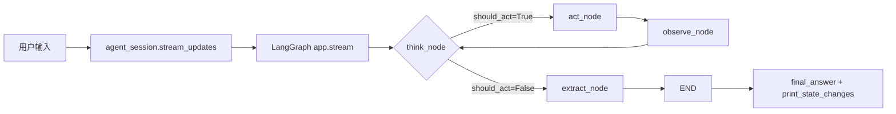
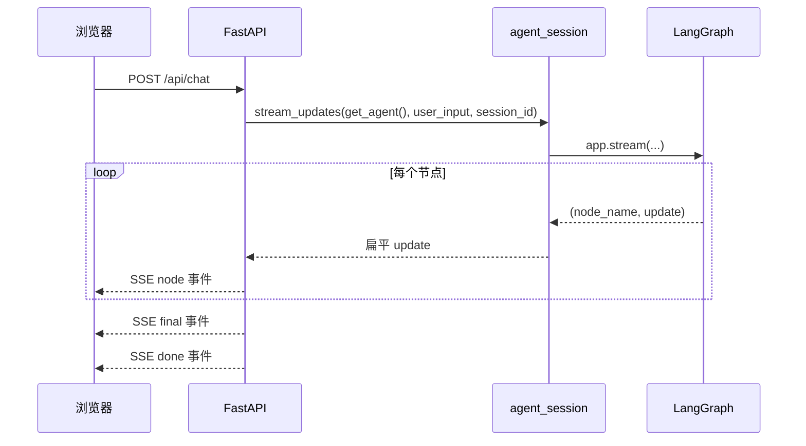
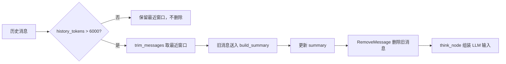
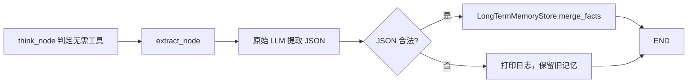

# test2 ReAct Agent 项目完整解析

> 本文档以当前工作区源码为准，覆盖 `test2` 的架构、核心概念、全部 Python 函数、主要数据流、运行方式和扩展方式。
> 本文档采用代码优先风格：每个 Python 函数都给出接收参数、返回内容、作用、完整源码和调用链。

## 目录

- [1. 项目总览](#sec-overview)
  - [1.1 项目作用](#overview-purpose)
  - [1.2 技术栈](#overview-stack)
  - [1.3 环境配置](#overview-env)
  - [1.4 启动方式](#overview-run)
  - [1.5 当前文件树](#overview-tree)
- [2. 架构分层](#sec-architecture)
  - [2.1 分层总览](#architecture-overview)
  - [2.2 配置层：providers.toml + config.py](#architecture-config)
  - [2.3 工具层：tools.py](#architecture-tools)
  - [2.4 状态层：state.py](#architecture-state)
  - [2.5 图核心层：graph.py](#architecture-graph)
  - [2.6 记忆层：memory_contracts.py + memory.py + memory_store.py](#architecture-memory)
  - [2.7 运行时层：runtime.py](#architecture-runtime)
  - [2.8 入口层：agent_session.py + __main__.py + web.py](#architecture-entry)
  - [2.9 前端层：static/index.html](#architecture-frontend)
  - [2.10 依赖方向与调用链](#architecture-calls)
- [3. 核心概念](#sec-concepts)
  - [3.1 StateGraph](#concepts-stategraph)
  - [3.2 MessagesState](#concepts-messages-state)
  - [3.3 add_messages](#concepts-add-messages)
  - [3.4 thread_id](#concepts-thread-id)
  - [3.5 SqliteSaver](#concepts-sqlite-saver)
- [4. 逐模块函数解析](#sec-functions)
  - [4.0 通用对象契约](#contract-overview)
    - [4.0.1 ReActState](#contract-react-state)
    - [4.0.2 tool_call](#contract-tool-call)
    - [4.0.3 LangChain 消息对象](#contract-messages)
    - [4.0.4 MemoryStore](#contract-memory-store)
    - [4.0.5 AgentRuntime](#contract-agent-runtime)
    - [4.0.6 updates 元组](#contract-updates)
  - [4.1 config.py](#module-config)
    - [4.1.1 get_llm](#func-config-get_llm)
  - [4.2 tools.py](#module-tools)
    - [4.2.1 calculator](#func-tools-calculator)
    - [4.2.2 weather](#func-tools-weather)
  - [4.3 state.py](#module-state)
    - [4.3.1 keep_existing_summary](#func-state-keep_existing_summary)
    - [4.3.2 ReActState](#class-state-react_state)
  - [4.4 graph.py](#module-graph)
    - [4.4.1 think_node](#func-graph-think_node)
    - [4.4.2 act_node](#func-graph-act_node)
    - [4.4.3 observe_node](#func-graph-observe_node)
    - [4.4.4 should_continue](#func-graph-should_continue)
    - [4.4.5 build_graph](#func-graph-build_graph)
  - [4.5 memory_contracts.py](#module-memory-contracts)
    - [4.5.1 MemoryStore](#class-memory-contracts-memory_store)
    - [4.5.2 get_memory_context](#func-memory-contracts-get_memory_context)
    - [4.5.3 merge_facts](#func-memory-contracts-merge_facts)
  - [4.6 memory.py](#module-memory)
    - [4.6.1 parse_memory_json](#func-memory-parse_memory_json)
    - [4.6.2 extract_memory_facts](#func-memory-extract_memory_facts)
    - [4.6.3 history_tokens](#func-memory-history_tokens)
    - [4.6.4 build_long_term_memory_section](#func-memory-build_long_term_memory_section)
    - [4.6.5 build_summary_section](#func-memory-build_summary_section)
    - [4.6.6 build_recent_history_section](#func-memory-build_recent_history_section)
    - [4.6.7 compose_llm_input](#func-memory-compose_llm_input)
    - [4.6.8 build_summary](#func-memory-build_summary)
    - [4.6.9 prepare_conversation](#func-memory-prepare_conversation)
  - [4.7 memory_store.py](#module-memory-store)
    - [4.7.1 LongTermMemoryStore](#class-memory-store-long_term_memory_store)
    - [4.7.2 __init__](#func-memory-store-init)
    - [4.7.3 _init_schema](#func-memory-store-init_schema)
    - [4.7.4 merge_facts](#func-memory-store-merge_facts)
    - [4.7.5 get_facts](#func-memory-store-get_facts)
    - [4.7.6 get_memory_context](#func-memory-store-get_memory_context)
    - [4.7.7 clear_scope](#func-memory-store-clear_scope)
    - [4.7.8 close](#func-memory-store-close)
    - [4.7.9 _now](#func-memory-store-now)
  - [4.8 runtime.py](#module-runtime)
    - [4.8.1 AgentRuntime](#class-runtime-agent_runtime)
    - [4.8.2 close](#func-runtime-close)
    - [4.8.3 create_runtime](#func-runtime-create_runtime)
  - [4.9 agent_session.py](#module-agent-session)
    - [4.9.1 initial_state](#func-agent-session-initial_state)
    - [4.9.2 session_config](#func-agent-session-session_config)
    - [4.9.3 stream_updates](#func-agent-session-stream_updates)
    - [4.9.4 collect_messages](#func-agent-session-collect_messages)
    - [4.9.5 final_answer](#func-agent-session-final_answer)
    - [4.9.6 clear_thread](#func-agent-session-clear_thread)
  - [4.10 __main__.py](#module-main)
    - [4.10.1 print_react_log](#func-main-print_react_log)
    - [4.10.2 print_state_changes](#func-main-print_state_changes)
    - [4.10.3 main](#func-main-main)
  - [4.11 web.py](#module-web)
    - [4.11.1 get_runtime](#func-web-get_runtime)
    - [4.11.2 get_agent](#func-web-get_agent)
    - [4.11.3 sse](#func-web-sse)
    - [4.11.4 render_node_payload](#func-web-render_node_payload)
    - [4.11.5 index](#func-web-index)
    - [4.11.6 chat](#func-web-chat)
    - [4.11.7 chat.gen](#func-web-chat-gen)
    - [4.11.8 clear_session](#func-web-clear_session)
  - [4.12 __init__.py](#module-init)
    - [4.12.1 hello](#func-init-hello)
  - [4.13 static/index.html JS 概览](#module-frontend)
    - [4.13.1 getSessionId](#js-get-session-id)
    - [4.13.2 escapeHtml](#js-escape-html)
    - [4.13.3 append](#js-append)
    - [4.13.4 bubble](#js-bubble)
    - [4.13.5 indicator](#js-indicator)
    - [4.13.6 renderNode](#js-render-node)
    - [4.13.7 send](#js-send)
    - [4.13.8 clearSession](#js-clear-session)
    - [4.13.9 handleEvent](#js-handle-event)
- [5. 完整数据流](#sec-data-flow)
  - [5.1 CLI 一次对话](#flow-cli)
  - [5.2 Web SSE 一次对话](#flow-web-sse)
  - [5.3 动态摘要触发](#flow-summary)
  - [5.4 长期记忆提取](#flow-long-term)
  - [5.5 清空会话](#flow-clear)
- [6. 扩展与调试](#sec-guide)
  - [6.1 新增供应商](#guide-provider)
  - [6.2 新增工具](#guide-tool)
  - [6.3 运行测试](#guide-tests)
  - [6.4 导出 Mermaid](#guide-mermaid)
  - [6.5 FAQ](#guide-faq)

---

<a id="sec-overview"></a>
## 1. 项目总览

<a id="overview-purpose"></a>
### 1.1 项目作用

`test2` 是一个基于 LangGraph 的最小化 ReAct Agent：

- LLM 根据历史消息判断是否需要调用工具。
- 如果需要工具，就执行 `think -> act -> observe` 循环。
- 如果不需要工具，就生成最终回复。
- 支持 `calculator` 和 `weather` 两个演示工具。
- 支持 CLI 和 Web 两个入口。
- 支持 SQLite 持久化的多轮对话记忆和项目级长期记忆。

<a id="overview-stack"></a>
### 1.2 技术栈

| 层级 | 技术 | 作用 |
| --- | --- | --- |
| 图引擎 | LangGraph | 定义状态、节点、边和编译后的 Agent 图 |
| LLM 抽象 | LangChain Core | 消息类型、工具绑定、`BaseMessage` |
| LLM 供应商 | langchain-anthropic / langchain-openai | 创建 ChatModel |
| 配置 | TOML + .env | 供应商预设与环境密钥 |
| 会话持久化 | langgraph-checkpoint-sqlite | 保存多轮对话 checkpoint |
| 长期记忆 | 标准库 sqlite3 | 保存项目级长期记忆 |
| Web | FastAPI + SSE + 原生 JS | 浏览器可视化入口 |
| 测试 | pytest | 单元测试 runner 和 memory contract |

<a id="overview-env"></a>
### 1.3 环境配置

项目根目录的 `.env.example` 提供了完整模板：

```dotenv
LLM_PROVIDER=anthropic
LLM_MODEL=claude-sonnet-4-20250514
LLM_API_KEY=sk-ant-xxxxx
LLM_TEMPERATURE=0
QWEATHER_API_HOST=xxxxxx
QWEATHER_API_KEY=xxxxxx
```

核心变量：

| 变量 | 说明 |
| --- | --- |
| `LLM_PROVIDER` | 供应商名称，例如 `anthropic`、`openai`、`ollama` |
| `LLM_MODEL` | 模型名；不填时使用 `providers.toml` 的第一个模型 |
| `LLM_API_KEY` | API Key |
| `LLM_TEMPERATURE` | 温度参数，默认 `0` |
| `LLM_BASE_URL` | 自定义供应商时才需要 |
| `QWEATHER_API_HOST` / `QWEATHER_API_KEY` | 使用 `weather` 工具时配置 |

`config.py` 会在导入时从项目根目录加载 `.env`，不依赖启动时的 cwd。

<a id="overview-run"></a>
### 1.4 启动方式

```bash
cd test2
uv sync

# CLI
uv run python -m test2 --app-dir src

# Web
uv run python -m uvicorn test2.web:app --reload --app-dir src
```

CLI 支持：

```text
quit / exit / q : 退出
clear / /clear : 清空当前会话 checkpoint
```

Web 启动后访问 `http://127.0.0.1:8000`。

<a id="overview-tree"></a>
### 1.5 当前文件树

```text
test2/
├── .env.example
├── README.md
├── pyproject.toml
├── uv.lock
├── tests/
│   ├── test_agent_session.py
│   └── test_memory_contracts.py
└── src/test2/
    ├── __init__.py
    ├── __main__.py
    ├── agent_session.py
    ├── config.py
    ├── graph.py
    ├── memory.py
    ├── memory_contracts.py
    ├── memory_store.py
    ├── providers.toml
    ├── runtime.py
    ├── state.py
    ├── tools.py
    ├── web.py
    ├── docs/
    │   ├── wiki.md
    │   ├── fastapi-sse-前端可视化.md
    │   └── multi-turn-memory.md
    └── static/
        └── index.html
```

---

<a id="sec-architecture"></a>
## 2. 架构分层

<a id="architecture-overview"></a>
### 2.1 分层总览

```text
providers.toml + .env
        │
        ▼
config.py ──► LLM 实例
        │
        ▼
tools.py ──► 工具 schema
        │
        ▼
state.py ──► ReActState
        │
        ▼
memory_contracts.py ◄── memory.py
        │                  │
        ▼                  ▼
memory_store.py ──────► graph.py ──► LangGraph app
                                    │
                                    ▼
                              runtime.py
                                    │
              ┌─────────────────────┼─────────────────────┐
              ▼                     ▼                     ▼
        agent_session.py       __main__.py (CLI)      web.py (FastAPI)
                                                        │
                                                        ▼
                                                   static/index.html
```

<a id="architecture-config"></a>
### 2.2 配置层：providers.toml + config.py

`providers.toml` 是纯配置，保存供应商协议、`base_url` 和模型列表。`config.py` 只负责：

- 加载根目录 `.env`。
- 读取 `LLM_PROVIDER`。
- 查 `providers.toml`。
- 根据 `protocol` 创建 `ChatAnthropic` 或 `ChatOpenAI`。

<a id="architecture-tools"></a>
### 2.3 工具层：tools.py

`tools.py` 用 `@tool` 定义 `calculator` 和 `weather`，并导出：

```python
TOOLS = [calculator, weather]
TOOL_MAP = {t.name: t for t in TOOLS}
```

`graph.py` 使用 `TOOLS` 做 `bind_tools`；`act_node` 使用 `TOOL_MAP` 查找并执行工具。

<a id="architecture-state"></a>
### 2.4 状态层：state.py

`state.py` 定义 `ReActState`，继承 LangGraph `MessagesState`，并增加：

```python
summary: Annotated[str, keep_existing_summary]
should_act: bool
tool_calls: list
iteration: int
```

`summary` 使用自定义 reducer，空字符串不会覆盖已有摘要。

<a id="architecture-graph"></a>
### 2.5 图核心层：graph.py

`graph.py` 定义四个节点：

```text
think -> should_continue?
  ├── should_act=True  -> act -> observe -> think
  └── should_act=False -> extract -> END
```

`build_graph()` 负责组装 `StateGraph` 并编译 app。

<a id="architecture-memory"></a>
### 2.6 记忆层：memory_contracts.py + memory.py + memory_store.py

三层职责：

```text
memory_contracts.py : MemoryStore Protocol + 常量
memory.py           : token 估算、摘要、消息裁剪、LLM 输入组装、长期记忆提取
memory_store.py     : SQLite 实现 LongTermMemoryStore
```

`memory.py` 依赖 `MemoryStore` 接口，不依赖具体 SQLite 类。

<a id="architecture-runtime"></a>
### 2.7 运行时层：runtime.py

`create_runtime()` 显式组合：

```text
SqliteSaver (checkpointer)
+ LongTermMemoryStore
+ build_graph(...)
= AgentRuntime
```

这样 `import test2.graph` 不会创建数据库，也没有模块级 checkpointer。

<a id="architecture-entry"></a>
### 2.8 入口层：agent_session.py + __main__.py + web.py

- `agent_session.py` 统一构造初始 state、config、stream、消息收集、最终答案和清空。
- `__main__.py` 是 CLI 交互入口。
- `web.py` 是 FastAPI + SSE 入口，复用 `agent_session.stream_updates()`。

<a id="architecture-frontend"></a>
### 2.9 前端层：static/index.html

`index.html` 使用原生 JS 实现：

- 从 `localStorage` 读取或生成 `session_id`。
- 通过 `fetch` 调用 `/api/chat`。
- 手动解析 SSE 流。
- 渲染 Think / Act / Observe 卡片和状态指示灯。
- 调用 `/api/clear` 清空当前会话。

<a id="architecture-calls"></a>
### 2.10 依赖方向与调用链

```text
CLI/Web
  -> agent_session.stream_updates()
  -> runtime.app (LangGraph)
  -> think_node
      -> prepare_conversation()
      -> compose_llm_input()
      -> llm_with_tools.invoke()
  -> act_node
  -> observe_node
  -> extract_node
      -> extract_memory_facts()
      -> LongTermMemoryStore
```

---

<a id="sec-concepts"></a>
## 3. 核心概念

<a id="concepts-stategraph"></a>
### 3.1 StateGraph

`StateGraph` 是 LangGraph 的图容器。它要求你显式定义：

- `State`：节点共享的数据结构。
- `Node`：接收 state、返回更新 dict 的 Python 函数。
- `Edge`：节点之间的连接。

本项目的图由 `build_graph()` 创建：

```python
graph = StateGraph(ReActState)
graph.set_entry_point("think")
graph.add_conditional_edges("think", should_continue, {...})
graph.add_edge("act", "observe")
graph.add_edge("observe", "think")
graph.add_edge("extract", END)
return graph.compile(checkpointer=checkpointer)
```

<a id="concepts-messages-state"></a>
### 3.2 MessagesState

`MessagesState` 提供带 `add_messages` 的 `messages` 字段：

```python
class MessagesState(TypedDict):
    messages: Annotated[list[AnyMessage], add_messages]
```

`ReActState` 继承它，因此天然拥有可合并的消息历史。

<a id="concepts-add-messages"></a>
### 3.3 add_messages

`add_messages` 是消息列表 reducer：

```text
新 id  -> 追加
同 id  -> 替换
RemoveMessage -> 删除
无 id  -> 追加并自动分配 id
```

节点只需要返回本轮新增消息，不需要手动拼完整历史。

<a id="concepts-thread-id"></a>
### 3.4 thread_id

`thread_id` 是 LangGraph config 中用于区分会话的 ID：

```python
config = {
    "recursion_limit": MAX_ITERATIONS * 6,
    "configurable": {"thread_id": "cli-default"},
}
```

同一个 `thread_id` 共享 checkpoint 历史；不同 `thread_id` 互不影响。

<a id="concepts-sqlite-saver"></a>
### 3.5 SqliteSaver

`SqliteSaver` 把 checkpoint 持久化到 SQLite：

```python
conn = sqlite3.connect(str(path), check_same_thread=False)
checkpointer = SqliteSaver(conn)
app = graph.compile(checkpointer=checkpointer)
```

默认数据库文件是 `data/memory.db`。

<a id="sec-functions"></a>
## 4. 逐模块函数解析

每个函数小节统一按以下顺序说明：

```text
快速参数表
参数详解
快速返回表
返回详解
作用
源码
调用链
失败模式
```

“参数详解”重点解释业务语义、读写关系和流程角色；“约束/非法值”放在快速参数表；“失败模式”单独说明函数级异常。

<a id="contract-overview"></a>
### 4.0 通用对象契约

本小节集中定义后续函数反复使用的对象形状。函数章节中的复杂参数会引用这里，只补充当前函数特有的关联。

<a id="contract-react-state"></a>
#### 4.0.1 ReActState

`ReActState` 是 LangGraph 的全局状态，由 `agent_session.initial_state()` 写入初始值，再由各节点返回增量更新。

| 字段 | 类型 | 必填/默认 | 业务含义 | 读写关系 |
| --- | --- | --- | --- | --- |
| `messages` | `list[BaseMessage]` | 必填，无默认 | 完整对话历史，决定 LLM 可见上下文 | `initial_state()` 写入用户消息；各节点追加/替换；`add_messages` 合并 |
| `summary` | `str` | 必填，默认 `""` | 早期对话的动态摘要 | `prepare_conversation()` 生成；`think_node` 返回；`keep_existing_summary` 合并 |
| `should_act` | `bool` | 必填，默认 `False` | 是否还需要执行工具 | `think_node` 写入；`should_continue()` 读取 |
| `tool_calls` | `list[dict]` | 必填，默认 `[]` | 本轮待执行工具调用 | `think_node` 写入；`act_node` 读取 |
| `iteration` | `int` | 必填，默认 `0` | 已完成的工具执行轮数 | `observe_node` 递增 |

示例：

```json
{
  "messages": [
    {"type": "human", "content": "北京天气怎么样？"}
  ],
  "summary": "",
  "should_act": false,
  "tool_calls": [],
  "iteration": 0
}
```

<a id="contract-tool-call"></a>
#### 4.0.2 tool_call

`tool_call` 是 `tool_calls` 列表中的单个字典，表示 LLM 请求执行一次工具。

| 字段 | 类型 | 必填 | 业务含义 | 关键关联 |
| --- | --- | --- | --- | --- |
| `name` | `str` | 是 | 工具名称，必须能在 `TOOL_MAP` 中找到 | `act_node` 用它查工具 |
| `args` | `dict` | 是 | 工具入参，与工具 schema 对应 | `act_node` 调用 `tool.invoke(args)` |
| `id` | `str` | 是 | 工具调用唯一 ID | 生成的 `ToolMessage.tool_call_id` 必须引用它 |

示例：

```json
{
  "name": "weather",
  "args": {"city": "北京"},
  "id": "call_abc123"
}
```

<a id="contract-messages"></a>
#### 4.0.3 LangChain 消息对象

消息对象是 `messages` 列表的元素，本项目中主要使用以下四种：

| 类型 | 用途 | 关键字段 | 关键关联 |
| --- | --- | --- | --- |
| `BaseMessage` | 所有消息的基类 | `content`、`id`、`type` | 抽象接口 |
| `HumanMessage` | 用户输入 | `content` | 由 `initial_state()` 创建 |
| `AIMessage` | LLM 输出 | `content`、`tool_calls` | 带 `tool_calls` 时进入 `act` |
| `ToolMessage` | 工具执行结果 | `content`、`tool_call_id` | `tool_call_id` 对应 AIMessage 的 tool_call id |

`RemoveMessage` 不承载内容，只表示删除 checkpoint 中指定 id 的旧消息。

<a id="contract-memory-store"></a>
#### 4.0.4 MemoryStore

`MemoryStore` 是项目级长期记忆的读写接口，当前实现是 `LongTermMemoryStore`。

| 方法 | 接收 | 返回 | 业务含义 |
| --- | --- | --- | --- |
| `get_memory_context(scope)` | `scope: str` | `str` | 读取可注入 LLM 的长期记忆 |
| `merge_facts(scope, category, facts, source_thread_id)` | 作用域、类别、事实列表、来源会话 | `None` | 写入并合并新事实 |

示例调用：

```python
context = memory_store.get_memory_context("project")
memory_store.merge_facts("project", "user_preferences", ["用户喜欢简洁回答"])
```

<a id="contract-agent-runtime"></a>
#### 4.0.5 AgentRuntime

`AgentRuntime` 是 CLI/Web 共用的运行时容器，由 `create_runtime()` 创建。

| 字段 | 类型 | 业务含义 |
| --- | --- | --- |
| `app` | LangGraph app | 编译后的 Agent 图 |
| `checkpointer` | `SqliteSaver` | 多轮对话 checkpoint |
| `memory_store` | `LongTermMemoryStore` | 项目级长期记忆 SQLite 实现 |
| `db_path` | `Path` | SQLite 数据库路径 |
| `conn` | `sqlite3.Connection` | SQLite 连接 |

<a id="contract-updates"></a>
#### 4.0.6 updates 元组

`updates` 是 `stream_updates()` 产出的扁平流，每个元素都是 `(node_name, update)`。

```text
node_name: str，例如 "think"、"act"、"observe"、"extract"
update: dict，该节点本轮返回的 state 增量
```

示例：

```text
("think", {"messages": [AIMessage(...)], "should_act": True})
```

<a id="module-config"></a>
### 4.1 config.py

`config.py` 负责加载 `.env`、读取 `providers.toml` 并创建 LLM 实例。

模块级关键逻辑：

```python
PROJECT_ROOT = Path(__file__).resolve().parents[2]
load_dotenv(PROJECT_ROOT / ".env")

PRESETS_PATH = Path(__file__).parent / "providers.toml"
with open(PRESETS_PATH, "rb") as f:
    PRESETS = tomllib.load(f)
```

<a id="func-config-get_llm"></a>
#### 4.1.1 get_llm

**逐行注释源码**

```python
def get_llm(provider: str | None = None, temperature: float | None = None):
    """
    获取 LLM 实例

    Args:
        provider: 供应商名称，不传则读 .env 中的 LLM_PROVIDER
        temperature: 温度参数，不传则读 .env 中的 LLM_TEMPERATURE

    Returns:
        LangChain ChatModel 实例
    """
    # 从环境变量读取
    # 优先使用显式 provider，没传就从 .env 读取 LLM_PROVIDER，并统一小写
    provider = (provider or os.getenv("LLM_PROVIDER", "")).strip().lower()
    # 读取模型名，为空时后面会用预设表第一个模型兜底
    model = os.getenv("LLM_MODEL", "").strip()
    # 读取统一 API Key，Anthropic 有 key 才显式传，OpenAI 用 placeholder 占位
    api_key = os.getenv("LLM_API_KEY", "").strip()
    if temperature is None:
        temperature = float(os.getenv("LLM_TEMPERATURE", "0"))

    # provider 为空说明用户没有配置供应商，直接报错并列出支持列表
    if not provider:
        raise ValueError(
            "未设置 LLM_PROVIDER，请在 .env 中设置，例如:\n"
            "  LLM_PROVIDER=openai\n"
            f"  支持: {', '.join(PRESETS.keys())}"
        )

    # 查表
    # 用 provider 查 providers.toml，得到协议、base_url、models
    preset = PRESETS.get(provider)
    #preset 是一个字典，包含了该供应商协议、 URL 和模型列表
    # 查不到预设说明配置名写错，抛出带支持列表的错误
    if not preset:
        raise ValueError(
            f"未知的 LLM_PROVIDER: '{provider}'\n"
            f"支持: {', '.join(PRESETS.keys())}\n"
            f"请在 .env 中设置 LLM_PROVIDER=上述之一"
        )

    # 读取该供应商走的协议，默认 openai
    protocol = preset.get("protocol", "openai")

    # Anthropic 协议：用 ChatAnthropic
    # Anthropic 走原生 ChatAnthropic
    if protocol == "anthropic":
        from langchain_anthropic import ChatAnthropic
        kwargs: dict = {
            "model": model or preset.get("models", [""])[0],
            "temperature": temperature,
        }
        # 有 LLM_API_KEY 才显式传，否则交给 ChatAnthropic 回退 ANTHROPIC_API_KEY，避免 pydantic 校验失败
        if api_key:
            kwargs["api_key"] = api_key
        return ChatAnthropic(**kwargs)
    #有自定义密钥就手动传入，没有就不填密钥参数，交给框架自动读取环境变量

    # OpenAI 协议：用 ChatOpenAI（覆盖绝大多数供应商）
    # OpenAI 兼容供应商统一走 ChatOpenAI，只改 base_url 和模型
    if protocol == "openai":
        from langchain_openai import ChatOpenAI
        base_url = preset.get("base_url") or os.getenv("LLM_BASE_URL", "")
        return ChatOpenAI(
            model=model or preset.get("models", [""])[0],
            api_key=api_key or "placeholder",
            base_url=base_url,
            temperature=temperature,
        )

    # 协议既不是 anthropic 也不是 openai，直接拒绝
    raise ValueError(f"不支持的协议: {protocol}")
```

**参数**

- `provider`: 供应商名，可选，默认读 `LLM_PROVIDER`；必须存在于 `providers.toml`。
- `temperature`: 温度参数，可选，默认读 `LLM_TEMPERATURE`，兜底 0。

**整体执行场景**

正常路径是 provider 存在且 protocol 是 anthropic/openai；异常路径是 provider 缺失或不存在。

**数据流举例**

provider -> PRESETS 查表 -> protocol -> ChatAnthropic/ChatOpenAI -> 返回 ChatModel。

**关键点与边界**

不直接请求模型；OpenAI 无 key 时用 placeholder，认证错误延迟到调用阶段。

**伪代码调用示例**

```python
llm = get_llm("ollama")
# 返回 ChatOpenAI 兼容实例
```

<a id="module-tools"></a>
### 4.2 tools.py

`tools.py` 定义两个可被 LLM 调用的工具，并导出 `TOOLS` 和 `TOOL_MAP`。

<a id="func-tools-calculator"></a>
#### 4.2.1 calculator

**逐行注释源码**

```python
@tool
def calculator(expression: str) -> str:
    """计算数学表达式。

    支持: +, -, *, /, **, sqrt, sin, cos, tan, log, pi, e
    示例: "2 + 3 * 4", "sqrt(16)", "sin(pi/2)", "2**10"
    """
    # 安全的数学环境，禁止任意代码执行
    # 构造白名单命名空间，禁止 __import__ 等危险能力
    safe_ns = {
        "__builtins__": {},
        "sqrt": math.sqrt,
        "sin": math.sin,
        "cos": math.cos,
        "tan": math.tan,
        "log": math.log,
        "log2": math.log2,
        "log10": math.log10,
        "abs": abs,
        "round": round,
        "pi": math.pi,
        "e": math.e,
    }
    # 计算可能失败，必须捕获语法错误、数学错误和任意异常
    try:
        # 只在 safe_ns 里 eval，因此表达式只能用白名单函数和常量
        result = eval(expression, safe_ns)
        # 返回字符串，方便 act_node 直接包成 ToolMessage
        return str(result)
    # 任何异常都转成可读文本，不让工具执行炸掉整张图
    except Exception as ex:
        return f"计算错误: {ex}"
```

**参数**

- `expression`: 数学表达式字符串，由 act_node 从 tool_call.args 传入。

**整体执行场景**

正常：表达式在白名单命名空间可求值，返回数字字符串；失败：语法错误或数学错误，返回错误文本。

**数据流举例**

expression -> safe_ns eval -> str(result) -> act_node 包成 ToolMessage。

**关键点与边界**

`__builtins__` 置空，禁止危险代码执行；错误不抛给图。

**伪代码调用示例**

```python
calculator("2 + 3 * 4")
# 返回 "14"
```

<a id="func-tools-weather"></a>
#### 4.2.2 weather

**逐行注释源码**

```python
@tool
def weather(city: str) -> str:
    """查询指定城市的当前实时天气（调用和风天气 API）。

    Args:
        city: 城市名称，如 "北京"、"上海"、"深圳"
    """
    # 读取和风天气 API 域名与密钥，缺配置直接返回失败文本
    api_host = os.getenv("QWEATHER_API_HOST")
    api_key = os.getenv("QWEATHER_API_KEY")
    if not api_host or not api_key:
        return "天气查询失败：未配置 QWEATHER_API_HOST 或 QWEATHER_API_KEY"

    # 构造 API 鉴权头，和风天气使用 X-QW-Api-Key
    headers = {"X-QW-Api-Key": api_key}

    try:
        # 1. 城市搜索：中文名 → LocationID
        geo_url = f"https://{api_host}/geo/v2/city/lookup"
        #requests.get() 方法用于向指定的 URL 发送 GET 请求，并返回一个 Response 对象。
        # 第一步：用城市中文名请求地理编码接口，换回 LocationID
        geo_resp = requests.get(geo_url, params={"location": city, "range": "cn", "number": 1}, headers=headers, timeout=5)
        geo_data = geo_resp.json()
        # 城市搜索失败时直接返回用户可读错误
        if geo_data.get("code") != "200" or not geo_data.get("location"):
            return f"未找到城市「{city}」，请检查城市名称"
        city_info = geo_data["location"][0]
        city_id = city_info["id"]
        city_name = city_info["name"]
        adm = city_info.get("adm1", "")

        # 2. 实时天气
        weather_url = f"https://{api_host}/v7/weather/now"
        # 第二步：用 LocationID 请求实时天气接口
        weather_resp = requests.get(weather_url, params={"location": city_id, "lang": "zh"}, headers=headers, timeout=5)
        data = weather_resp.json()
        # 天气接口返回错误码时直接返回失败原因
        if data.get("code") != "200":
            return f"天气查询失败：API 返回错误码 {data.get('code')}"

        now = data["now"]
        # 把天气字段拼成完整中文文本，LLM 后续可直接阅读
        return (
            f"{adm} {city_name}：{now['text']}，"
            f"气温 {now['temp']}°C，体感 {now['feelsLike']}°C，"
            f"湿度 {now['humidity']}%，{now['windDir']} {now['windScale']}级"
        )

    except requests.exceptions.Timeout:
        return f"天气查询超时，请稍后重试"
    except requests.exceptions.RequestException as e:
        return f"天气查询网络错误：{e}"
    except (KeyError, IndexError) as e:
        return f"天气数据解析错误：{e}"
```

**参数**

- `city`: 城市名称字符串，由 act_node 从 tool_call.args 传入。

**整体执行场景**

正常：城市搜索成功并返回实时天气；失败：缺配置、未找到城市、网络或解析错误。

**数据流举例**

city -> 地理编码 API -> LocationID -> 实时天气 API -> 中文天气文本。

**关键点与边界**

不抛异常，所有失败都转成字符串，作为工具结果交给 LLM。

**伪代码调用示例**

```python
weather("北京")
# 返回 "北京：晴，气温 25°C..."
```

<a id="module-state"></a>
### 4.3 state.py

`state.py` 定义 LangGraph 的全局状态。

<a id="func-state-keep_existing_summary"></a>
#### 4.3.1 keep_existing_summary

**逐行注释源码**

```python
def keep_existing_summary(old_value: str, new_value: str) -> str:
    """空字符串不覆盖已有摘要，避免每次调用初始状态清空 summary。"""
    # 新摘要非空就用新摘要，空字符串保留旧摘要，避免初始 state 清空记忆
    return new_value if new_value else old_value
```

**参数**

- `old_value`: 旧 summary。
- `new_value`: 节点返回的新 summary。

**整体执行场景**

正常：新值非空，使用新值；边界：新值为空，保留旧值。

**数据流举例**

old_value + new_value -> 非空判断 -> 最终 summary。

**关键点与边界**

防止 initial_state 的空 summary 覆盖已有摘要。

**伪代码调用示例**

```python
keep_existing_summary("旧摘要", "")
# 返回 "旧摘要"
```

<a id="class-state-react_state"></a>
#### 4.3.2 ReActState

**逐行注释源码**

```python
class ReActState(MessagesState):
    """ReAct Agent 的状态"""

    # 早期对话的动态摘要
    summary: Annotated[str, keep_existing_summary]
    # 是否需要执行工具
    should_act: bool
    # 当前待执行的工具调用列表
    tool_calls: list
    # 循环计数（防止无限循环）
    iteration: int
```

**参数**

无构造参数，是 LangGraph State 类型。

**整体执行场景**

被 StateGraph 使用；节点通过返回 dict 更新字段。

**数据流举例**

initial_state -> LangGraph 节点增量更新 -> 最终状态。

**关键点与边界**

字段形状见 4.0.1；messages 用 add_messages，summary 用 keep_existing_summary。

**伪代码调用示例**

```python
state = initial_state("你好")
# 得到完整 ReActState 初始值
```

<a id="module-graph"></a>
### 4.4 graph.py

`graph.py` 是 ReAct 循环的图定义，包含节点函数、条件函数和 `build_graph()`。

模块级常量：

```python
MAX_ITERATIONS = 35
MEMORY_WINDOW = 20
```

<a id="func-graph-think_node"></a>
#### 4.4.1 think_node

**逐行注释源码**

```python
def think_node(state: ReActState, llm_with_tools, llm, memory_store) -> dict:
    """
    Think 节点：AI 分析当前状态，决定下一步行动。

    接收：ReActState、绑定工具的 LLM、原始 LLM、长期记忆 Store
    返回：本轮状态更新 dict
    """
    # 先让记忆工具决定：给 LLM 看哪些最近消息、是否生成摘要、要删除哪些旧消息
    summary, recent_history, removals = prepare_conversation(
        state,
        llm,
        MEMORY_WINDOW,
    )
    # 按 长期记忆 -> 摘要 -> 最近消息 的顺序组装最终 LLM 输入
    llm_input = compose_llm_input(memory_store, summary, recent_history)

    # 调用绑定工具的 LLM，让它决定本轮是回答还是请求工具
    response = llm_with_tools.invoke(llm_input)

    # 判断 AI 是否请求了工具调用
    # 有没有 tool_calls 是 ReAct 是否继续循环的开关
    has_tool_calls = bool(response.tool_calls)

    # 返回增量状态：消息交给 add_messages，should_act 交给条件边
    return {
        "messages": removals + [response],
        "thought": response.content or "(AI 请求调用工具)",
        "should_act": has_tool_calls,
        "tool_calls": response.tool_calls or [],
        "summary": summary,
    }
```

**参数**

- `state`: ReActState，LangGraph 自动传入。
- `llm_with_tools`: 绑定工具模型。
- `llm`: 原始模型。
- `memory_store`: MemoryStore。

**整体执行场景**

正常：模型返回最终回复；循环：模型返回 tool_calls，进入 act。

**数据流举例**

state -> prepare_conversation -> compose_llm_input -> llm_with_tools.invoke -> 返回 messages/should_act/tool_calls/summary。

**关键点与边界**

removals 只在摘要触发时非空；should_act 驱动条件边。

**伪代码调用示例**

```python
think_node(state, llm_with_tools, llm, store)
# 返回本轮状态更新 dict
```

<a id="func-graph-act_node"></a>
#### 4.4.2 act_node

**逐行注释源码**

```python
def act_node(state: ReActState) -> dict:
    """
    Act 节点：执行所有待处理的工具调用。

    接收：ReActState
    返回：{"messages": [ToolMessage, ...]}
    """
    # 准备收集所有工具结果
    results = []
    # 遍历 LLM 本轮请求的每一个工具调用
    for call in state["tool_calls"]:
        tool_name = call["name"]
        tool_args = call["args"]

        # 查找并执行工具
        # 按工具名查 TOOL_MAP，查不到就是未知工具
        tool = TOOL_MAP.get(tool_name)
        # 未知工具也返回 ToolMessage，让 LLM 知道发生了什么
        if tool is None:
            content = f"错误：未知工具 '{tool_name}'"
        else:
            try:
                # 调用真实工具，工具异常会被包成文本
                content = tool.invoke(tool_args)
            except Exception as e:
                content = f"工具执行失败: {e}"

        # 构造 ToolMessage（LangChain 要求的格式）
        # 每个工具结果必须关联原 tool_call_id，否则 LLM 无法对应
        results.append(
            ToolMessage(content=str(content), tool_call_id=call["id"])
        )

    # 只返回本轮新增 ToolMessage，由 add_messages 合并历史
    return {"messages": results}
```

**参数**

- `state`: ReActState，必须包含 tool_calls。

**整体执行场景**

正常：执行所有工具并返回 ToolMessage；边界：未知工具或工具异常。

**数据流举例**

state.tool_calls -> TOOL_MAP 查工具 -> tool.invoke -> ToolMessage。

**关键点与边界**

tool_call_id 必须对应 AIMessage 的 tool_call.id。

**伪代码调用示例**

```python
act_node(state)
# 返回 {"messages": [ToolMessage(...)]}
```

<a id="func-graph-observe_node"></a>
#### 4.4.3 observe_node

**逐行注释源码**

```python
def observe_node(state: ReActState) -> dict:
    """
    Observe 节点：记录本轮观察结果，递增循环计数。

    接收：ReActState
    返回：{"iteration": state["iteration"] + 1}
    """
    # 只递增 iteration，表示完成一轮 act->observe
    return {
        "iteration": state["iteration"] + 1,
    }
```

**参数**

- `state`: ReActState，必须包含 iteration。

**整体执行场景**

每经过一次 act->observe 都会递增。

**数据流举例**

iteration -> iteration + 1 -> 覆盖状态。

**关键点与边界**

不修改 messages，只记录轮数。

**伪代码调用示例**

```python
observe_node({"iteration": 1})
# 返回 {"iteration": 2}
```

<a id="func-graph-should_continue"></a>
#### 4.4.4 should_continue

**逐行注释源码**

```python
def should_continue(state: ReActState) -> str:
    """
    条件判断：AI 请求了工具 → 继续循环，否则结束。

    接收：ReActState
    返回："act" 或 "end"
    """
    # should_act=True 表示还有工具要执行，回到 act
    if state["should_act"]:
        return "act"
    # should_act=False 表示任务完成，进入 extract 后结束
    return "end"
```

**参数**

- `state`: ReActState，必须包含 should_act。

**整体执行场景**

should_act=True -> act；False -> end。

**数据流举例**

should_act -> 条件字符串 -> conditional_edges 映射。

**关键点与边界**

返回值必须匹配 add_conditional_edges 的 key。

**伪代码调用示例**

```python
should_continue({"should_act": True})
# 返回 "act"
```

<a id="func-graph-build_graph"></a>
#### 4.4.5 build_graph

**逐行注释源码**

```python
def build_graph(
    provider: str,
    *,
    checkpointer,
    memory_store,
):
    """
    显式组装并编译 ReAct Agent 图。

    接收：
        provider：LLM 提供商
        checkpointer：LangGraph checkpointer
        memory_store：长期记忆 Store
    返回：编译后的 LangGraph app
    """
    # 先创建原始模型
    llm = get_llm(provider)
    # 再绑定工具，得到 think 节点使用的模型
    llm_with_tools = llm.bind_tools(TOOLS)

    # 用 ReActState 定义图的状态契约
    graph = StateGraph(ReActState)
    # 注册 think 节点，并通过 lambda 闭包注入 llm/memory_store
    graph.add_node(
        "think",
        lambda state: think_node(state, llm_with_tools, llm, memory_store),
    )
    # 注册 think 节点，并通过 lambda 闭包注入 llm/memory_store
    graph.add_node("act", act_node)
    # 注册 think 节点，并通过 lambda 闭包注入 llm/memory_store
    graph.add_node("observe", observe_node)
    # 注册 think 节点，并通过 lambda 闭包注入 llm/memory_store
    graph.add_node(
        "extract",
        lambda state: extract_memory_facts(state, llm, memory_store),
    )

    graph.set_entry_point("think")
    # think 后根据 should_continue 决定去 act 还是 extract
    graph.add_conditional_edges(
        "think",
        should_continue,
        {
            "act": "act",
            "end": "extract",
        },
    )
    graph.add_edge("act", "observe")
    graph.add_edge("observe", "think")
    graph.add_edge("extract", END)

    # 编译图并绑定 checkpointer，返回 CLI/Web 可运行对象
    return graph.compile(checkpointer=checkpointer)
```

**参数**

- `provider`: 供应商名。
- `checkpointer`: LangGraph checkpointer。
- `memory_store`: MemoryStore。

**整体执行场景**

正常：组装图并编译；异常：provider 无效或依赖缺失。

**数据流举例**

provider -> get_llm -> bind_tools -> StateGraph -> compile。

**关键点与边界**

不在 import 阶段执行；通过 lambda 闭包注入 think/extract 依赖。

**伪代码调用示例**

```python
app = build_graph("ollama", checkpointer=cp, memory_store=store)
# 返回编译后的 LangGraph app
```

<a id="module-memory-contracts"></a>
### 4.5 memory_contracts.py

`memory_contracts.py` 定义记忆层共享常量和最小 Provider 接口。

```python
MEMORY_SCOPE = "project"

CATEGORIES = (
    "user_preferences",
    "project_facts",
    "entities",
    "key_decisions",
    "unfinished_tasks",
)
```

<a id="class-memory-contracts-memory_store"></a>
#### 4.5.1 MemoryStore

**逐行注释源码**

```python
@runtime_checkable
class MemoryStore(Protocol):
    """Minimal interface used by graph-facing memory functions."""

    def get_memory_context(self, scope: str = MEMORY_SCOPE) -> str: ...

    def merge_facts(
        self,
        scope: str,
        category: str,
        facts: list,
        source_thread_id: str | None = None,
    ) -> None: ...
```

**参数**

无构造参数，是 Protocol。

**整体执行场景**

被 memory.py 依赖；LongTermMemoryStore 实现。

**数据流举例**

MemoryStore 接口 -> LongTermMemoryStore SQLite 实现。

**关键点与边界**

只约定 get_memory_context 和 merge_facts。

**伪代码调用示例**

```python
class FakeStore:
    def get_memory_context(self, scope="project"): ...
    def merge_facts(self, scope, category, facts, source_thread_id=None): ...
# FakeStore 结构性满足 MemoryStore
```

<a id="func-memory-contracts-get_memory_context"></a>
#### 4.5.2 get_memory_context

**逐行注释源码**

```python
    # 接口方法：按 scope 返回可注入 LLM 的长期记忆文本
    def get_memory_context(self, scope: str = MEMORY_SCOPE) -> str: ...
```

**参数**

- `scope`: 记忆作用域，默认 project。

**整体执行场景**

返回格式化记忆文本；无记忆返回空字符串。

**数据流举例**

scope -> Store 查询 -> 格式化文本。

**关键点与边界**

不写入，只读取。

**伪代码调用示例**

```python
store.get_memory_context("project")
# 返回记忆文本或空字符串
```

<a id="func-memory-contracts-merge_facts"></a>
#### 4.5.3 merge_facts

**逐行注释源码**

```python
    # 接口方法：按 scope+category 合并新事实，写入实现层
    def merge_facts(
        self,
        scope: str,
        category: str,
        facts: list,
        source_thread_id: str | None = None,
    ) -> None: ...
```

**参数**

- `scope`: 作用域。
- `category`: 类别。
- `facts`: 新事实列表。
- `source_thread_id`: 来源会话，可选。

**整体执行场景**

正常：写入并合并；边界：facts 为空直接返回。

**数据流举例**

facts -> 去重合并 -> SQLite upsert。

**关键点与边界**

只描述接口，具体去重/限量由实现负责。

**伪代码调用示例**

```python
store.merge_facts("project", "entities", ["test2"])
# 无返回值，写入后 get_memory_context 可读
```

<a id="module-memory"></a>
### 4.6 memory.py

`memory.py` 负责 token 估算、动态摘要、旧消息裁剪、LLM 输入组装和长期记忆提取。

模块级常量与 prompt：

```python
SUMMARY_TOKEN_THRESHOLD = 6000
```

<a id="func-memory-parse_memory_json"></a>
#### 4.6.1 parse_memory_json

**逐行注释源码**

```python
def parse_memory_json(content: str) -> dict:
    """解析 LLM 返回的长期记忆 JSON。"""
    # 统一转字符串并去首尾空白
    text = str(content).strip()
    # LLM 可能把 JSON 包在 Markdown 代码围栏里，先剥掉围栏
    if text.startswith("```"):
        lines = [
            line
            for line in text.splitlines()
            if not line.startswith("```")
        ]
        text = "\n".join(lines).strip()
    # 真正解析 JSON；解析失败会抛异常给上层
    data = json.loads(text)
    # 顶层必须是 dict，否则不是我们约定的记忆 JSON
    if not isinstance(data, dict):
        raise ValueError("memory extraction must return a JSON object")
    return data
```

**参数**

- `content`: LLM 返回的 JSON 文本，允许 ``` 围栏。

**整体执行场景**

正常：返回 dict；异常：非法 JSON 或顶层非 dict。

**数据流举例**

content -> 剥围栏 -> json.loads -> dict。

**关键点与边界**

解析失败由 extract_memory_facts 捕获，不中断对话。

**伪代码调用示例**

```python
parse_memory_json('{"user_preferences": []}')
# 返回 dict
```

<a id="func-memory-extract_memory_facts"></a>
#### 4.6.2 extract_memory_facts

**逐行注释源码**

```python
def extract_memory_facts(state, llm, memory_store: MemoryStore) -> dict:
    """最终回复后提取项目级长期记忆；失败时保留旧记忆，不中断对话。"""
    try:
        config = get_config()
        # 从 LangGraph config 拿 thread_id，作为长期记忆来源会话
        thread_id = config.get("configurable", {}).get("thread_id")

        # 第一条是提取指令，告诉 LLM 只输出固定 JSON
        prompt = [SystemMessage(content=EXTRACT_PROMPT)]
        # 有会话摘要时把摘要也放进去，提取结果更完整
        if state.get("summary"):
            prompt.append(
                SystemMessage(content=f"会话摘要：\n{state['summary']}")
            )
        # 把对话消息追加到 prompt，让 LLM 基于真实对话提取
        prompt.extend(state["messages"])

        # 调用原始 LLM 生成记忆 JSON
        response = llm.invoke(prompt)
        data = parse_memory_json(response.content)
        # 遍历五个固定类别，逐类写入 store
        for category in CATEGORIES:
            facts = data.get(category)
            if isinstance(facts, list):
                # 只写入当前提取到的事实，不覆盖旧记忆
                memory_store.merge_facts(
                    MEMORY_SCOPE,
                    category,
                    facts,
                    source_thread_id=thread_id,
                )
    except Exception as e:
        print(f"[memory] 长期记忆提取失败: {e}")
    return {}
```

**参数**

- `state`: 当前状态。
- `llm`: 原始模型。
- `memory_store`: MemoryStore。

**整体执行场景**

正常：提取并写入记忆；异常：LLM/JSON/store 失败只打印日志。

**数据流举例**

state+summary+messages -> LLM JSON -> 按类别 merge_facts。

**关键点与边界**

不覆盖旧记忆，失败不中断对话。

**伪代码调用示例**

```python
extract_memory_facts(state, llm, store)
# 返回 {}，并把长期记忆写入 store
```

<a id="func-memory-history_tokens"></a>
#### 4.6.3 history_tokens

**逐行注释源码**

```python
def history_tokens(messages) -> int:
    """估算一段消息历史约占用的 token 数。"""
    # 用近似 token 估算历史长度，判断是否触发摘要
    return count_tokens_approximately(messages)
```

**参数**

- `messages`: 消息列表。

**整体执行场景**

返回近似 token 数。

**数据流举例**

messages -> count_tokens_approximately -> int。

**关键点与边界**

只做估算，不做精确 tokenizer。

**伪代码调用示例**

```python
history_tokens([HumanMessage(content="你好")])
# 返回 非负整数
```

<a id="func-memory-build_long_term_memory_section"></a>
#### 4.6.4 build_long_term_memory_section

**逐行注释源码**

```python
def build_long_term_memory_section(memory_store: MemoryStore) -> list:
    """构造项目级长期记忆 SystemMessage 段。"""
    # 从项目长期记忆 Store 读取格式化文本
    context = memory_store.get_memory_context(MEMORY_SCOPE)
    # 没有记忆就不生成 SystemMessage，避免空段
    if not context:
        return []
    # 有记忆时生成长期记忆 SystemMessage，放到 LLM 输入最前面
    return [SystemMessage(content=f"项目长期记忆：\n{context}")]
```

**参数**

- `memory_store`: MemoryStore。

**整体执行场景**

正常：有记忆返回 SystemMessage；边界：无记忆返回空列表。

**数据流举例**

store -> get_memory_context -> SystemMessage -> LLM 输入第一段。

**关键点与边界**

只读不写，排在摘要之前。

**伪代码调用示例**

```python
build_long_term_memory_section(store)
# 返回 [SystemMessage(...)] 或 []
```

<a id="func-memory-build_summary_section"></a>
#### 4.6.5 build_summary_section

**逐行注释源码**

```python
def build_summary_section(summary: str) -> list:
    """构造会话摘要 SystemMessage 段。"""
    # 没有摘要就返回空列表，LLM 输入不插入摘要段
    if not summary:
        return []
    # 有摘要时把它包装成 SystemMessage
    return [SystemMessage(content=summary)]
```

**参数**

- `summary`: 会话摘要字符串。

**整体执行场景**

正常：非空生成 SystemMessage；边界：空返回空列表。

**数据流举例**

summary -> SystemMessage -> LLM 输入第二段。

**关键点与边界**

不修改摘要，只做包装。

**伪代码调用示例**

```python
build_summary_section("摘要")
# 返回 [SystemMessage(content="摘要")]
```

<a id="func-memory-build_recent_history_section"></a>
#### 4.6.6 build_recent_history_section

**逐行注释源码**

```python
def build_recent_history_section(recent_history: list) -> list:
    """返回最近消息列表，不负责裁剪。"""
    # 浅拷贝最近消息，避免 compose_llm_input 修改污染原窗口
    return list(recent_history)
```

**参数**

- `recent_history`: 最近消息列表。

**整体执行场景**

始终返回浅拷贝列表。

**数据流举例**

recent_history -> list(recent_history) -> LLM 输入第三段。

**关键点与边界**

避免调用方修改污染原窗口。

**伪代码调用示例**

```python
build_recent_history_section(messages)
# 返回新列表
```

<a id="func-memory-compose_llm_input"></a>
#### 4.6.7 compose_llm_input

**逐行注释源码**

```python
def compose_llm_input(
    memory_store: MemoryStore,
    summary: str,
    recent_history: list,
) -> list:
    """按顺序组装长期记忆、会话摘要、最近消息。"""
    # 按 长期记忆 -> 摘要 -> 最近消息 顺序拼接，这是记忆注入的核心顺序
    return (
        build_long_term_memory_section(memory_store)
        + build_summary_section(summary)
        + build_recent_history_section(recent_history)
    )
```

**参数**

- `memory_store`: MemoryStore。
- `summary`: 摘要。
- `recent_history`: 最近消息。

**整体执行场景**

按固定顺序拼接三段，空段会被跳过。

**数据流举例**

长期记忆段 + 摘要段 + 最近消息段 -> LLM 输入。

**关键点与边界**

顺序是记忆系统核心约定。

**伪代码调用示例**

```python
compose_llm_input(store, summary, history)
# 返回 [SystemMessage(...), SystemMessage(...), HumanMessage(...)]
```

<a id="func-memory-build_summary"></a>
#### 4.6.8 build_summary

**逐行注释源码**

```python
def build_summary(llm, retired_messages, old_summary: str = "") -> str:
    """使用不带工具的原始 LLM 生成或更新摘要。"""
    # 没有待归档消息就保留旧摘要，不调 LLM
    if not retired_messages:
        return old_summary

    # 构造 prompt 第一段：摘要系统指令，告诉 LLM 输出格式和保留重点
    prompt = [SystemMessage(content=SUMMARY_PROMPT)]
    # 有旧摘要就进入增量更新模式
    if old_summary:
        # 旧摘要加入 prompt，让模型在旧摘要基础上合并新消息
        prompt.append(SystemMessage(content=f"已有摘要：\n{old_summary}"))
    # 把所有待归档历史消息追加进去，完整 prompt = 指令 + 旧摘要 + 新消息
    prompt.extend(retired_messages)

    # 调用不带工具的原始 LLM 生成或更新摘要
    response = llm.invoke(prompt)
    # 返回清理后的新摘要文本
    return str(response.content).strip()
```

**参数**

- `llm`: 不带工具的原始模型。
- `retired_messages`: 待归档历史消息列表。
- `old_summary`: 旧摘要，默认空字符串。

**整体执行场景**

场景一：首次生成摘要，prompt = 系统提示 + 历史消息；场景二：增量更新，prompt = 系统提示 + 旧摘要 + 新归档消息。

**数据流举例**

旧摘要：

```text
用户喜欢喝咖啡，家住合肥。
```

新的 `retired_messages`：

```text
user: 周末想去爬山
assistant: 推荐近郊的山
```

传给 LLM 的 prompt：

```text
【系统指令：生成对话摘要】
已有摘要：
用户喜欢喝咖啡，家住合肥。

user: 周末想去爬山
assistant: 推荐近郊的山
```

模型输出新摘要：

```text
用户喜欢喝咖啡，家住合肥；用户提到周末想去爬山，助手推荐了近郊的山。
```

**关键点与边界**

```text
1. retired_messages 为空时直接返回旧摘要，不调 LLM，避免无效调用。
2. 增量模式依赖 LLM，模型能力弱时可能丢失信息。
3. 不操作 LongTermMemoryStore；build_summary 只压缩对话上下文，
   LongTermMemoryStore 负责抽取用户事实并持久化到 SQLite。
```

**伪代码调用示例**

```python
new_sum = build_summary(llm, retired_messages_1)
new_sum2 = build_summary(llm, retired_messages_2, old_summary=new_sum)
```

<a id="func-memory-prepare_conversation"></a>
#### 4.6.9 prepare_conversation

**逐行注释源码**

```python
def prepare_conversation(state, llm, recent_window: int) -> tuple[str, list, list]:
    """
    返回 (summary, recent_history, removals)。

    - summary: 当前会话摘要，超过 token 阈值时由 LLM 更新。
    - recent_history: 本次应送入 LLM 的最近消息窗口。
    - removals: 被摘要覆盖后需要从 checkpoint 删除的旧消息。
    """
    # 取完整历史消息，作为窗口裁剪和 token 判断的输入
    messages = state["messages"]
    # 旧摘要可能不存在，按空字符串处理
    old_summary = state.get("summary") or ""

    # 用 trim_messages 计算最近窗口，start_on=human 避免从工具消息中间开始
    recent_history = trim_messages(
        messages,
        max_tokens=recent_window,
        token_counter=len,
        strategy="last",
        start_on="human",
    )

    # 历史未超阈值时不做摘要，不删除旧消息
    if history_tokens(messages) <= SUMMARY_TOKEN_THRESHOLD:
        return old_summary, recent_history, []

    # 收集窗口内要保留的消息 id
    kept_ids = {msg.id for msg in recent_history if msg.id is not None}
    # 找出被窗口淘汰且带 id 的旧消息，作为摘要归档对象
    retired_messages = [
        msg
        for msg in messages
        if msg.id is not None and msg.id not in kept_ids
    ]  # retired_messages 是被裁剪掉的旧消息
    # 没有可归档旧消息就保留旧摘要，不调用 LLM
    if not retired_messages:
        return old_summary, recent_history, []

    # 用旧摘要 + 归档消息生成新摘要
    summary = build_summary(llm, retired_messages, old_summary)
    # 为每条归档旧消息生成 RemoveMessage，交给 add_messages 删除
    removals = [RemoveMessage(id=msg.id) for msg in retired_messages]
    return summary, recent_history, removals
```

**参数**

- `state`: ReActState。
- `llm`: 原始模型。
- `recent_window`: 最近窗口消息条数，默认传 MEMORY_WINDOW。

**整体执行场景**

未超阈值：只返回窗口；超阈值：生成摘要并返回 RemoveMessage。

**数据流举例**

state.messages -> trim_messages -> token 判断 -> build_summary -> (summary, recent_history, removals)。

**关键点与边界**

只有超阈值才删除旧消息，未总结前不丢历史。

**伪代码调用示例**

```python
summary, recent, removals = prepare_conversation(state, llm, 20)
```

<a id="module-memory-store"></a>
### 4.7 memory_store.py

`memory_store.py` 是 `MemoryStore` 的 SQLite 实现。

```python
DEFAULT_DB_PATH = PROJECT_ROOT / "data" / "memory.db"
MAX_FACTS_PER_CATEGORY = 100


def _decode_facts_json(raw: str) -> list[str]:
    """把 facts_json 列解析为事实字符串列表；损坏数据返回空列表。"""
    try:
        data = json.loads(raw)
    except (json.JSONDecodeError, TypeError):
        return []
    if not isinstance(data, list):
        return []
    return [str(item) for item in data]
```

<a id="class-memory-store-long_term_memory_store"></a>
#### 4.7.1 LongTermMemoryStore

**逐行注释源码**

```python
class LongTermMemoryStore:
    """基于 SQLite 的长期记忆 Store。"""

    def __init__(self, db_path: str | Path = DEFAULT_DB_PATH):
        self.db_path = Path(db_path)
        self.db_path.parent.mkdir(parents=True, exist_ok=True)  # 数据库文件所在文件夹不存在就创建
        #打开 SQLite 文件；check_same_thread=False 允许多线程访问
        self.conn = sqlite3.connect(str(self.db_path), check_same_thread=False)
        # 设置行工厂为 Row 类型，方便直接访问列值
        self.conn.row_factory = sqlite3.Row

        self._init_schema()

    def _init_schema(self):# 初始化数据库表，_表示私有方法
        self.conn.execute(
            """
            CREATE TABLE IF NOT EXISTS long_term_memory (
                scope TEXT NOT NULL,
                category TEXT NOT NULL,
                facts_json TEXT NOT NULL,
                source_thread_id TEXT,
                updated_at TEXT NOT NULL,
                PRIMARY KEY (scope, category)
            )
            """
        )#以上注释是给SQLite看的，造一张表，名叫 long_term_memory；如果已经造过了就跳过，别报错
        #第 1 列叫 scope（范围），存文本，不许留空。
        #第 2 列叫 category（分类），存文本，不许留空。
        #第 3 列叫 facts_json（事实 JSON），存文本，不许留空。
        #第 4 列叫 source_thread_id（来源线程 ID），存文本，可空。
        #第 5 列叫 updated_at（更新时间），存文本，不许留空。

        #提交事务后，数据库文件才会被写入
        self.conn.commit()

    def merge_facts(
        self,
        scope: str,
        category: str,
        facts: list,
        source_thread_id: str | None = None,
    ):
        """追加新事实，按精确文本去重，单类最多保留 100 条。"""
        if not facts:
            return

        #get_facts 读取数据库里已经存在的旧事实
        existing = self.get_facts(scope, category)
        #复制旧列表
        merged = list(existing)
        #如果事实不为空且不在现有事实中，则添加到merged列表中
        for fact in facts:
            text = str(fact).strip()
            if text and text not in merged:
                merged.append(text)
        #保留最新 MAX_FACTS_PER_CATEGORY 条事实
        merged = merged[-MAX_FACTS_PER_CATEGORY:]
        self.conn.execute(
            """
            INSERT INTO long_term_memory (
                scope,
                category,
                facts_json,
                source_thread_id,
                updated_at
            )
            VALUES (?, ?, ?, ?, ?)
            ON CONFLICT(scope, category) DO UPDATE SET
                facts_json = excluded.facts_json,
                source_thread_id = excluded.source_thread_id,
                updated_at = excluded.updated_at
            """,
            (
                scope,
                category,
                json.dumps(merged, ensure_ascii=False),
                source_thread_id,
                self._now(),
            ),
        )
        self.conn.commit()

    def get_facts(self, scope: str, category: str) -> list[str]:
        row = self.conn.execute(
            """
            SELECT facts_json
            FROM long_term_memory
            WHERE scope = ? AND category = ?
            """,
            (scope, category),
        ).fetchone()
        if not row:
            return []

        try:
            data = json.loads(row["facts_json"])
        except json.JSONDecodeError:
            return []

        if not isinstance(data, list):
            return []
        return [str(item) for item in data]

    def get_memory_context(self, scope: str = MEMORY_SCOPE) -> str:
        """返回按类别组织好的长期记忆文本。"""
        rows = self.conn.execute(
            """
            SELECT category
            FROM long_term_memory
            WHERE scope = ?
            ORDER BY category
            """,
            (scope,),
        ).fetchall()

        parts = []
        for row in rows:
            category = row["category"]
            facts = self.get_facts(scope, category)
            if facts:
                parts.append(f"{category}:\n- " + "\n- ".join(facts))
        return "\n\n".join(parts)

    def clear_scope(self, scope: str = MEMORY_SCOPE):
        self.conn.execute(
            "DELETE FROM long_term_memory WHERE scope = ?",
            (scope,),
        )
        self.conn.commit()

    def close(self):
        self.conn.close()

    @staticmethod
    def _now() -> str:
        return datetime.now(timezone.utc).isoformat()
```

**参数**

- `db_path`: SQLite 文件路径，默认 data/memory.db。

**整体执行场景**

构造时建目录、连接、建表。

**数据流举例**

db_path -> sqlite3.connect -> long_term_memory 表 -> 可读写 Store。

**关键点与边界**

实现 MemoryStore，并额外提供 clear_scope/close。

**伪代码调用示例**

```python
store = LongTermMemoryStore("data/memory.db")
# 返回已连接的 SQLite Store
```

<a id="func-memory-store-init"></a>
#### 4.7.2 __init__

**逐行注释源码**

```python
    def __init__(self, db_path: str | Path = DEFAULT_DB_PATH):
        # 保存数据库文件路径，后续所有方法都通过它访问
        self.db_path = Path(db_path)
        # 数据库目录不存在就创建，避免 sqlite3 连接失败
        self.db_path.parent.mkdir(parents=True, exist_ok=True)  # 数据库文件所在文件夹不存在就创建
        #打开 SQLite 文件；check_same_thread=False 允许多线程访问
        # 打开 SQLite 连接；check_same_thread=False 允许跨线程访问
        self.conn = sqlite3.connect(str(self.db_path), check_same_thread=False)
        # 设置行工厂为 Row 类型，方便直接访问列值
        self.conn.row_factory = sqlite3.Row

        # 初始化表结构，确保 long_term_memory 表存在
        self._init_schema()
```

**参数**

- `db_path`: 数据库文件路径。

**整体执行场景**

创建目录、打开连接、初始化表结构。

**数据流举例**

db_path -> Path -> mkdir -> connect -> _init_schema。

**关键点与边界**

check_same_thread=False 允许多线程访问。

**伪代码调用示例**

```python
store = LongTermMemoryStore("data/memory.db")
```

<a id="func-memory-store-init_schema"></a>
#### 4.7.3 _init_schema

**逐行注释源码**

```python
    def _init_schema(self):# 初始化数据库表，_表示私有方法
        # 执行建表 SQL；CREATE TABLE IF NOT EXISTS 不会重复创建
        self.conn.execute(
            """
            CREATE TABLE IF NOT EXISTS long_term_memory (
                scope TEXT NOT NULL,
                category TEXT NOT NULL,
                facts_json TEXT NOT NULL,
                source_thread_id TEXT,
                updated_at TEXT NOT NULL,
                PRIMARY KEY (scope, category)
            )
            """
        )#以上注释是给SQLite看的，造一张表，名叫 long_term_memory；如果已经造过了就跳过，别报错
        #第 1 列叫 scope（范围），存文本，不许留空。
        #第 2 列叫 category（分类），存文本，不许留空。
        #第 3 列叫 facts_json（事实 JSON），存文本，不许留空。
        #第 4 列叫 source_thread_id（来源线程 ID），存文本，可空。
        #第 5 列叫 updated_at（更新时间），存文本，不许留空。

        #提交事务后，数据库文件才会被写入
        # 提交建表事务
        self.conn.commit()
```

**参数**

无。

**整体执行场景**

确保表存在。

**数据流举例**

CREATE TABLE IF NOT EXISTS -> commit。

**关键点与边界**

重复调用不会破坏数据。

**伪代码调用示例**

```python
store._init_schema()
```

<a id="func-memory-store-merge_facts"></a>
#### 4.7.4 merge_facts

**逐行注释源码**

```python
    def merge_facts(
        self,
        scope: str,
        category: str,
        facts: list,
        source_thread_id: str | None = None,
    ):
        """追加新事实，按精确文本去重，单类最多保留 100 条。"""
        # 没有新事实就直接返回，避免空写数据库
        if not facts:
            return

        #get_facts 读取数据库里已经存在的旧事实
        # 读取该类已有事实，作为合并基础
        existing = self.get_facts(scope, category)
        #复制旧列表
        # 复制旧列表，不直接修改数据库读取结果
        merged = list(existing)
        #如果事实不为空且不在现有事实中，则添加到merged列表中
        # 逐条处理新事实
        for fact in facts:
            # 事实统一转字符串并去空白
            text = str(fact).strip()
            # 按精确文本去重，已有事实不重复加入
            if text and text not in merged:
                merged.append(text)
        #保留最新 MAX_FACTS_PER_CATEGORY 条事实
        # 单类最多保留 100 条，超过后丢弃最旧事实
        merged = merged[-MAX_FACTS_PER_CATEGORY:]
        # 用 upsert 写回 scope+category 这一行
        self.conn.execute(
            """
            INSERT INTO long_term_memory (
                scope,
                category,
                facts_json,
                source_thread_id,
                updated_at
            )
            VALUES (?, ?, ?, ?, ?)
            ON CONFLICT(scope, category) DO UPDATE SET
                facts_json = excluded.facts_json,
                source_thread_id = excluded.source_thread_id,
                updated_at = excluded.updated_at
            """,
            (
                scope,
                category,
                json.dumps(merged, ensure_ascii=False),
                source_thread_id,
                self._now(),
            ),
        )
        # 提交写入事务
        self.conn.commit()
```

**参数**

- `scope`, `category`, `facts`, `source_thread_id`。

**整体执行场景**

正常：去重合并写入；边界：facts 为空直接返回。

**数据流举例**

旧 facts + 新 facts -> 去重 -> 保留 100 条 -> upsert。

**关键点与边界**

精确文本去重，单类最多 100 条。

**伪代码调用示例**

```python
store.merge_facts("project", "entities", ["test2"])
```

<a id="func-memory-store-get_facts"></a>
#### 4.7.5 get_facts

**逐行注释源码**

```python
    def get_facts(self, scope: str, category: str) -> list[str]:
        # 按 scope+category 查询一行 facts_json
        row = self.conn.execute(
            """
            SELECT facts_json
            FROM long_term_memory
            WHERE scope = ? AND category = ?
            """,
            (scope, category),
        ).fetchone()
        # 没有记录返回空列表
        if not row:
            return []

        # 由共享解析函数统一处理 JSON、非 list 和脏数据
        return _decode_facts_json(row["facts_json"])
```

**参数**

- `scope`, `category`。

**整体执行场景**

正常返回字符串列表；无记录或 JSON 损坏返回空列表。

**数据流举例**

scope+category -> SELECT -> _decode_facts_json -> list[str]。

**关键点与边界**

`get_facts` 和 `get_memory_context` 共用 `_decode_facts_json`，损坏数据返回空列表，不抛异常。

**伪代码调用示例**

```python
store.get_facts("project", "entities")
# 返回 ["test2"] 或 []
```

<a id="func-memory-store-get_memory_context"></a>
#### 4.7.6 get_memory_context

**逐行注释源码**

```python
    def get_memory_context(self, scope: str = MEMORY_SCOPE) -> str:
        """返回按类别组织好的长期记忆文本。"""
        # 一次查询该 scope 下所有类别和 facts_json，避免逐类别二次查询
        rows = self.conn.execute(
            """
            SELECT category, facts_json
            FROM long_term_memory
            WHERE scope = ?
            ORDER BY category
            """,
            (scope,),
        ).fetchall()

        parts = []
        for row in rows:
            category = row["category"]
            # 用共享解析函数读取该类别事实
            facts = _decode_facts_json(row["facts_json"])
            # 只把非空类别拼进最终上下文
            if facts:
                # 格式化为 “类别:
- 事实” 的 LLM 可读文本
                parts.append(f"{category}:\n- " + "\n- ".join(facts))
        return "\n\n".join(parts)
```

**参数**

- `scope`: 默认 project。

**整体执行场景**

正常返回多类别记忆文本；无记忆返回空字符串。

**数据流举例**

scope -> 一次 SELECT category+facts_json -> 按类别格式化文本。

**关键点与边界**

一次 SQL 读取全部类别与事实，避免原来的 1+N 查询；输出适合直接放入 SystemMessage。

**伪代码调用示例**

```python
store.get_memory_context("project")
```

<a id="func-memory-store-clear_scope"></a>
#### 4.7.7 clear_scope

**逐行注释源码**

```python
    def clear_scope(self, scope: str = MEMORY_SCOPE):
        # 删除指定 scope 的全部长期记忆行
        self.conn.execute(
            "DELETE FROM long_term_memory WHERE scope = ?",
            (scope,),
        )
        # 提交删除事务
        self.conn.commit()
```

**参数**

- `scope`: 默认 project。

**整体执行场景**

删除指定 scope 全部长期记忆。

**数据流举例**

DELETE FROM long_term_memory WHERE scope=? -> commit。

**关键点与边界**

不影响其他 scope。

**伪代码调用示例**

```python
store.clear_scope("project")
```

<a id="func-memory-store-close"></a>
#### 4.7.8 close

**逐行注释源码**

```python
    def close(self):
        # 关闭 SQLite 连接，释放资源
        self.conn.close()
```

**参数**

无。

**整体执行场景**

关闭 SQLite 连接。

**数据流举例**

conn.close()。

**关键点与边界**

关闭后不能继续读写。

**伪代码调用示例**

```python
store.close()
```

<a id="func-memory-store-now"></a>
#### 4.7.9 _now

**逐行注释源码**

```python
    @staticmethod
    def _now() -> str:
        # 生成 UTC ISO 时间，避免不同时区写入时间不一致
        return datetime.now(timezone.utc).isoformat()
```

**参数**

无。

**整体执行场景**

生成 UTC ISO 时间戳。

**数据流举例**

datetime.now(timezone.utc).isoformat()。

**关键点与边界**

用于 updated_at。

**伪代码调用示例**

```python
LongTermMemoryStore._now()
```

<a id="module-runtime"></a>
### 4.8 runtime.py

`runtime.py` 显式组合 checkpointer、memory store 和图，避免模块 import 阶段产生副作用。

<a id="class-runtime-agent_runtime"></a>
#### 4.8.1 AgentRuntime

**逐行注释源码**

```python
@dataclass
class AgentRuntime:
    """一个可运行的 Agent 实例及其共享依赖。"""

    app: object
    checkpointer: SqliteSaver
    memory_store: LongTermMemoryStore
    db_path: Path
    conn: sqlite3.Connection

    def close(self):
        """关闭运行时持有的 SQLite 连接。"""
        self.memory_store.close()
        self.conn.close()
```

**参数**

- `app`, `checkpointer`, `memory_store`, `db_path`, `conn`。

**整体执行场景**

由 create_runtime 构造，CLI/Web 共享。

**数据流举例**

create_runtime -> AgentRuntime -> runtime.app / checkpointer / memory_store。

**关键点与边界**

close 会关闭 memory_store 和 conn。

**伪代码调用示例**

```python
runtime = create_runtime("ollama")
```

<a id="func-runtime-close"></a>
#### 4.8.2 close

**逐行注释源码**

```python
    def close(self):
        """关闭运行时持有的 SQLite 连接。"""
        # 先关闭长期记忆 Store 的连接
        self.memory_store.close()
        # 再关闭 SqliteSaver 共用的 SQLite 连接
        self.conn.close()
```

**参数**

无。

**整体执行场景**

关闭所有 SQLite 连接。

**数据流举例**

memory_store.close() -> conn.close()。

**关键点与边界**

重复 close 可能报错。

**伪代码调用示例**

```python
runtime.close()
```

<a id="func-runtime-create_runtime"></a>
#### 4.8.3 create_runtime

**逐行注释源码**

```python
def create_runtime(
    provider: str = "anthropic",
    db_path: str | Path | None = None,
) -> AgentRuntime:
    """显式创建 Agent 运行时，不在模块 import 阶段产生文件系统副作用。"""
    # 没有显式 db_path 就用 data/memory.db
    path = Path(db_path or DEFAULT_DB_PATH)
    # 创建 data 目录，避免数据库连接失败
    path.parent.mkdir(parents=True, exist_ok=True)

    # 打开 SQLite 连接
    conn = sqlite3.connect(str(path), check_same_thread=False)
    # 创建多轮对话 checkpointer
    checkpointer = SqliteSaver(conn)
    # 创建项目级长期记忆 Store
    memory_store = LongTermMemoryStore(path)
    # 组装并编译 LangGraph 图
    app = build_graph(
        provider,
        checkpointer=checkpointer,
        memory_store=memory_store,
    )
    # 把所有共享依赖打包成 AgentRuntime
    return AgentRuntime(
        app=app,
        checkpointer=checkpointer,
        memory_store=memory_store,
        db_path=path,
        conn=conn,
    )
```

**参数**

- `provider`: 默认 anthropic。
- `db_path`: 可选。

**整体执行场景**

正常：组合完整 runtime；异常：provider 无效。

**数据流举例**

provider/db_path -> SqliteSaver + LongTermMemoryStore + build_graph -> AgentRuntime。

**关键点与边界**

只在 create_runtime 阶段产生数据库副作用。

**伪代码调用示例**

```python
runtime = create_runtime("ollama", db_path="data/memory.db")
```

<a id="module-agent-session"></a>
### 4.9 agent_session.py

`agent_session.py` 是 CLI/Web 共享的会话 runner。

<a id="func-agent-session-initial_state"></a>
#### 4.9.1 initial_state

**逐行注释源码**

```python
def initial_state(user_message: str) -> dict:
    """Build the initial ReActState values for a new user turn."""
    # 构造一轮对话的初始 state，messages 放入 HumanMessage
    return {
        "messages": [HumanMessage(content=user_message)],
        "thought": "",
        "summary": "",
        "should_act": False,
        "tool_calls": [],
        "iteration": 0,
    }
```

**参数**

- `user_message`: 用户消息字符串。

**整体执行场景**

构造一轮对话初始 state。

**数据流举例**

user_message -> HumanMessage + 空字段 -> state。

**关键点与边界**

thought 是历史遗留字段。

**伪代码调用示例**

```python
initial_state("你好")
```

<a id="func-agent-session-session_config"></a>
#### 4.9.2 session_config

**逐行注释源码**

```python
def session_config(
    thread_id: str,
    recursion_limit: int | None = None,
) -> dict:
    """Build LangGraph config for a thread, with a safe recursion limit."""
    # 返回 LangGraph config：thread_id 控制会话记忆，recursion_limit 防止长循环
    return {
        "recursion_limit": MAX_ITERATIONS * 6
        if recursion_limit is None
        else recursion_limit,
        "configurable": {"thread_id": thread_id},
    }
```

**参数**

- `thread_id`: 会话 ID。
- `recursion_limit`: 可选，默认 MAX_ITERATIONS * 6。

**整体执行场景**

生成 LangGraph config。

**数据流举例**

thread_id/recursion_limit -> config dict。

**关键点与边界**

thread_id 决定记忆隔离。

**伪代码调用示例**

```python
session_config("thread-1")
```

<a id="func-agent-session-stream_updates"></a>
#### 4.9.3 stream_updates

**逐行注释源码**

```python
def stream_updates(
    app,
    user_message: str,
    thread_id: str,
    recursion_limit: int | None = None,
) -> Iterator[tuple[str, dict]]:
    """Stream LangGraph updates as flattened (node_name, update) pairs."""
    # 调用 LangGraph updates 模式，逐个拿到节点 step
    for step in app.stream(
        initial_state(user_message),
        config=session_config(thread_id, recursion_limit),
        stream_mode="updates",
    ):
        # 把原始 step dict 扁平化为 (node_name, update)
        for node_name, update in step.items():
            # LangGraph 用 None 表示节点没有产生状态更新（如 extract 返回空 dict）
            if update is None:
                continue
            # 逐个 yield，让 CLI/Web 保持流式能力
            yield node_name, update
```

**参数**

- `app`, `user_message`, `thread_id`, `recursion_limit`。

**整体执行场景**

流式扁平化节点更新。

**数据流举例**

app.stream -> step -> 跳过空更新 -> (node_name, update) yield。

**关键点与边界**

跳过 `None` 空更新，避免 `collect_messages()` / Web 渲染对 `None.get()` 崩溃；CLI list 收集，Web 边收边发 SSE。

**伪代码调用示例**

```python
list(stream_updates(app, "你好", "thread-1"))
```

<a id="func-agent-session-collect_messages"></a>
#### 4.9.4 collect_messages

**逐行注释源码**

```python
def collect_messages(
    updates: Iterable[tuple[str, dict]],
) -> list[BaseMessage]:
    """Collect all message updates from flattened session updates."""
    messages: list[BaseMessage] = []
    for _, update in updates:
        # 把每个节点返回的消息追加到统一列表
        messages.extend(update.get("messages", []))
    return messages
```

**参数**

- `updates`: (node, update) 可迭代对象。

**整体执行场景**

收集所有节点消息。

**数据流举例**

updates -> update["messages"] -> list。

**关键点与边界**

不还原 checkpoint 历史。

**伪代码调用示例**

```python
collect_messages(updates)
```

<a id="func-agent-session-final_answer"></a>
#### 4.9.5 final_answer

**逐行注释源码**

```python
def final_answer(updates: Iterable[tuple[str, dict]]) -> str:
    """Return the last non-tool-call AIMessage with non-empty content."""
    # 从最后节点往前找，保证取到最终答案
    for _, update in reversed(list(updates)):
        # 从每个节点消息里倒序找 AI 回复
        for msg in reversed(update.get("messages", [])):
            # 消息内容可能是 str 或 list，统一转字符串
            content = msg.content if isinstance(msg.content, str) else str(msg.content)
            # 只接受非工具调用、非空内容的 AIMessage
            if (
                isinstance(msg, AIMessage)
                and content.strip()
                and not getattr(msg, "tool_calls", None)
            ):
                # 找到最终答案后直接返回
                return content
    # 所有消息都不是最终答案时返回兜底文本
    return "（无最终回复）"
```

**参数**

- `updates`: (node, update) 可迭代对象。

**整体执行场景**

正常找到最终回复；边界无最终回复返回兜底。

**数据流举例**

倒序遍历 updates -> 找非工具 AI 消息 -> 返回内容。

**关键点与边界**

跳过 tool_calls，避免把中间思考当最终答案。

**伪代码调用示例**

```python
final_answer(updates)
# 返回 "最终回复"
```

<a id="func-agent-session-clear_thread"></a>
#### 4.9.6 clear_thread

**逐行注释源码**

```python
def clear_thread(runtime, thread_id: str) -> None:
    """Clear the checkpoint history for one thread."""
    # 删除指定 thread 的 checkpoint，但不清长期记忆
    runtime.checkpointer.delete_thread(thread_id)
```

**参数**

- `runtime`, `thread_id`。

**整体执行场景**

删除对话 checkpoint，不清长期记忆。

**数据流举例**

runtime.checkpointer.delete_thread(thread_id)。

**关键点与边界**

CLI/Web 共用。

**伪代码调用示例**

```python
clear_thread(runtime, "thread-1")
```

<a id="module-main"></a>
### 4.10 __main__.py

`__main__.py` 是 CLI 交互入口。

<a id="func-main-print_react_log"></a>
#### 4.10.1 print_react_log

**逐行注释源码**

```python
def print_react_log(messages, iteration):
    """打印 ReAct 过程日志（Think → Act → Observe）"""
    print(f"\n{'='*50}")
    print(f"  ReAct 循环完成：共 {iteration} 轮")
    print(f"{'='*50}")

    turn = 0
    # 遍历消息，根据类型识别 Think/Act/Observe
    for msg in messages:
        # 带 tool_calls 的 AIMessage 是 Think
        if hasattr(msg, "tool_calls") and msg.tool_calls:
            turn += 1
            thought = msg.content or "(请求调用工具)"
            print(f"\n  🤔 [Think #{turn}] {thought[:100]}")
            for tc in msg.tool_calls:
                print(f"  ⚡ [Act] 调用 {tc['name']}({tc['args']})")

        # ToolMessage 是 Observe
        elif msg.__class__.__name__ == "ToolMessage":
            content = msg.content[:80] + "..." if len(msg.content) > 80 else msg.content
            print(f"  👁️  [Observe] {content}")
```

**参数**

- `messages`, `iteration`。

**整体执行场景**

按 Think/Observe 打印日志。

**数据流举例**

messages -> 类型判断 -> print。

**关键点与边界**

当前 main 中已注释，保留备用。

**伪代码调用示例**

```python
print_react_log(messages, 2)
```

<a id="func-main-print_state_changes"></a>
#### 4.10.2 print_state_changes

**逐行注释源码**

```python
def print_state_changes(updates):
    """打印每一步 state 变化（stream_mode="updates" 捕获的记录）"""
    # 遍历扁平节点更新，逐个打印
    for i, (node_name, update) in enumerate(updates, 1):
        print(f"\n─── 第 {i} 步 · {node_name} 节点 ───")
        for key, value in update.items():
            # messages 特殊展开成 + MessageType 格式
            if key == "messages":
                for msg in value:
                    print(f"  + {msg.__class__.__name__}: {str(msg.content)[:250]}")
                    if getattr(msg, "tool_calls", None):
                        for tc in msg.tool_calls:
                            print(f"    └ {tc['name']}({tc['args']})")
            else:
                print(f"  {key}: {value}")
```

**参数**

- `updates`: (node, update) 可迭代对象。

**整体执行场景**

逐节点打印状态变化。

**数据流举例**

updates -> 打印 node -> 打印 messages/其他字段。

**关键点与边界**

messages 特殊展开，其他字段直接打印。

**伪代码调用示例**

```python
print_state_changes(updates)
```

<a id="func-main-main"></a>
#### 4.10.3 main

**逐行注释源码**

```python
def main():
    # 读取 provider：从 .env 环境变量
    # 从 .env 读取供应商，默认 anthropic
    provider = os.getenv("LLM_PROVIDER", "anthropic").strip().lower()

    model = os.getenv("LLM_MODEL", "")

    print(f"⏳ 正在初始化 ReAct Agent (provider: {provider}, model: {model or '自动'})...")

    # 构建运行时
    try:
        # 创建完整运行时，失败时打印配置提示并退出
        runtime = create_runtime(provider)
        app = runtime.app
    except Exception as e:
        print(f"❌ 初始化失败: {e}")
        print("   请检查 .env 文件中的 LLM_PROVIDER / LLM_MODEL / LLM_API_KEY 配置")
        sys.exit(1)

    print(f"✅ ReAct Agent 已就绪")
    print(f"   输入 quit 或 exit 退出")
    print(f"   输入 clear 或 /clear 清空当前会话记忆")
    print(f"   切换供应商：改 .env 中的 LLM_PROVIDER 即可")
    print(f"   最大循环次数: {MAX_ITERATIONS}")
    print()

    # 交互循环
    while True:
        try:
            # 读取用户输入并去空白
            user_input = input("你: ").strip()
        except (EOFError, KeyboardInterrupt):
            print("\n👋 再见！")
            break

        if not user_input:
            continue
        if user_input.lower() in ("quit", "exit", "q"):
            print("👋 再见！")
            break
        # clear 命令清空当前 thread checkpoint
        if user_input.lower() in ("clear", "/clear"):
            clear_thread(runtime, THREAD_ID)
            print("\n🧹 已清空当前会话记忆")
            continue

        # 运行 Agent（stream 模式：逐步捕获 state 变化）
        try:
            # 收集本轮所有节点更新
            updates = list(stream_updates(app, user_input, THREAD_ID))
        except Exception as e:
            print(f"\n❌ 运行出错: {e}")
            continue

        # 汇总所有消息
        all_messages = collect_messages(updates)

        # 打印最终回复
        # 从节点更新里提取最终回复
        final_content = final_answer(updates)
        if final_content and final_content != "（无最终回复）":
            print(f"\n📎 {final_content}")

        # 统计轮数（observe 节点出现次数）
        # 统计 observe 出现次数作为轮数
        iterations = sum(1 for node, _ in updates if node == "observe")

        # 打印 ReAct 过程日志
        #print_react_log(all_messages, iterations)

        # 打印每一步 state 变化（数据视角）
        print_state_changes(updates)
```

**参数**

无显式参数，读 .env 和 stdin。

**整体执行场景**

CLI 交互主循环。

**数据流举例**

provider -> create_runtime -> input -> stream_updates -> final_answer -> print。

**关键点与边界**

clear 只清当前 thread。

**伪代码调用示例**

```python
main()
# 启动 CLI 交互循环
```

<a id="module-web"></a>
### 4.11 web.py

`web.py` 是 FastAPI + SSE 入口。

<a id="func-web-get_runtime"></a>
#### 4.11.1 get_runtime

**逐行注释源码**

```python
def get_runtime():
    global _runtime
    # 第一次访问才创建，后续请求复用同一个 runtime
    if _runtime is None:
        provider = os.getenv("LLM_PROVIDER", "anthropic").strip().lower()
        # 创建并缓存 AgentRuntime
        _runtime = create_runtime(provider)
    return _runtime
```

**参数**

无。

**整体执行场景**

懒加载单例 runtime。

**数据流举例**

首次 create_runtime -> 缓存 -> 后续复用。

**关键点与边界**

避免 Web 启动即创建数据库。

**伪代码调用示例**

```python
runtime = get_runtime()
```

<a id="func-web-get_agent"></a>
#### 4.11.2 get_agent

**逐行注释源码**

```python
def get_agent():
    # 从缓存 runtime 取出编译图
    return get_runtime().app
```

**参数**

无。

**整体执行场景**

从 runtime 取编译图。

**数据流举例**

get_runtime().app -> app。

**关键点与边界**

Web 不直接接触 checkpointer/store。

**伪代码调用示例**

```python
app = get_agent()
```

<a id="func-web-sse"></a>
#### 4.11.3 sse

**逐行注释源码**

```python
def sse(event: str, data: dict) -> str:
    """打包一条 SSE 事件"""
    # 按 SSE 协议拼接 event 和 data，data 用 JSON 序列化
    return (
        f"event: {event}\n"
        f"data: {json.dumps(data, ensure_ascii=False, default=str)}\n\n"
    )
```

**参数**

- `event`: 事件名。
- `data`: dict。

**整体执行场景**

将事件序列化为 SSE 文本。

**数据流举例**

event+data -> JSON -> event:/data: 文本。

**关键点与边界**

data 必须可 JSON 序列化。

**伪代码调用示例**

```python
sse("node", {"content": "你好"})
```

<a id="func-web-render_node_payload"></a>
#### 4.11.4 render_node_payload

**逐行注释源码**

```python
def render_node_payload(node: str, update: dict) -> dict:
    """
    把单个节点的 state 更新，整理成前端好渲染的扁平结构。

    - 把 messages 里的消息提取成纯文本列表（避免前端依赖 LangChain 对象结构）
    - 保留 iteration / should_act / tool_calls 供前端展示
    """
    messages = []
    # 把 LangChain 消息对象转成前端可读纯文本
    for msg in update.get("messages", []):
        entry = {"type": msg.__class__.__name__, "content": str(msg.content)}
        # 有工具调用时保留 name/args，供前端展示
        tool_calls = getattr(msg, "tool_calls", None)
        if tool_calls:
            entry["tool_calls"] = [
                {"name": tc["name"], "args": tc["args"]} for tc in tool_calls
            ]
        messages.append(entry)

    # 输出扁平 payload，包含 node/messages/thought/should_act/tool_calls/iteration
    return {
        "node": node,
        "messages": messages,
        "thought": update.get("thought", ""),
        "should_act": update.get("should_act", False),
        "tool_calls": update.get("tool_calls", []),
        "iteration": update.get("iteration", 0),
    }
```

**参数**

- `node`, `update`。

**整体执行场景**

把 LangChain 消息转前端可读 payload。

**数据流举例**

update.messages -> 纯文本 entry -> 扁平 dict。

**关键点与边界**

避免前端依赖 Python 对象。

**伪代码调用示例**

```python
render_node_payload("think", update)
```

<a id="func-web-index"></a>
#### 4.11.5 index

**逐行注释源码**

```python
@app.get("/", response_class=HTMLResponse)
async def index():
    # 读取 static/index.html 并返回 HTMLResponse
    with open(os.path.join(STATIC_DIR, "index.html"), encoding="utf-8") as f:
        return HTMLResponse(f.read())
```

**参数**

无。

**整体执行场景**

返回静态首页。

**数据流举例**

index.html -> HTMLResponse。

**关键点与边界**

文件缺失会 500。

**伪代码调用示例**

```python
await index()
```

<a id="func-web-chat"></a>
#### 4.11.6 chat

**逐行注释源码**

```python
@app.post("/api/chat")
async def chat(request: Request):
    # 从请求体读 message 和 session_id
    body = await request.json()
    user_input = body.get("message", "").strip()
    session_id = str(body.get("session_id") or "default").strip() or "default"
    # 空消息直接返回 error 事件
    if not user_input:
        return StreamingResponse(
            iter([sse("error", {"message": "消息不能为空"})]),
            media_type="text/event-stream",
        )

    # 定义 SSE 生成器，真正流式运行 Agent
    def gen():
        yield sse("user", {"content": user_input})
        updates = []
        try:
            for node_name, update in stream_updates(
                get_agent(),
                user_input,
                session_id,
            ):
                updates.append((node_name, update))
                yield sse("node", render_node_payload(node_name, update))

            yield sse("final", {"content": final_answer(updates)})
            yield sse("done", {})
        except Exception as e:
            yield sse("error", {"message": str(e)})

    # 把生成器包装成 SSE 响应
    return StreamingResponse(gen(), media_type="text/event-stream")
```

**参数**

- `request`: FastAPI Request，body 含 message/session_id。

**整体执行场景**

正常返回 SSE 流；空消息返回 error 流。

**数据流举例**

body -> gen() -> StreamingResponse。

**关键点与边界**

真正运行 Agent 在 gen() 中。

**伪代码调用示例**

```python
# POST /api/chat
# 返回 text/event-stream
```

<a id="func-web-chat-gen"></a>
#### 4.11.7 chat.gen

**逐行注释源码**

```python
    def gen():
        # 先回显用户消息
        yield sse("user", {"content": user_input})
        updates = []
        try:
            # 用共享 runner 流式获取节点更新
            for node_name, update in stream_updates(
                get_agent(),
                user_input,
                session_id,
            ):
                # 边发 SSE 边收集 updates，最后提取 final
                updates.append((node_name, update))
                # 每个节点发一条 node 事件
                yield sse("node", render_node_payload(node_name, update))

            # 发最终答案
            yield sse("final", {"content": final_answer(updates)})
            # 通知前端本轮结束
            yield sse("done", {})
        except Exception as e:
            # 异常时发 error 事件，不中断连接
            yield sse("error", {"message": str(e)})
```

**参数**

闭包捕获 user_input/session_id。

**整体执行场景**

user -> node* -> final -> done；异常 -> error。

**数据流举例**

stream_updates -> render_node_payload -> sse -> yield。

**关键点与边界**

边流式边收集 updates，用于 final_answer。

**伪代码调用示例**

```python
for text in gen():
    pass
# 每次 yield 一条 SSE 文本
```

<a id="func-web-clear_session"></a>
#### 4.11.8 clear_session

**逐行注释源码**

```python
@app.post("/api/clear")
async def clear_session(request: Request):
    body = await request.json()
    session_id = str(body.get("session_id") or "default").strip() or "default"
    # 复用共享清空逻辑，只删除当前会话 checkpoint
    clear_thread(get_runtime(), session_id)
    # 返回固定成功 JSON
    return {"ok": True}
```

**参数**

- `request`: body 含 session_id。

**整体执行场景**

删除当前会话 checkpoint。

**数据流举例**

session_id -> clear_thread -> {"ok": True}。

**关键点与边界**

不清长期记忆。

**伪代码调用示例**

```python
# POST /api/clear
# 返回 {"ok": True}
```

<a id="module-init"></a>
### 4.12 __init__.py

<a id="func-init-hello"></a>
#### 4.12.1 hello

**逐行注释源码**

```python
def hello() -> None:
    # 仅验证包可运行的示例函数
    print("Hello from py112!")
```

**参数**

无。

**整体执行场景**

打印示例文本。

**数据流举例**

print("Hello from py112!")。

**关键点与边界**

不参与 Agent 流程。

**伪代码调用示例**

```python
hello()
# 输出 Hello from py112!
```

<a id="module-frontend"></a>
### 4.13 static/index.html JS 概览

前端只做概览，不逐函数贴源码。

核心职责：

```text
生成/读取 session_id
发送消息到 /api/chat
解析 SSE 事件
渲染 Think / Act / Observe 卡片
调用 /api/clear 清空会话
```

<a id="js-get-session-id"></a>
#### 4.13.1 getSessionId

**接收**

```text
无
```

**返回**

```text
string：session_id
```

**作用**

```text
从 localStorage 读取或生成 session_id
```

<a id="js-escape-html"></a>
#### 4.13.2 escapeHtml

**接收**

```text
s：任意字符串
```

**返回**

```text
转义后的 HTML 安全字符串
```

**作用**

```text
防止用户/模型内容注入 HTML
```

<a id="js-append"></a>
#### 4.13.3 append

**接收**

```text
el：DOM 元素
```

**返回**

```text
无
```

**作用**

```text
把元素追加到消息区并滚动到底部
```

<a id="js-bubble"></a>
#### 4.13.4 bubble

**接收**

```text
text：str
cls：str
```

**返回**

```text
无
```

**作用**

```text
创建用户/助手气泡
```

<a id="js-indicator"></a>
#### 4.13.5 indicator

**接收**

```text
无
```

**返回**

```text
span 节点数组
```

**作用**

```text
创建 Think / Act / Observe 指示灯
```

<a id="js-render-node"></a>
#### 4.13.6 renderNode

**接收**

```text
data：SSE node 事件的 payload
```

**返回**

```text
无
```

**作用**

```text
根据 node 类型渲染卡片
```

<a id="js-send"></a>
#### 4.13.7 send

**接收**

```text
无
```

**返回**

```text
Promise
```

**作用**

```text
发送消息、解析 SSE、处理事件
```

<a id="js-clear-session"></a>
#### 4.13.8 clearSession

**接收**

```text
无
```

**返回**

```text
Promise
```

**作用**

```text
调用 /api/clear 并清空页面消息
```

<a id="js-handle-event"></a>
#### 4.13.9 handleEvent

**接收**

```text
event：string
data：object
spans：指示灯节点数组
getActiveIdx：读取当前激活指示灯的 function
```

**返回**

```text
无
```

**作用**

```text
分发 node / final / error 事件
```

<a id="sec-data-flow"></a>
## 5. 完整数据流

<a id="flow-cli"></a>
### 5.1 CLI 一次对话



流程说明：

```text
1. CLI 使用 THREAD_ID = DEFAULT_THREAD_ID = "cli-default"。
2. stream_updates() 构造 initial_state 和 session_config。
3. LangGraph 逐节点返回 (node_name, update)。
4. CLI 收集 updates，用 final_answer() 提取最终答案。
5. print_state_changes() 打印每一步 state 变化。
```

<a id="flow-web-sse"></a>
### 5.2 Web SSE 一次对话



事件类型：

```text
user : 回显用户消息
node : 节点状态
final: 最终答案
done : 本轮结束
error: 错误信息
```

<a id="flow-summary"></a>
### 5.3 动态摘要触发



关键点：

```text
1. trim_messages 只决定本次给 LLM 看什么。
2. 只有 token 超过阈值时才生成摘要并删除旧消息。
3. 未超过阈值时旧消息保留在 checkpoint，避免未总结就丢失。
```

<a id="flow-long-term"></a>
### 5.4 长期记忆提取



记忆类别：

```text
user_preferences
project_facts
entities
key_decisions
unfinished_tasks
```

<a id="flow-clear"></a>
### 5.5 清空会话

```mermaid
flowchart LR
    A[CLI clear 或 Web /api/clear] --> B[clear_thread(runtime, thread_id)]
    B --> C[checkpointer.delete_thread(thread_id)]
    C --> D[对话 checkpoint 删除]
    D --> E[长期记忆保留]
```

---

<a id="sec-guide"></a>
## 6. 扩展与调试

<a id="guide-provider"></a>
### 6.1 新增供应商

在 `providers.toml` 增加一个 section：

```toml
[newprovider]
protocol = "openai"
base_url = "https://api.newprovider.com/v1"
models = ["model-a", "model-b"]
```

然后在 `.env` 设置：

```dotenv
LLM_PROVIDER=newprovider
LLM_MODEL=model-a
LLM_API_KEY=sk-xxx
```

不需要改 `config.py`。

<a id="guide-tool"></a>
### 6.2 新增工具

在 `tools.py` 添加工具并加入 `TOOLS`：

```python
@tool
def search_web(query: str) -> str:
    """搜索互联网。"""
    return "搜索结果..."

TOOLS = [calculator, weather, search_web]
TOOL_MAP = {t.name: t for t in TOOLS}
```

LLM 会自动通过 `bind_tools(TOOLS)` 看到新工具。

<a id="guide-tests"></a>
### 6.3 运行测试

```bash
uv run pytest
```

当前测试覆盖：

```text
agent_session.initial_state / session_config / stream_updates / clear_thread
agent_session.collect_messages / final_answer
memory section 空/非空
compose_llm_input 顺序
MemoryStore Protocol 结构性匹配
```

<a id="guide-mermaid"></a>
### 6.4 导出 Mermaid

使用 LangGraph 自带方法导出：

```python
from test2.runtime import create_runtime

runtime = create_runtime("ollama")
print(runtime.app.get_graph().draw_mermaid())
runtime.close()
```

把输出粘贴到 [mermaid.live](https://mermaid.live) 查看。

<a id="guide-faq"></a>
### 6.5 FAQ

**Q：`bind_tools()` 和直接传 tools 给 AgentExecutor 有什么区别？**

本质都是把工具 schema 传给 LLM。LangGraph 的优势是显式暴露循环和状态，而不是把过程藏在 `AgentExecutor` 黑盒里。

**Q：为什么 messages 不用普通 list 拼接？**

普通拼接只会追加，相同 id 也会重复；`add_messages` 支持按 id 追加、替换和 `RemoveMessage` 删除，适合聊天历史管理。

**Q：`ToolMessage.tool_call_id` 是干什么的？**

它把工具结果关联到对应的 AIMessage tool call。如果 id 不匹配，LLM 无法正确理解结果属于哪个调用。

**Q：为什么 recursion_limit 默认是 `MAX_ITERATIONS * 6`？**

图内除了 `think -> act -> observe`，还包含 `extract -> END` 等节点；`* 6` 为最大 35 轮循环留出足够深度，避免长任务误触递归上限。

**Q：为什么 `import test2.graph` 不会创建数据库？**

重构后 `graph.py` 不再保存模块级数据库连接和记忆 Store；数据库由 `create_runtime()` 显式创建。

**Q：`summary` 的 reducer 为什么这样写？**

每次节点返回 `summary` 时，LangGraph 会用 reducer 合并。`keep_existing_summary` 保证空字符串不会覆盖已有摘要，避免初始 state 反复清空摘要。

---

> 本文档按当前工作区源码编写。改动代码后，函数签名、返回值和数据流都应同步更新。
