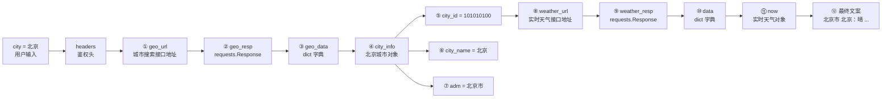

# ReAct Agent 项目完整解析 (test2)

> 本文档是对 `test2/` 项目的逐行级解析，目标读者：只懂 LangChain、想理解 LangGraph 和 ReAct 原理的开发者。
>
> test2 是 test1 的升级版，核心改进：**用 `providers.toml` 查表替代硬编码 if-elif**，**.env 极简配置**，**package 化（`python -m test2`）**。

---

## 目录

- **一、项目概述**
  - 1.1 这个项目做什么？
  - 1.2 test2 vs test1：改了什么？
  - 1.3 技术栈
  - 1.4 文件结构
- **二、ReAct 原理讲解**
  - 2.1 什么是 ReAct？
  - 2.2 三步循环详解
  - 2.3 为什么循环不会无限跑？
- **三、LangGraph 核心概念（对照 LangChain）**
  - 3.1 从 LangChain 到 LangGraph
  - 3.2 LangGraph 的 3 个核心组件
- 3.3 `MessagesState` 和 `add_messages` 是什么？
- **四、逐文件深度解析**
  - 4.1 `providers.toml` — 供应商预设表（test2 核心改进）
  - 4.2 `config.py` — LLM Provider 配置（查表模式）
  - 4.3 `tools.py` — 工具定义
    - 工具 1：计算器 `calculator`
    - 工具 2：天气查询 `weather`
      - 第一步：城市搜索接口 — 逐行拆解
      - 第二步：实时天气接口 — 逐行拆解
      - 完整示例：一次天气查询的变量快照（以北京为例）
    - 工具导出
  - 4.4 `graph.py` — 图定义（核心文件）
    - 第一层：State 定义
    - 第二层：节点函数
    - 第三层：条件边
    - 第四层：组装图
    - 第五层：State 逐步变化
  - 4.5 `__main__.py` — 运行入口
    - Provider 读取
    - 调用图引擎
    - 日志打印
- **五、完整数据流图**
- **六、test2 架构设计分析**
  - 6.1 查表模式（Table-Driven Configuration）
  - 6.2 协议抽象
  - 6.3 与 test1 的架构演进
- **七、与 Claude Code (CCB) 的对比**
- **八、扩展指南**
  - 8.1 添加新供应商
  - 8.2 添加新工具
  - 8.3 添加记忆功能
  - 8.4 添加循环反思
- **九、常见问题**
- **十、运行调试**
  - 启动
  - 测试用例
  - 查看图结构（调试用）

---

## 一、项目概述

### 1.1 这个项目做什么？

这是一个**最小化的 ReAct Agent**，能在终端里和你对话，并通过工具完成任务。和 test1 一样。

```
你: 北京今天天气怎么样？如果温度升高3度是多少？

Agent 内部发生的事：
  第 1 轮 Think → Act → Observe：
    🤔 AI 分析：用户问天气，需要调用 weather 工具
    ⚡ 执行：weather("北京") → "北京：晴，气温 25°C..."
    👁️ 观察：拿到结果

  第 2 轮 Think → Act → Observe：
    🤔 AI 分析：当前 25°C，升高 3 度需要计算 25+3
    ⚡ 执行：calculator("25 + 3") → "28"
    👁️ 观察：拿到结果

  第 3 轮 Think：
    🤔 AI 分析：两个问题都回答了，不需要再行动
    → 结束，返回最终回复

📎 北京今天天气：晴，气温 25°C。升高 3 度后为 28°C。
```

### 1.2 test2 vs test1：改了什么？

| 维度 | test1 | test2 |
|------|-------|-------|
| Provider 配置 | `config.py` 中 if-elif 硬编码 | `providers.toml` 查表 + `config.py` 只负责查表和创建实例 |
| 添加新供应商 | 改代码（在 config.py 加 elif 分支） | 改配置（在 providers.toml 加一个 section） |
| .env 复杂度 | 每个供应商一个 `_API_KEY` 变量 | 统一 `LLM_API_KEY`，极简 3 行 |
| 运行方式 | `python run.py` | `python -m test2`（标准 package） |
| 天气工具 | 模拟数据（离线） | 和风天气 API（实时数据） |
| 供应商数量 | 4 个 | 9 个（含 custom） |

### 1.3 技术栈

| 层级 | 技术 | 作用 |
|------|------|------|
| 图引擎 | LangGraph | 定义 ReAct 循环的状态图 |
| LLM 抽象 | LangChain Core | 消息类型、工具接口、bind_tools |
| LLM 提供商 | langchain-anthropic / langchain-openai | 对接 9 家供应商 |
| 配置 | TOML | 供应商预设（查表模式） |
| 运行时 | Python 3.10+ | 标准 package（pyproject.toml） |

### 1.4 文件结构

```
test2/
├── README.md           使用说明
├── .env                环境变量（不提交Git）
├── .env.example        环境变量模板
├── wiki.md             本文件（逐行解析）
├── pyproject.toml      Python 项目配置
└── src/test2/
    ├── __main__.py     运行入口                          [132 行]
    ├── config.py       LLM Provider 配置（查表模式）      [95 行]
    ├── providers.toml  供应商预设表（核心改进）            [50 行]
    ├── graph.py        LangGraph 图定义                   [192 行]
    ├── tools.py        工具定义（含和风天气 API）          [97 行]
```

---

## 二、ReAct 原理讲解

### 2.1 什么是 ReAct？

ReAct = **Re**asoning + **Act**ing，2022 年由 Yao et al. 提出的 Agent 范式：

```
传统 LLM：  问题 → 思考 → 回答（只能想，不能做）

ReAct Agent：问题 → 思考 → 行动 → 观察 → 思考 → 行动 → ... → 回答
                           ↑_________________________|
                                    循环直到完成
```

**核心思想**：让 AI 不只是"想"，还能"做"，做完之后根据结果继续"想"。

### 2.2 三步循环详解

| 步骤 | 英文 | 做什么 | 对应本项目的节点 |
|------|------|--------|-----------------|
| 思考 | Think | AI 分析当前状态，决定下一步 | `think_node()` |
| 行动 | Act | 执行 AI 请求的工具 | `act_node()` |
| 观察 | Observe | 收集工具执行结果，更新状态 | `observe_node()` |

### 2.3 为什么循环不会无限跑？

两层保护：

```
第 1 层：AI 自己判断
  think 节点返回 should_act=False → 循环结束
  （AI 认为任务已完成，不再请求工具）

第 2 层：硬性上限
  MAX_ITERATIONS = 35（graph.py L145）
  recursion_limit = 105（__main__.py，MAX_ITERATIONS × 3）
  超过上限 → LangGraph 自动抛出异常
```

---

## 三、LangGraph 核心概念（对照 LangChain）

### 3.1 从 LangChain 到 LangGraph

你用过 LangChain 的 `AgentExecutor`，它是这样的：

```python
# LangChain 方式（黑盒）
from langchain.agents import AgentExecutor, create_tool_calling_agent

executor = AgentExecutor(agent=agent, tools=tools, max_iterations=10)
result = executor.invoke({"input": "..."})
# 内部发生了什么？你看不到。
```

LangGraph 的方式：

```python
# LangGraph 方式（显式）
graph = StateGraph(ReActState)
graph.add_node("think", think_node)     # 每一步都显式定义
graph.add_node("act", act_node)
graph.add_edge("think", "act")          # 连接关系也显式
app = graph.compile()
result = app.invoke(initial_state)
```

**关键区别**：

| 对比项 | LangChain AgentExecutor | LangGraph StateGraph |
|--------|------------------------|---------------------|
| 循环逻辑 | 隐藏在内部 | 显式定义为图结构 |
| 状态管理 | 内部管理 messages | 你定义 State，完全可控 |
| 条件分支 | 不支持 | `add_conditional_edges()` |
| 中间状态 | 不可访问 | 每个节点都能读写状态 |
| 可视化 | 不支持 | 可导出为 Mermaid 图 |

### 3.2 LangGraph 的 3 个核心组件

```
StateGraph（状态图）
  │
  ├── State（状态）
  │     定义：TypedDict，所有节点共享的数据结构
  │     本项目：ReActState（继承 MessagesState，追加 should_act / tool_calls / iteration）
  │
  ├── Node（节点）
  │     定义：一个普通 Python 函数，接收 state，返回要更新的字段
  │     本项目：think_node, act_node, observe_node
  │
  └── Edge（边）
        定义：节点之间的连接，分为普通边和条件边
        本项目：
          think ──条件边──→ act 或 END
          act   ──普通边──→ observe
          observe ──普通边──→ think（形成循环）
```

### 3.3 `MessagesState` 和 `add_messages` 是什么？

这是 LangGraph 最重要的概念之一：

```python
class ReActState(MessagesState):
    should_act: bool
    tool_calls: list
    iteration: int
```

`MessagesState` 自带：

```python
messages: Annotated[list[AnyMessage], add_messages]
```

**含义**：节点只需要返回本轮新增消息，`add_messages` 会按消息 `id` 合并历史。无重复 `id` 时追加，相同 `id` 时替换，并支持用 `RemoveMessage` 删除历史。

```
初始 state:  messages = [HumanMessage("北京天气")]

think_node 返回:  messages = [AIMessage(tool_calls=[weather])]
  → state.messages = [HumanMessage, AIMessage]   ← 拼接

act_node 返回:  messages = [ToolMessage("晴天 25°C")]
  → state.messages = [HumanMessage, AIMessage, ToolMessage]   ← 继续拼接

下一轮 think_node 返回:  messages = [AIMessage(tool_calls=[calculator])]
  → state.messages = [HumanMessage, AIMessage, ToolMessage, AIMessage]   ← 继续拼接
```

如果不用 reducer，每次返回都会**覆盖**之前的历史，AI 就"失忆"了。`add_messages` 就是 LangGraph 为对话消息准备的标准 reducer。

---

## 四、逐文件深度解析

### 4.1 `providers.toml` — 供应商预设表（test2 核心改进）

**职责**：集中管理所有 LLM 供应商的连接信息。代码只需查表，不需硬编码。

**设计意图**：test1 中每加一个供应商就要在 `config.py` 里加一个 `elif` 分支，代码和配置耦合在一起。test2 把"供应商有哪些、怎么连接"完全抽离到 TOML 文件中，`config.py` 只负责"根据名字查表、根据协议创建实例"。

```toml
[openai]
protocol = "openai"
base_url = "https://api.openai.com/v1"
models = ["gpt-4o", "gpt-4o-mini", "gpt-4-turbo", "o4-mini"]

[deepseek]
protocol = "openai"
base_url = "https://api.deepseek.com/v1"
models = ["deepseek-chat", "deepseek-reasoner"]

[anthropic]
protocol = "anthropic"
models = ["claude-sonnet-4-20250514", "claude-haiku-3-5-20251022", "claude-opus-4-20250514"]
```

**每个 section 的含义**：

| 字段 | 说明 | 示例 |
|------|------|------|
| `protocol` | 协议类型，决定用哪个 LangChain 客户端 | `"openai"` 或 `"anthropic"` |
| `base_url` | API 端点地址（openai 协议必须；anthropic 协议无需，SDK 内置） | `"https://api.openai.com/v1"` |
| `models` | 该供应商支持的模型列表 | `["gpt-4o", "gpt-4o-mini"]` |

**为什么大部分供应商都用 `protocol = "openai"`？**

因为它们都实现了 OpenAI 兼容的 API 格式（`/v1/chat/completions`），可以复用 `langchain-openai` 的 `ChatOpenAI` 客户端，只需改 `base_url`：

```
OpenAI 官方:     https://api.openai.com/v1
DeepSeek:        https://api.deepseek.com/v1
智谱:            https://open.bigmodel.cn/api/paas/v4/
阿里百炼:        https://dashscope.aliyuncs.com/compatible-mode/v1
Ollama 本地:     http://localhost:11434/v1
SiliconFlow:     https://api.siliconflow.cn/v1
Groq:            https://api.groq.com/openai/v1
                 ↑ 格式一样，只是地址不同
```

唯一例外是 Anthropic，它有自己的原生 SDK（`langchain-anthropic`），不走 OpenAI 兼容格式。

**custom section**：给用户一个"完全自定义"的入口。没有预设 `base_url`，需要用户在 `.env` 里填 `LLM_BASE_URL`。

**添加新供应商的操作**：只需在 `providers.toml` 加一个 section，不需要改任何 Python 代码。

---

### 4.2 `config.py` — LLM Provider 配置（查表模式）

**职责**：从 `.env` 读 `LLM_PROVIDER` → 查 `providers.toml` → 返回 LLM 实例。

**核心流程**：

```
.env 中的 LLM_PROVIDER 和 LLM_MODEL
        │
        ▼
  查 providers.toml
        │
        ├── 找到 → 读 protocol 字段
        │           ├── "anthropic" → ChatAnthropic(...)
        │           └── "openai"    → ChatOpenAI(base_url=..., ...)
        │
        └── 找不到 → 抛 ValueError，提示支持的供应商列表
```

**关键代码逻辑**（config.py 第 49-79 行）：

```python
# 1. 查表
preset = PRESETS.get(provider)
if not preset:
    raise ValueError(f"未知的 LLM_PROVIDER: '{provider}'")

# 2. 读协议类型
protocol = preset.get("protocol", "openai")

# 3. 根据协议创建对应客户端
if protocol == "anthropic":
    return ChatAnthropic(model=..., api_key=..., temperature=...)

if protocol == "openai":
    base_url = preset.get("base_url") or os.getenv("LLM_BASE_URL", "")
    return ChatOpenAI(model=..., base_url=base_url, ...)
```

**与 test1 的关键区别**：

| 维度 | test1 config.py | test2 config.py |
|------|----------------|----------------|
| 供应商信息 | 硬编码在 if-elif 分支中 | 从 providers.toml 动态读取 |
| 添加供应商 | 改 Python 代码 | 改 TOML 配置 |
| 模型列表 | 散落在各分支 | 集中在 providers.toml |
| 代码行数 | ~60 行（含供应商信息） | ~80 行（含注释和错误提示） |

**环境变量读取**（config.py 第 36-40 行）：

```python
provider = (provider or os.getenv("LLM_PROVIDER", "")).strip().lower()
model = os.getenv("LLM_MODEL", "").strip()
api_key = os.getenv("LLM_API_KEY", "").strip()
```

统一使用 `LLM_API_KEY` 一个变量，不管用哪家供应商。这比 test1 的 `ANTHROPIC_API_KEY` / `OPENAI_API_KEY` / `ZHIPU_API_KEY` 各自独立的方式简洁得多——因为用户一次只会用一家供应商。

---

### 4.3 `tools.py` — 工具定义

**职责**：定义 AI 可以调用的工具。

#### 工具 1：计算器 `calculator`

```python
@tool
def calculator(expression: str) -> str:
```

**安全设计**（第 21-34 行）：

```python
safe_ns = {
    "__builtins__": {},   # ← 禁用所有内置函数（防止代码注入）
    "sqrt": math.sqrt,    # ← 只开放数学函数
    "sin": math.sin,
    ...
}
result = eval(expression, safe_ns)
```

为什么 `__builtins__` 要设为空？因为 `eval()` 默认可以执行任意 Python 代码：

```python
# 如果不安全，AI 可能生成这样的表达式：
eval("__import__('os').system('rm -rf /')")   # 删除整个系统！

# 设置 __builtins__ = {} 后，__import__ 不可用，这行会报错
```

#### 工具 2：天气查询 `weather`

**与 test1 的关键区别**：test1 用模拟数据（字典硬编码），test2 调用**和风天气实时 API**。

两步 API 调用：

```
1. 城市搜索：中文名 → LocationID
   GET /geo/v2/city/lookup?location=北京 → 返回 city_id

2. 实时天气：LocationID → 天气数据
   GET /v7/weather/now?location={city_id} → 返回温度/湿度/风向等
```

需要配置环境变量 `QWEATHER_API_HOST` 和 `QWEATHER_API_KEY`。

##### 第一步：城市搜索接口 — 逐行拆解

```python
geo_resp = requests.get(geo_url, params={"location": city, "range": "cn", "number": 1}, headers=headers, timeout=5)
geo_data = geo_resp.json()
if geo_data.get("code") != "200" or not geo_data.get("location"):
    return f"未找到城市「{city}」，请检查城市名称"
city_info = geo_data["location"][0]
city_id = city_info["id"]
city_name = city_info["name"]
adm = city_info.get("adm1", "")
```

###### 第 1 行：`geo_resp = requests.get(geo_url, params={...}, headers=headers, timeout=5)`

### 整体作用
向**和风地理编码接口**发送**GET网络请求**，用城市中文名查询匹配的城市信息，把服务器返回的所有数据存入对象 `geo_resp`。
逐个解析入参：
1. **geo_url**
固定接口地址：`https://{api_host}/geo/v2/city/lookup`，是和风天气用来「文字地名→城市唯一ID」的专用接口。
2. **params={...}**
GET请求的**查询参数**，会自动拼接在网址末尾，不需要手动拼接字符串：
- `location: city`：核心参数，把用户传入的城市名（合肥、北京等）传给接口，作为搜索关键词；
- `range: "cn"`：限定搜索范围仅为**中国大陆**，规避国外同名城市（比如国内"伦敦镇"和英国伦敦区分开）；
- `number: 1`：要求接口**只返回1条匹配结果**，默认取相似度最高、最热门的城市，简化后续代码，不用做多选逻辑。
3. **headers=headers**
带上之前定义的鉴权头 `{"X-QW-Api-Key": api_key}`，接口校验密钥，判断你是否有权限调用。
4. **timeout=5**
超时限制：如果服务器5秒内没有返回数据，直接抛出`Timeout`超时异常，终止本次请求。
目的：防止网络卡顿、服务器宕机时，代码长时间卡死阻塞整个智能体循环。
5. **geo_resp**
请求完成后得到的**响应对象**，里面包含：服务器状态码、原始文本、json数据、响应头等全部网络返回内容。

###### 第 2 行：`geo_data = geo_resp.json()`
### 详细解释
1. 接口返回的数据是**JSON格式字符串**，人类和Python都不方便读取；
2. `.json()` 是requests内置方法：自动把JSON字符串**解析转换成Python字典dict**；
3. 转换后`geo_data`就是标准字典，可以用`字典["键名"]`、`.get()`取值。
示例转换前后：
原始字符串：`{"code":"200","location":[{"id":"101010100","name":"北京"}]}`
转为字典：`{"code":"200", "location": [{"id": "101010100", "name": "北京"}]}`

补充：
如果接口返回格式错乱，该行会触发解析异常，会被最下方的异常捕获捕获。

###### 第 3 行：`if geo_data.get("code") != "200" or not geo_data.get("location"):`
### 两个判断条件，满足任意一个就判定查询失败
#### 条件1：`geo_data.get("code") != "200"`
- 和风天气所有接口约定：`code="200"` 代表接口**业务正常执行**；
- 非200：代表请求出错（密钥错误、接口限流、调用超限、参数非法等）；
- 用`.get("code")`而不是`geo_data["code"]`：
  防止极端情况字典无`code`键，`[]`取值会直接报错，`.get()`找不到键会返回`None`，更安全。

#### 条件2：`not geo_data.get("location")`
- `location`是接口返回的城市列表，类型为列表list；
- 找不到城市时，`location`为空列表`[]`，空列表布尔值为False；
- `not 空列表` 结果为True，代表没有匹配到目标城市。

#### 逻辑`or`
两个条件**任意一个成立**，直接执行return，终止当前函数，返回提示文本给到LLM。

###### 第 4 行：`city_info = geo_data["location"][0]`
1. `geo_data["location"]`：接口返回的城市数组列表，`[城市对象1,城市对象2...]`；
2. `[0]`：取列表**第一个元素**，对应前面参数`number=1`，也就是匹配度最高的城市；
3. `city_info`：赋值后是单个城市字典，形如`{"id":"xxx","name":"xxx","adm1":"xxx"}`。

### 为什么不用.get()？
前面if已经提前校验过`location`一定存在且非空，所以这里可以直接用`[]`精准取值。

###### 第 5 行：`city_id = city_info["id"]`
提取城市唯一数字ID。
核心用途：**实时天气接口不支持中文城市名，只能用id查询天气**，这是整个两步请求的核心目的。

###### 第 6 行：`city_name = city_info["name"]`
提取接口标准化城市名称。
作用：用户输入别名（如"帝都""庐州"），接口会返回标准地名，用来统一最终展示文案，避免名称混乱。

###### 第 7 行：`adm = city_info.get("adm1", "")`
1. `adm1`：和风接口固定字段，代表**一级行政区**（省份、直辖市），比如合肥市adm1=安徽省，北京市adm1=北京市；
2. `.get("adm1", "")`：
   部分小众县级城市可能无adm1字段，找不到键不会报错，默认赋值为空字符串`""`；
3. 赋值给adm变量：后续拼接天气文案，用来显示省份，提升可读性。

###### 本段整体执行流程梳理
1. 发起GET请求 → 拿到网络响应；
2. 响应转为字典，方便取值；
3. 双重校验：接口是否正常、有无匹配城市；
4. 校验失败：返回文字提示，函数结束；
5. 校验成功：取出列表第一个城市对象；
6. 分别提取：天气查询必备id、标准城市名、省份名称；
7. 本段执行完毕，进入下一段实时天气接口请求逻辑。

##### 第二步：实时天气接口 — 逐行拆解

```python
# 2. 实时天气
weather_url = f"https://{api_host}/v7/weather/now"
weather_resp = requests.get(weather_url, params={"location": city_id, "lang": "zh"}, headers=headers, timeout=5)
data = weather_resp.json()
if data.get("code") != "200":
    return f"天气查询失败：API 返回错误码 {data.get('code')}"
now = data["now"]
return (
    f"{adm} {city_name}：{now['text']}，"
    f"气温 {now['temp']}°C，体感 {now['feelsLike']}°C，"
    f"湿度 {now['humidity']}%，{now['windDir']} {now['windScale']}级"
)
```

###### 第 1 行：`weather_url = f"https://{api_host}/v7/weather/now"`

### 整体作用
拼接**实时天气接口**的完整地址。和风天气把「地理编码」和「实时天气」拆成两套独立接口：
- 第一步用过的 `/geo/v2/city/lookup`：文字地名 → 城市唯一 ID；
- 本行用到的 `/v7/weather/now`：城市 ID → 当前实时天气。

`v7` 是接口版本号，`weather/now` 表示「此刻的实况天气」。用 f-string 把配置好的 `api_host` 拼进地址。

###### 第 2 行：`weather_resp = requests.get(weather_url, params={"location": city_id, "lang": "zh"}, headers=headers, timeout=5)`

### 整体作用
向实时天气接口发送 GET 请求，用**第一步拿到的 `city_id`** 查询天气。

逐个解析入参：
1. **`location: city_id`**
   核心参数。注意传的是**城市数字 ID**，不是中文名——实时天气接口只认 ID 不认地名。这正是第一步先做城市搜索的根本原因：两步请求靠 `city_id` 串联。
2. **`lang: "zh"`**
   指定返回语言为中文。天气现象字段 `text` 会直接返回「晴」「多云」「小雨」，省去二次翻译。
3. **`headers=headers`** / **`timeout=5`**
   与第一步完全相同的鉴权头和 5 秒超时兜底。

###### 第 3 行：`data = weather_resp.json()`

### 详细解释
同第一步第 2 行：把接口返回的 JSON 字符串解析为 Python 字典，后续所有取值都基于 `data`。

###### 第 4 行：`if data.get("code") != "200":`

### 整体作用
再次校验业务状态码。和风天气无论哪个接口，`code="200"` 都代表业务正常。这一步防御的是：`city_id` 失效（城市被下线）、接口限流、密钥权限不足、参数非法等。

校验风格与第一步完全一致——每个接口调用后都做一次业务校验，形成统一的防御习惯。

###### 第 5 行：`return f"天气查询失败：API 返回错误码 {data.get('code')}"`

### 详细解释
校验失败时，把具体错误码拼进文案返回给 LLM。注意这里返回的是**字符串**而非抛异常——这是工具函数的约定：工具永远返回文本给 LLM，由 LLM 组织成用户能看懂的话，而不是让程序崩溃。

###### 第 6 行：`now = data["now"]`

### 详细解释
1. `data["now"]`：实时天气数据对象（字典），包含 `text`（天气现象）、`temp`（气温）、`feelsLike`（体感）、`humidity`（湿度）、`windDir`（风向）、`windScale`（风力等级）等字段；
2. 用 `[]` 而非 `.get()`：前面已校验 `code=200`，`now` 必然存在，直接取值更简洁；
3. 把常用字段提取到 `now` 变量，后续拼文案时免去重复写 `data["now"]["temp"]` 长路径。

###### 第 7-9 行：`return (...)` 多行拼接

### 整体作用
把天气数据拼成一句**人类可读的自然语言**返回给 LLM，最终效果形如：

```text
安徽省 合肥市：多云，气温 28°C，体感 30°C，湿度 62%，东南风 3级
```

逐段解析：
1. `{adm} {city_name}`——省份 + 标准城市名，来自第一步提取的变量，用户输入「庐州」也会统一显示为「合肥」；
2. `{now['text']}`——天气现象（晴/多云/小雨…）；
3. `{now['temp']}`、`{now['feelsLike']}`——气温与体感温度，单位 °C；
4. `{now['humidity']}`——相对湿度百分比；
5. `{now['windDir']}`、`{now['windScale']}`——风向与风力等级。

### 为什么用多行括号写法？
Python 圆括号内的字符串可**隐式换行拼接**。每条天气信息独立成段，一眼能看清返回了哪些字段；单行写法会超过 80 字符，可读性差。

### 为什么返回字符串而不是结构化数据？
整个 ReAct 流程里，工具与 LLM 只通过**字符串**通信：LLM 发起工具调用 → 工具执行 → 返回文本 → LLM 组织成自然语言回复。返回字符串让 LLM 可直接引用，无需二次解析。

###### 异常处理：`except` 三层兜底（外层整体）

整段代码被 `try` 包裹，任何一行出错都会被外层捕获，统一转成友好文案：

| 异常类型 | 触发场景 | 返回文案 |
|---|---|---|
| `requests.exceptions.Timeout` | 5 秒内无响应（网络卡顿/服务宕机） | `天气查询超时，请稍后重试` |
| `requests.exceptions.RequestException` | 网络层错误（DNS 解析失败、连接被拒等） | `天气查询网络错误：{e}` |
| `KeyError` / `IndexError` | 接口返回结构异常，缺字段或列表越界 | `天气数据解析错误：{e}` |

设计意图：**工具永不崩溃**。无论 API 抽风还是网络抖动，工具永远返回一段可读文本，保证 ReAct 循环不断链。

###### 本段整体执行流程梳理

1. 拼接实时天气接口地址（`/v7/weather/now`）；
2. 用第一步拿到的 `city_id` + 中文语言参数发 GET 请求；
3. 响应 JSON 转为字典；
4. 校验业务状态码，非 200 直接返回错误文案；
5. 取出 `now` 实时天气对象；
6. 拼接「省份 城市：天气现象，气温，体感，湿度，风向风力」的自然语言文案；
7. 任何一步异常，由三层 except 兜底，返回友好提示；
8. weather 工具全流程闭环：`城市名 → 城市 ID → 实时天气 → 自然语言文案`。

##### 完整示例：一次天气查询的变量快照（以北京为例）

> 示例数据为**演示用**，按和风天气官方 API 返回格式模拟构造。真实运行时字段名一致，但值随城市/时间变化。

这里把 `weather("北京")` 从**代码逐行**抽象为**变量快照**，让你直观看到每个变量"长什么样"。先看整条数据链：



###### 配置与鉴权头

```python
# 来自 .env
api_host = "devapi.qweather.com"
api_key  = "YOUR_API_KEY"          # 真实运行时是用户填的密钥

headers = {"X-QW-Api-Key": "YOUR_API_KEY"}
```

`headers` 就是一行字典：键 `X-QW-Api-Key` 是和风天气固定的鉴权头字段名，值就是你的密钥。两个 API 请求都带上它。

###### ① geo_url — 城市搜索接口地址

```python
geo_url = "https://devapi.qweather.com/geo/v2/city/lookup"
```

纯字符串，固定不变。真正的参数在下面通过 `params=` 自动拼接。

###### ② geo_resp — 城市搜索的响应对象

```python
geo_resp = requests.get(geo_url, params={...}, headers=headers, timeout=5)
```

`geo_resp` 是一个 `requests.Response` 对象，不是字典。你关心它的几个关键属性：

```
geo_resp.status_code   → 200          # HTTP 状态码
geo_resp.url           → "https://devapi.qweather.com/geo/v2/city/lookup?location=北京&range=cn&number=1"
                                      # 参数已自动拼进 url
geo_resp.json()        → 返回下面的 geo_data（dict）
```

注意 `url` 里能看到 `params` 已经生效：`location=北京&range=cn&number=1`。这就是"传 `params` 比手动拼字符串安全"的体现。

###### ③ geo_data — 转为字典后的城市搜索结果

```python
geo_data = geo_resp.json()
```

`geo_data` 是一个标准 Python 字典，长这样：

```json
{
  "code": "200",
  "location": [
    {
      "id": "101010100",
      "name": "北京",
      "adm1": "北京市",
      "adm2": "北京市",
      "lat": "39.90469",
      "lon": "116.40717",
      "country": "中国"
    }
  ]
}
```

`code="200"` 表示业务正常；`location` 是匹配到的城市列表（因为我们传了 `number=1`，只返回 1 条）。

###### ④ city_info — 北京城市对象

```python
city_info = geo_data["location"][0]   # 取列表第一个
```

`city_info` 是上面 `location` 列表里的第一个元素，即**北京这一个城市的字典**：

```json
{
  "id": "101010100",
  "name": "北京",
  "adm1": "北京市",
  "lat": "39.90469",
  "lon": "116.40717",
  "country": "中国"
}
```

###### ⑤ city_id — 城市唯一数字 ID

```python
city_id = city_info["id"]   # → "101010100"
```

`"101010100"` 是北京在和风天气的 **LocationID**。它是第二步实时天气接口的**唯一入参**——这是整条数据链的核心中转站。

###### ⑥ city_name — 标准化城市名

```python
city_name = city_info["name"]   # → "北京"
```

用户输入别名（如"帝都"）时，接口会返回标准名，保证最终文案统一。

###### ⑦ adm — 一级行政区

```python
adm = city_info.get("adm1", "")   # → "北京市"
```

北京是直辖市，`adm1` 就是"北京市"（等于城市名）。如果是普通地级市，如合肥，`adm1 = "安徽省"`。

###### ⑧ weather_url — 实时天气接口地址

```python
weather_url = f"https://devapi.qweather.com/v7/weather/now"
```

与 `geo_url` 不同，这里用的是**另一个接口**：`/geo/v2/city/lookup`（地名→ID）已用完，轮到 `/v7/weather/now`（ID→天气）。

###### ⑨ weather_resp — 实时天气的响应对象

```python
weather_resp = requests.get(weather_url, params={"location": city_id, "lang": "zh"}, headers=headers, timeout=5)
```

关键属性：

```
weather_resp.status_code   → 200
weather_resp.url           → "https://devapi.qweather.com/v7/weather/now?location=101010100&lang=zh"
                                      # 注意 location 传的是 city_id，不是中文名
weather_resp.json()        → 返回下面的 data（dict）
```

注意 `url` 里是 `location=101010100`，证明第一步的 `city_id` 已被正确传给第二步——两步接口靠它串联。

###### ⑩ data — 转为字典后的实时天气结果

```python
data = weather_resp.json()
```

```json
{
  "code": "200",
  "updateTime": "2025-06-01T10:20+08:00",
  "now": {
    "obsTime": "2025-06-01T10:20+08:00",
    "temp": "25",
    "feelsLike": "26",
    "text": "晴",
    "windDir": "东北风",
    "windScale": "3",
    "humidity": "40",
    "pressure": "1006",
    "vis": "20"
  }
}
```

###### ⑪ now — 实时天气对象

```python
now = data["now"]
```

`now` 就是上面 `data["now"]` 这个字典，代码把它单独抽出来，后续拼文案时不用写很长的 `data["now"]["temp"]`：

```json
{
  "temp": "25",
  "feelsLike": "26",
  "text": "晴",
  "windDir": "东北风",
  "windScale": "3",
  "humidity": "40"
}
```

###### ⑫ 最终返回 — 拼接成自然语言文案

```python
return (
    f"{adm} {city_name}：{now['text']}，"
    f"气温 {now['temp']}°C，体感 {now['feelsLike']}°C，"
    f"湿度 {now['humidity']}%，{now['windDir']} {now['windScale']}级"
)
```

把第⑦⑥⑤提取的信息和 `now` 的字段拼起来，最终返回给 LLM 的字符串是：

```text
北京市 北京：晴，气温 25°C，体感 26°C，湿度 40%，东北风 3级
```

**整条数据链回顾**：

```
"北京" → headers → geo_url → geo_resp → geo_data → city_info
   → city_id="101010100" → weather_url → weather_resp → data → now
   → "北京市 北京：晴，气温 25°C，体感 26°C，湿度 40%，东北风 3级"
```

---

#### 工具导出（第 92-96 行）

```python
TOOLS = [calculator, weather]
TOOL_MAP = {t.name: t for t in TOOLS}
```

- `TOOLS`：列表，传给 `llm.bind_tools()` 让 AI 知道有哪些工具可用
- `TOOL_MAP`：字典，`act_node` 执行工具时快速查找

---

### 4.4 `graph.py` — 图定义（核心文件）

**职责**：定义 ReAct 循环的完整图结构。与 test1 相比，graph.py 几乎没有变化——因为 ReAct 循环逻辑本身没变，变的只是外围的配置方式。

#### 第一层：State 定义（第 26-37 行）

```python
class ReActState(MessagesState):
    should_act: bool      # 是否需要执行工具
    tool_calls: list      # 待执行的工具调用列表
    iteration: int        # 循环计数
```

每个字段的作用：

| 字段 | 类型 | 谁写入 | 谁读取 | 说明 |
|------|------|--------|--------|------|
| `messages` | `list[AnyMessage]` | think, act | think | 整个对话历史，由 MessagesState 提供 |
| `should_act` | `bool` | think | should_continue | 是否继续循环 |
| `tool_calls` | `list` | think | act | 待执行的工具列表 |
| `iteration` | `int` | observe | __main__.py（日志） | 循环轮次 |

**关于 `thought` 字段的一个细节**：`ReActState` 中继承并声明了 `messages / should_act / tool_calls / iteration`，**没有** `thought`。但 `think_node` 的返回 dict 里仍然写了 `"thought": ...`——这是从 test1 残留的写法。LangGraph 对"未在 `ReActState` 中声明的键"会**静默忽略**，既不报错也不存入状态，所以实际 State 里永远不会有 `thought`。真正的日志信息是从 `messages` 中解析的（见 4.5 节 `print_state_changes`）。

#### 第二层：节点函数（第 43-108 行）

**think_node（第 43-60 行）**：

```python
def think_node(state: ReActState, llm_with_tools) -> dict:
    response = llm_with_tools.invoke(state["messages"])
    has_tool_calls = bool(response.tool_calls)
    return {
        "messages": [response],
        "thought": response.content or "(AI 请求调用工具)",
        "should_act": has_tool_calls,
        "tool_calls": response.tool_calls or [],
    }
```

执行流程：

```
输入：state["messages"] = [HumanMessage, AIMessage, ToolMessage, ...]
  ↓
调用 LLM：llm_with_tools.invoke(messages)
  ↓
LLM 返回 response，包含：
  - content: "我来帮你查天气"（文字回复）
  - tool_calls: [{"name": "weather", "args": {"city": "北京"}, "id": "xxx"}]
  ↓
输出：更新 state 的 3 个字段
```

**为什么用 `llm_with_tools` 而不是 `llm`？**

```python
llm_with_tools = llm.bind_tools(TOOLS)   # graph.py 第 144 行
```

`bind_tools()` 做了什么？它在发给 LLM 的请求中附加了工具的 JSON Schema，让 AI 知道：
- 有哪些工具可用
- 每个工具的参数是什么
- 什么时候该调用哪个工具

没有 `bind_tools()`，AI 就不知道工具的存在，永远不会返回 `tool_calls`。

**act_node（第 63-90 行）**：

```python
def act_node(state: ReActState) -> dict:
    results = []
    for call in state["tool_calls"]:
        tool = TOOL_MAP.get(call["name"])
        content = tool.invoke(call["args"])
        results.append(ToolMessage(content=str(content), tool_call_id=call["id"]))
    return {"messages": results}
```

这里有个细节：`tool_call_id=call["id"]`。LangChain 要求 `ToolMessage` 必须带 `tool_call_id`，用来匹配"这个结果是哪个工具调用的"。如果不带，LLM 收到消息后不知道对应关系，会报错。

**observe_node（第 93-108 行）**：

```python
def observe_node(state: ReActState) -> dict:
    return {"iteration": state["iteration"] + 1}
```

这个节点很轻量，只做一件事：递增计数器。为什么单独成一个节点？

1. **架构清晰**：Think → Act → Observe 三步完整体现
2. **扩展性**：未来可以在这里加日志、反思、记忆存储等逻辑
3. **教学价值**：让学生看到完整的 ReAct 三步

#### 第三层：条件边（第 111-120 行）

```python
def should_continue(state: ReActState) -> str:
    if state["should_act"]:
        return "act"
    return "end"
```

这是循环的"开关"：

```
think 节点执行完毕
  ↓
should_continue() 被调用
  ├── state["should_act"] == True  → 返回 "act"  → 去执行工具
  └── state["should_act"] == False → 返回 "end"  → 结束循环
```

#### 第四层：组装图（第 130-173 行）

```python
def build_graph(provider: str = "anthropic"):
    llm = get_llm(provider)
    llm_with_tools = llm.bind_tools(TOOLS)

    graph = StateGraph(ReActState)

    graph.add_node("think", lambda state: think_node(state, llm_with_tools))
    graph.add_node("act", act_node)
    graph.add_node("observe", observe_node)

    graph.set_entry_point("think")

    graph.add_conditional_edges("think", should_continue, {
        "act": "act",
        "end": END,
    })

    graph.add_edge("act", "observe")
    graph.add_edge("observe", "think")

    app = graph.compile()
    return app
```

**逐行解释**：

| 行 | 代码 | 做了什么 |
|----|------|---------|
| 141 | `llm = get_llm(provider)` | 创建 LLM 实例（走查表逻辑） |
| 144 | `llm.bind_tools(TOOLS)` | 把工具 schema 注入 LLM |
| 147 | `StateGraph(ReActState)` | 创建空图，指定状态类型 |
| 150 | `add_node("think", ...)` | 注册 think 节点 |
| 151 | `add_node("act", ...)` | 注册 act 节点 |
| 152 | `add_node("observe", ...)` | 注册 observe 节点 |
| 155 | `set_entry_point("think")` | 入口是 think |
| 158-165 | `add_conditional_edges(...)` | think 出来后，条件判断去哪 |
| 168 | `add_edge("act", "observe")` | act → observe |
| 169 | `add_edge("observe", "think")` | observe → think（形成循环） |
| 172 | `graph.compile()` | 编译图，返回可执行的 app |

**为什么 think 节点用 lambda 包装？**

```python
# 这样写不行：
graph.add_node("think", think_node)
# 因为 think_node 需要两个参数 (state, llm_with_tools)
# 但 LangGraph 调用节点时只传一个参数 (state)

# 所以用 lambda 把 llm_with_tools 闭包进去：
graph.add_node("think", lambda state: think_node(state, llm_with_tools))
# 这样 LangGraph 调用时只传 state，llm_with_tools 从闭包获取
```

#### 第五层：State 逐步变化（以「北京天气 + 升高 3 度」为例）

这一层把前面讲的所有节点串起来，看**一次真实对话里 State 是怎么一步步变的**。数据来源正是 4.5 节的 `app.stream(stream_mode="updates")`，每次 `print_state_changes(steps)` 打印的就是下面的内容。

**三条关键规则**（决定 State 怎么变）：

| # | 规则 | 说明 |
|---|------|------|
| 1 | `messages` 用 `add_messages` **合并** | 每节点返回的 `messages` 都合并进历史，越变越长 |
| 2 | 其余字段默认**覆盖** | `should_act` / `tool_calls` / `iteration` 没声明 reducer，节点返回即覆盖旧值 |
| 3 | 节点**只更新自己返回的字段** | 没返回的字段保持原值不动 |

**整体循环结构**：

```mermaid
graph LR
    S0[初始 state<br/>messages=[H] · it=0<br/>should_act=False] --> T1[think<br/>+AIMessage(tool_calls)<br/>should_act=True]
    T1 --> A1[act<br/>+ToolMessage 天气结果]
    A1 --> O1[observe<br/>it=1]
    O1 --> T2[think<br/>+AIMessage(tool_calls)<br/>should_act=True]
    T2 --> A2[act<br/>+ToolMessage 28]
    A2 --> O2[observe<br/>it=2]
    O2 --> T3[think<br/>+AIMessage 无 tool_calls<br/>should_act=False]
    T3 --> END[END 结束]
```

###### 第 0 步：初始状态（`__main__.py` 传入）

```python
{
    "messages":   [HumanMessage(content="北京今天天气怎么样？如果温度升高3度是多少？")],
    "thought":    "",      # 被丢弃（ReActState 未声明）
    "should_act": False,
    "tool_calls": [],
    "iteration":  0,
}
```

###### 第 1 步：think 节点（第 1 轮循环）

```
输入  messages = [H]
调用  llm.invoke → AIMessage(content="我来查询天气",
                             tool_calls=[{name:"weather", args:{city:"北京"}}])
输出  {
  "messages":   [AIMessage(tool_calls=[weather])],   # 拼接 → [H, AIM]
  "thought":    "我来查询天气",                       # 被丢弃
  "should_act": True,
  "tool_calls": [{name:"weather", args:{city:"北京"}, id:"call_1"}],
}
```

`should_continue()` 读到 `should_act=True` → 走向 `act`。

###### 第 2 步：act 节点

```
输入  tool_calls = [{name:"weather", args:{city:"北京"}}]
执行  TOOL_MAP["weather"].invoke({city:"北京"})
      → 调用和风 API → "北京市 北京：晴，气温 25°C，体感 26°C，湿度 40%，东北风 3级"
输出  {
  "messages": [ToolMessage(content="北京市 北京：晴...", tool_call_id="call_1")],
         # 拼接 → [H, AIM, TM]
}
```

注意：act 只返回 `messages`，所以 `should_act=True`、`tool_calls`、`iteration=0` 都**保持原值**（规则 3）。

###### 第 3 步：observe 节点

```
输出  { "iteration": 1 }   # 覆盖 0 → 1；其余字段不动
```

`act → observe → think` 形成闭环，进入第 2 轮循环。

###### 第 4 步：think 节点（第 2 轮循环）

```
输入  messages = [H, AIM, TM(晴 25°C)]
调用  llm.invoke → AIMessage(content="当前25°C，需计算25+3",
                             tool_calls=[{name:"calculator", args:{expr:"25+3"}}])
输出  {
  "messages":   [AIMessage(tool_calls=[calculator])],   # 拼接 → [H, AIM, TM, AIM]
  "should_act": True,
  "tool_calls": [{name:"calculator", args:{expr:"25+3"}, id:"call_2"}],
}
```

`should_continue()` 再次 `should_act=True` → 走向 `act`。

###### 第 5 步：act 节点

```
输入  tool_calls = [{name:"calculator", args:{expr:"25+3"}}]
执行  calculator("25+3") → "28"
输出  {
  "messages": [ToolMessage(content="28", tool_call_id="call_2")],
         # 拼接 → [H, AIM, TM, AIM, TM]
}
```

###### 第 6 步：observe 节点

```
输出  { "iteration": 2 }   # 覆盖 1 → 2
```

###### 第 7 步：think 节点（第 3 轮循环，最后一次）

```
输入  messages = [H, AIM, TM, AIM, TM("28")]
调用  llm.invoke → AIMessage(content="北京今天天气：晴，25°C。升高3度后为28°C。",
                             tool_calls=[])     ← 无工具调用
输出  {
  "messages":   [AIMessage(content="北京今天天气：晴，25°C。...")],   # 拼接
  "thought":    "北京今天天气：晴，25°C。升高3度后为28°C。",
  "should_act": False,
  "tool_calls": [],
}
```

`should_continue()` 读到 `should_act=False` → 返回 `"end"` → 走向 `END`，循环结束。

**结束时的完整 State**：

```python
{
    "messages":   [H, AIM(weather), TM(天气), AIM(calculator), TM("28"), AIM(最终回复)],
    "should_act": False,
    "tool_calls": [],
    "iteration":  2,        # 共 2 轮完整循环
}
```

> 提示：`iteration` 最终为 2，因为它只在 `observe` 节点累加；第 3 轮 think 结束后直接 `end`，没有经过 observe。这与 4.5 节 `iterations = sum(1 for s in steps if "observe" in s)` 的统计方式一致。

---

### 4.5 `__main__.py` — 运行入口

**职责**：提供交互式终端界面，调用图引擎，打印结果。

**与 test1 的 `run.py` 的区别**：
- 改为 `__main__.py`，支持 `python -m test2` 标准 package 运行方式
- 打印方式从 `print_react_log` 改为 `print_state_changes(steps)`（逐节点打印 State 变化）
- 添加了初始化失败的错误提示

#### Provider 读取（第 57、59 行）

```python
provider = os.getenv("LLM_PROVIDER", "anthropic").strip().lower()
model = os.getenv("LLM_MODEL", "")
```

当前版本**不再支持 `--provider` 命令行参数**（旧版有，现已被移除），只从 `.env` 读取。优先级简化为一层：**`.env` 中的 `LLM_PROVIDER` > 默认值 `anthropic`**。

`build_graph(provider)` 里的 `provider` 默认值也是 `"anthropic"`（graph.py L130），两处默认值保持一致。

#### 调用图引擎（第 91-103 行）

```python
steps = list(app.stream(
    {
        "messages": [HumanMessage(content=user_input)],
        "thought": "",
        "should_act": False,
        "tool_calls": [],
        "iteration": 0,
    },
    config={"recursion_limit": MAX_ITERATIONS * 3},
    stream_mode="updates",
))
```

**注意两点变化（相对 test1 / 旧版）**：

1. **`app.invoke()` 改成了 `app.stream(stream_mode="updates")`**：不再一次性返回最终结果，而是让 LangGraph **逐步吐出每个节点的 state 更新**。返回的 `steps` 是一个列表，每个元素形如 `{节点名: {字段: 值}}`，这正是打印"State 每步变化"的数据来源（见 4.4 末尾小节）。

2. **初始状态多了 `"thought": ""`**：这是 `__main__.py` 里写的初始值。但因为 `ReActState` 没声明 `thought` 字段，LangGraph 会静默丢弃它（与 4.4 节呼应）。

**初始状态的每个字段都要给初始值**，因为 LangGraph 不会自动初始化：

| 字段 | 初始值 | 为什么 |
|------|--------|--------|
| `messages` | `[HumanMessage]` | 包含用户的提问 |
| `thought` | `""` | 残留写法，实际被丢弃（未声明） |
| `should_act` | `False` | 还没有判断 |
| `tool_calls` | `[]` | 还没有工具调用 |
| `iteration` | `0` | 循环从 0 开始 |

**`recursion_limit`**：LangGraph 的图遍历深度上限。为什么是 `MAX_ITERATIONS × 3 = 105`？因为每轮 ReAct 循环遍历 3 个节点（think → act → observe），35 轮循环 = 105 次节点遍历。

#### 日志打印（第 39-52 行）

```python
def print_state_changes(steps):
    """打印每一步 state 变化（stream_mode="updates" 捕获的记录）"""
    for i, step in enumerate(steps, 1):
        for node_name, update in step.items():
            print(f"\n─── 第 {i} 步 · {node_name} 节点 ───")
            for key, value in update.items():
                if key == "messages":
                    for msg in value:
                        print(f"  + {msg.__class__.__name__}: {str(msg.content)[:250]}")
                        if getattr(msg, "tool_calls", None):
                            for tc in msg.tool_calls:
                                print(f"    └ {tc['name']}({tc['args']})")
                else:
                    print(f"  {key}: {value}")
```

**这是 test2 目前实际在用的日志函数**（`__main__.py` L127 调用）。它遍历 `steps`，把每个节点每次返回的字段原样打印出来——`messages` 里的每条消息用 `+` 前缀展示，非 `messages` 字段（`should_act` / `tool_calls` / `iteration` / `thought`）直接打印值。所以最终输出就是一份"State 每步变化"的完整清单。

旧的 `print_react_log`（第 19-36 行）仍然存在但**已被注释**（L124 `#print_react_log(...)`）。它通过消息类型判断属于哪一步：
- `AIMessage` + 有 `tool_calls` → Think（AI 决定行动）
- `ToolMessage` → Observe（工具执行结果）
- `AIMessage` + 无 `tool_calls` → 最终回复

---

## 五、完整数据流图

一次完整对话的数据流（以"北京天气 + 升高 3 度"为例）：

```
用户输入: "北京今天天气怎么样？如果温度升高3度是多少？"
  │
  ▼
__main__.py: app.invoke(initial_state)
  │
  ▼
══════════════ 第 1 轮 ReAct 循环 ══════════════
  │
  ▼
[think_node]
  输入: messages = [HumanMessage("北京天气...")]
  调用: llm.invoke(messages)
  LLM 返回: AIMessage(content="我来查询天气",
                      tool_calls=[{name:"weather", args:{city:"北京"}}])
  输出: {messages: [AIM], should_act: True,
         tool_calls: [{name:"weather", ...}]}
  │
  ▼
[should_continue] → should_act=True → "act"
  │
  ▼
[act_node]
  输入: tool_calls = [{name:"weather", args:{city:"北京"}}]
  执行: TOOL_MAP["weather"].invoke({city:"北京"})
        → 调用和风天气 API → "北京：晴，气温 25°C，湿度 40%，东北风 3 级"
  输出: {messages: [ToolMessage("北京：晴...")]}
  │
  ▼
[observe_node]
  输出: {iteration: 1}
  │
  ▼
══════════════ 第 2 轮 ReAct 循环 ══════════════
  │
  ▼
[think_node]
  输入: messages = [HumanMessage, AIMessage, ToolMessage("晴 25°C")]
  调用: llm.invoke(messages)
  LLM 返回: AIMessage(content="当前 25°C，需要计算 25+3",
                      tool_calls=[{name:"calculator", args:{expr:"25+3"}}])
  输出: {should_act: True, tool_calls: [{name:"calculator", ...}]}
  │
  ▼
[should_continue] → "act"
  │
  ▼
[act_node]
  执行: calculator("25 + 3") → "28"
  输出: {messages: [ToolMessage("28")]}
  │
  ▼
[observe_node]
  输出: {iteration: 2}
  │
  ▼
══════════════ 第 3 轮 ReAct 循环 ══════════════
  │
  ▼
[think_node]
  输入: messages = [HumanMessage, AIM, TM, AIM, TM("28")]
  调用: llm.invoke(messages)
  LLM 返回: AIMessage(content="北京今天天气：晴 25°C。升高3度后为 28°C。",
                      tool_calls=[])  ← 没有工具调用
  输出: {should_act: False}
  │
  ▼
[should_continue] → should_act=False → "end"
  │
  ▼
END — 返回 result
  │
  ▼
__main__.py: 打印最终回复 + ReAct 日志
```

---

## 六、test2 架构设计分析

### 6.1 查表模式（Table-Driven Configuration）

test2 最核心的架构改进是引入了 **查表模式**：

```
┌─────────────┐     ┌──────────────────┐     ┌─────────────────┐
│   .env      │────▶│   config.py      │────▶│  LangChain      │
│ LLM_PROVIDER│     │   查 providers.  │     │  ChatModel      │
│ LLM_MODEL   │     │   toml → 创建实例 │     │  实例           │
└─────────────┘     └──────────────────┘     └─────────────────┘
                            │
                    ┌───────┴───────┐
                    │ providers.toml│
                    │ (纯配置，无代码)│
                    └───────────────┘
```

**设计意图**：
- **关注点分离**：供应商的"连接信息"（base_url、模型列表）是配置，不是代码逻辑
- **开闭原则**：对扩展开放（加供应商只改 TOML），对修改封闭（config.py 不用动）
- **用户友好**：用户只需要在 `.env` 里写 3 行，不需要知道代码内部结构

### 6.2 协议抽象

`providers.toml` 中的 `protocol` 字段是一种**协议抽象**：

```
protocol = "openai"
    → ChatOpenAI(base_url=preset["base_url"])
    → 适用于：OpenAI、DeepSeek、智谱、阿里百炼、Ollama、SiliconFlow、Groq

protocol = "anthropic"
    → ChatAnthropic()
    → 适用于：Anthropic Claude
```

只需要两种协议就能覆盖 9 家供应商，因为 OpenAI 的 API 格式已经成为事实标准。

### 6.3 与 test1 的架构演进

```
test1:  .env ──▶ config.py (if-elif 硬编码) ──▶ LLM 实例
                    ↑
                    改供应商 = 改代码

test2:  .env ──▶ config.py (查表) ──▶ providers.toml (配置) ──▶ LLM 实例
                    ↑                        ↑
                    逻辑不变              改供应商 = 改配置
```

---

## 七、与 Claude Code (CCB) 的对比

本项目是 CCB Agent Loop 的**极简版**。对比：

| 维度 | 本项目 (test2) | CCB (claude-code-main) |
|------|---------------|----------------------|
| 循环引擎 | LangGraph StateGraph | 自研 query.ts (while true) |
| 工具数量 | 2 个 | 60+ 个 |
| 流式执行 | 否（等 LLM 完整返回） | 是（StreamingToolExecutor） |
| 并行工具 | 否（串行执行） | 是（只读并行，写入独占） |
| 上下文压缩 | 无 | 5 种策略（auto/reactive/micro/snip/memory） |
| 权限系统 | 无 | 4 层（规则/模式/分类器/提示） |
| 错误恢复 | 无 | 20+ 种错误类型的自动重试 |
| 配置管理 | providers.toml 查表 | 多源配置合并 |
| 状态管理 | TypedDict | AppState + Zustand + Bootstrap |
| 代码量 | ~500 行 | ~50,000+ 行 |

**核心相同点**：都是 `while(true) { think → act → observe }` 的循环。

---

## 八、扩展指南

### 8.1 添加新供应商

只需在 `providers.toml` 中加一个 section：

```toml
[newprovider]
protocol = "openai"
base_url = "https://api.newprovider.com/v1"
models = ["model-a", "model-b"]
```

然后 `.env` 中设置：

```env
LLM_PROVIDER=newprovider
LLM_MODEL=model-a
LLM_API_KEY=sk-xxx
```

不需要改任何 Python 代码。

### 8.2 添加新工具

在 `tools.py` 中：

```python
@tool
def search_web(query: str) -> str:
    """搜索互联网（需要接入真实 API）"""
    return "搜索结果..."

# 添加到 TOOLS 列表
TOOLS = [calculator, weather, search_web]
TOOL_MAP = {t.name: t for t in TOOLS}
```

AI 会自动发现新工具（因为 `bind_tools` 会传递所有工具的 schema）。

### 8.3 添加记忆功能

本项目当前使用 LangGraph `InMemorySaver` 实现同进程内的多轮对话记忆：

```python
from langgraph.checkpoint.memory import InMemorySaver

_checkpointer = InMemorySaver()
app = graph.compile(checkpointer=_checkpointer)

# 运行时传入 thread_id
config = {"configurable": {"thread_id": "user-123"}}
result = app.invoke(initial_state, config=config)

# 下一次调用同 thread_id，状态自动恢复（包括 messages 历史）
```

当前项目中的具体落地方式：

- CLI 使用固定 `thread_id = "cli-default"`，输入 `clear` 或 `/clear` 会调用 `delete_thread()` 清空记忆。
- Web 使用浏览器保存在 `localStorage` 的 `session_id` 作为 `thread_id`，`/api/clear` 接口用于清空当前会话。
- `think_node` 通过 `trim_messages` 只保留最近 `MEMORY_WINDOW`（默认 20）条消息，并用 `RemoveMessage` 裁剪 checkpoint 中的旧消息。
- 内存记忆只保留在当前 Python 进程内，服务重启后清空。

### 8.4 添加循环反思

在 `observe_node` 中加入反思逻辑：

```python
def observe_node(state: ReActState) -> dict:
    last_tool_result = state["messages"][-1].content
    if "错误" in last_tool_result:
        return {
            "iteration": state["iteration"] + 1,
            "thought": f"工具执行失败: {last_tool_result}，需要换一种方式",
        }
    return {"iteration": state["iteration"] + 1}
```

---

## 九、常见问题

### Q：`bind_tools()` 和直接传 `tools` 给 `AgentExecutor` 有什么区别？

本质一样。`AgentExecutor` 内部也会调用 `llm.bind_tools(tools)`。LangGraph 让你显式写出来，而不是藏在黑盒里。

### Q：为什么 `messages` 用 `add_messages` 而不用 `list.append`？

LangGraph 的 reducer 必须是纯函数（接收两个值，返回合并结果）。`add_messages` 会按消息 `id` 合并：

```python
add_messages(
    [HumanMessage(content="你好", id="1")],
    [HumanMessage(content="修改后的你好", id="1")],
)
# → [HumanMessage(content="修改后的你好", id="1")]
```

### Q：`ToolMessage` 的 `tool_call_id` 是干什么的？

LLM API 要求工具结果必须关联到对应的工具调用。`tool_call_id` 就是那个关联键。如果 ID 不匹配，LLM 会报错。

### Q：为什么 observe_node 那么简单，可以去掉吗？

技术上可以，把 `act → observe → think` 简化为 `act → think`。但保留它有教学意义，而且未来扩展方便（加日志、反思、记忆等）。

### Q：这个项目和 OpenAI 的 function calling 是什么关系？

`bind_tools()` 底层用的就是 LLM 的 tool calling / function calling 能力。不同厂商的叫法不同：

| 厂商 | 叫法 |
|------|------|
| Anthropic (Claude) | tool_use |
| OpenAI | function calling / tool calling |
| 智谱 (GLM) | 工具调用 |

LangChain 的 `bind_tools()` 屏蔽了这些差异。

---

## 十、运行调试

### 启动

```bash
cd test2
python -m test2 --provider zhipu
```

### 测试用例

```
# 单工具调用
你: 北京天气怎么样？

# 多工具串联（核心演示）
你: 北京今天天气怎么样？如果温度升高3度是多少？

# 纯计算
你: 1+1等于几？

# 超出工具能力（AI 会说"我无法..."）
你: 帮我写一首诗
```

### 查看图结构（调试用）

```python
# 在 graph.py 末尾加这段，可以导出 Mermaid 图
from test2.graph import build_graph
app = build_graph("zhipu")
print(app.get_graph().draw_mermaid())
```

输出的 Mermaid 代码可以粘贴到 [mermaid.live](https://mermaid.live) 查看可视化图。

---

> **总结**：test2 在 test1 的 ReAct 循环基础上，用 `providers.toml` 查表模式实现了配置与代码的分离——添加供应商不再需要改 Python 代码。理解了这个项目，你就理解了 Agent 的核心原理（ReAct 循环）以及工程化的配置管理思路（查表模式）。
