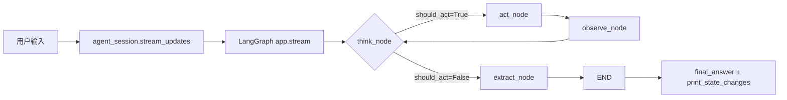
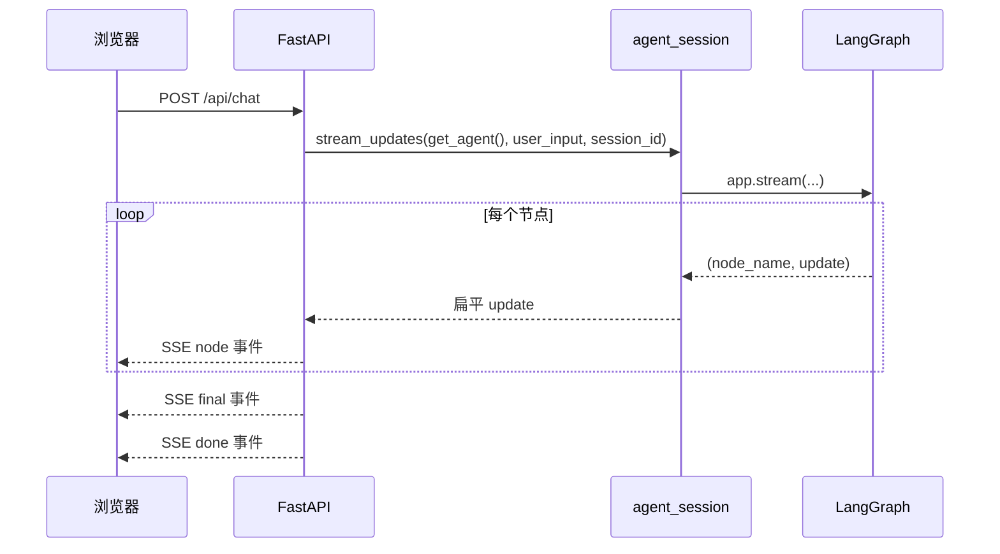
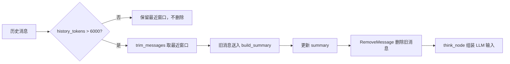
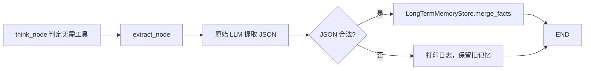

# test2 ReAct Agent 项目完整解析

> 本文档以当前工作区源码为准，覆盖 `test2` 的架构、核心概念、全部 Python 函数、主要数据流、运行方式和扩展方式。
> 本文档采用代码优先风格：每个 Python 函数都给出接收参数、返回内容、作用、完整源码和调用链。

## 目录

- [1. 项目总览](#sec-overview)
  - [1.1 项目作用](#overview-purpose)
  - [1.2 技术栈](#overview-stack)
  - [1.3 环境配置](#overview-env)
  - [1.4 启动方式](#overview-run)
  - [1.5 当前文件树](#overview-tree)
- [2. 架构分层](#sec-architecture)
  - [2.1 分层总览](#architecture-overview)
  - [2.2 配置层：providers.toml + config.py](#architecture-config)
  - [2.3 工具层：tools.py](#architecture-tools)
  - [2.4 状态层：state.py](#architecture-state)
  - [2.5 图核心层：graph.py](#architecture-graph)
  - [2.6 记忆层：memory_contracts.py + memory.py + memory_store.py](#architecture-memory)
  - [2.7 运行时层：runtime.py](#architecture-runtime)
  - [2.8 入口层：agent_session.py + __main__.py + web.py](#architecture-entry)
  - [2.9 前端层：static/index.html](#architecture-frontend)
  - [2.10 依赖方向与调用链](#architecture-calls)
- [3. 核心概念](#sec-concepts)
  - [3.1 StateGraph](#concepts-stategraph)
  - [3.2 MessagesState](#concepts-messages-state)
  - [3.3 add_messages](#concepts-add-messages)
  - [3.4 thread_id](#concepts-thread-id)
  - [3.5 SqliteSaver](#concepts-sqlite-saver)
- [4. 逐模块函数解析](#sec-functions)
  - [4.0 通用对象契约](#contract-overview)
    - [4.0.1 ReActState](#contract-react-state)
    - [4.0.2 tool_call](#contract-tool-call)
    - [4.0.3 LangChain 消息对象](#contract-messages)
    - [4.0.4 MemoryStore](#contract-memory-store)
    - [4.0.5 AgentRuntime](#contract-agent-runtime)
    - [4.0.6 updates 元组](#contract-updates)
  - [4.1 config.py](#module-config)
    - [4.1.1 get_llm](#func-config-get_llm)
  - [4.2 tools.py](#module-tools)
    - [4.2.1 calculator](#func-tools-calculator)
    - [4.2.2 weather](#func-tools-weather)
  - [4.3 state.py](#module-state)
    - [4.3.1 keep_existing_summary](#func-state-keep_existing_summary)
    - [4.3.2 ReActState](#class-state-react_state)
  - [4.4 graph.py](#module-graph)
    - [4.4.1 think_node](#func-graph-think_node)
    - [4.4.2 act_node](#func-graph-act_node)
    - [4.4.3 observe_node](#func-graph-observe_node)
    - [4.4.4 should_continue](#func-graph-should_continue)
    - [4.4.5 build_graph](#func-graph-build_graph)
  - [4.5 memory_contracts.py](#module-memory-contracts)
    - [4.5.1 MemoryStore](#class-memory-contracts-memory_store)
    - [4.5.2 get_memory_context](#func-memory-contracts-get_memory_context)
    - [4.5.3 merge_facts](#func-memory-contracts-merge_facts)
  - [4.6 memory.py](#module-memory)
    - [4.6.1 parse_memory_json](#func-memory-parse_memory_json)
    - [4.6.2 extract_memory_facts](#func-memory-extract_memory_facts)
    - [4.6.3 history_tokens](#func-memory-history_tokens)
    - [4.6.4 build_long_term_memory_section](#func-memory-build_long_term_memory_section)
    - [4.6.5 build_summary_section](#func-memory-build_summary_section)
    - [4.6.6 build_recent_history_section](#func-memory-build_recent_history_section)
    - [4.6.7 compose_llm_input](#func-memory-compose_llm_input)
    - [4.6.8 build_summary](#func-memory-build_summary)
    - [4.6.9 prepare_conversation](#func-memory-prepare_conversation)
  - [4.7 memory_store.py](#module-memory-store)
    - [4.7.1 LongTermMemoryStore](#class-memory-store-long_term_memory_store)
    - [4.7.2 __init__](#func-memory-store-init)
    - [4.7.3 _init_schema](#func-memory-store-init_schema)
    - [4.7.4 merge_facts](#func-memory-store-merge_facts)
    - [4.7.5 get_facts](#func-memory-store-get_facts)
    - [4.7.6 get_memory_context](#func-memory-store-get_memory_context)
    - [4.7.7 clear_scope](#func-memory-store-clear_scope)
    - [4.7.8 close](#func-memory-store-close)
    - [4.7.9 _now](#func-memory-store-now)
  - [4.8 runtime.py](#module-runtime)
    - [4.8.1 AgentRuntime](#class-runtime-agent_runtime)
    - [4.8.2 close](#func-runtime-close)
    - [4.8.3 create_runtime](#func-runtime-create_runtime)
  - [4.9 agent_session.py](#module-agent-session)
    - [4.9.1 initial_state](#func-agent-session-initial_state)
    - [4.9.2 session_config](#func-agent-session-session_config)
    - [4.9.3 stream_updates](#func-agent-session-stream_updates)
    - [4.9.4 collect_messages](#func-agent-session-collect_messages)
    - [4.9.5 final_answer](#func-agent-session-final_answer)
    - [4.9.6 clear_thread](#func-agent-session-clear_thread)
  - [4.10 __main__.py](#module-main)
    - [4.10.1 print_react_log](#func-main-print_react_log)
    - [4.10.2 print_state_changes](#func-main-print_state_changes)
    - [4.10.3 main](#func-main-main)
  - [4.11 web.py](#module-web)
    - [4.11.1 get_runtime](#func-web-get_runtime)
    - [4.11.2 get_agent](#func-web-get_agent)
    - [4.11.3 sse](#func-web-sse)
    - [4.11.4 render_node_payload](#func-web-render_node_payload)
    - [4.11.5 index](#func-web-index)
    - [4.11.6 chat](#func-web-chat)
    - [4.11.7 chat.gen](#func-web-chat-gen)
    - [4.11.8 clear_session](#func-web-clear_session)
  - [4.12 __init__.py](#module-init)
    - [4.12.1 hello](#func-init-hello)
  - [4.13 static/index.html JS 概览](#module-frontend)
    - [4.13.1 getSessionId](#js-get-session-id)
    - [4.13.2 escapeHtml](#js-escape-html)
    - [4.13.3 append](#js-append)
    - [4.13.4 bubble](#js-bubble)
    - [4.13.5 indicator](#js-indicator)
    - [4.13.6 renderNode](#js-render-node)
    - [4.13.7 send](#js-send)
    - [4.13.8 clearSession](#js-clear-session)
    - [4.13.9 handleEvent](#js-handle-event)
- [5. 完整数据流](#sec-data-flow)
  - [5.1 CLI 一次对话](#flow-cli)
  - [5.2 Web SSE 一次对话](#flow-web-sse)
  - [5.3 动态摘要触发](#flow-summary)
  - [5.4 长期记忆提取](#flow-long-term)
  - [5.5 清空会话](#flow-clear)
- [6. 扩展与调试](#sec-guide)
  - [6.1 新增供应商](#guide-provider)
  - [6.2 新增工具](#guide-tool)
  - [6.3 运行测试](#guide-tests)
  - [6.4 导出 Mermaid](#guide-mermaid)
  - [6.5 FAQ](#guide-faq)

---

<a id="sec-overview"></a>
## 1. 项目总览

<a id="overview-purpose"></a>
### 1.1 项目作用

`test2` 是一个基于 LangGraph 的最小化 ReAct Agent：

- LLM 根据历史消息判断是否需要调用工具。
- 如果需要工具，就执行 `think -> act -> observe` 循环。
- 如果不需要工具，就生成最终回复。
- 支持 `calculator` 和 `weather` 两个演示工具。
- 支持 CLI 和 Web 两个入口。
- 支持 SQLite 持久化的多轮对话记忆和项目级长期记忆。

<a id="overview-stack"></a>
### 1.2 技术栈

| 层级 | 技术 | 作用 |
| --- | --- | --- |
| 图引擎 | LangGraph | 定义状态、节点、边和编译后的 Agent 图 |
| LLM 抽象 | LangChain Core | 消息类型、工具绑定、`BaseMessage` |
| LLM 供应商 | langchain-anthropic / langchain-openai | 创建 ChatModel |
| 配置 | TOML + .env | 供应商预设与环境密钥 |
| 会话持久化 | langgraph-checkpoint-sqlite | 保存多轮对话 checkpoint |
| 长期记忆 | 标准库 sqlite3 | 保存项目级长期记忆 |
| Web | FastAPI + SSE + 原生 JS | 浏览器可视化入口 |
| 测试 | pytest | 单元测试 runner 和 memory contract |

<a id="overview-env"></a>
### 1.3 环境配置

项目根目录的 `.env.example` 提供了完整模板：

```dotenv
LLM_PROVIDER=anthropic
LLM_MODEL=claude-sonnet-4-20250514
LLM_API_KEY=sk-ant-xxxxx
LLM_TEMPERATURE=0
QWEATHER_API_HOST=xxxxxx
QWEATHER_API_KEY=xxxxxx
```

核心变量：

| 变量 | 说明 |
| --- | --- |
| `LLM_PROVIDER` | 供应商名称，例如 `anthropic`、`openai`、`ollama` |
| `LLM_MODEL` | 模型名；不填时使用 `providers.toml` 的第一个模型 |
| `LLM_API_KEY` | API Key |
| `LLM_TEMPERATURE` | 温度参数，默认 `0` |
| `LLM_BASE_URL` | 自定义供应商时才需要 |
| `QWEATHER_API_HOST` / `QWEATHER_API_KEY` | 使用 `weather` 工具时配置 |

`config.py` 会在导入时从项目根目录加载 `.env`，不依赖启动时的 cwd。

<a id="overview-run"></a>
### 1.4 启动方式

```bash
cd test2
uv sync

# CLI
uv run python -m test2 --app-dir src

# Web
uv run python -m uvicorn test2.web:app --reload --app-dir src
```

CLI 支持：

```text
quit / exit / q : 退出
clear / /clear : 清空当前会话 checkpoint
```

Web 启动后访问 `http://127.0.0.1:8000`。

<a id="overview-tree"></a>
### 1.5 当前文件树

```text
test2/
├── .env.example
├── README.md
├── pyproject.toml
├── uv.lock
├── tests/
│   ├── test_agent_session.py
│   └── test_memory_contracts.py
└── src/test2/
    ├── __init__.py
    ├── __main__.py
    ├── agent_session.py
    ├── config.py
    ├── graph.py
    ├── memory.py
    ├── memory_contracts.py
    ├── memory_store.py
    ├── providers.toml
    ├── runtime.py
    ├── state.py
    ├── tools.py
    ├── web.py
    ├── docs/
    │   ├── wiki.md
    │   ├── fastapi-sse-前端可视化.md
    │   └── multi-turn-memory.md
    └── static/
        └── index.html
```

---

<a id="sec-architecture"></a>
## 2. 架构分层

<a id="architecture-overview"></a>
### 2.1 分层总览

```text
providers.toml + .env
        │
        ▼
config.py ──► LLM 实例
        │
        ▼
tools.py ──► 工具 schema
        │
        ▼
state.py ──► ReActState
        │
        ▼
memory_contracts.py ◄── memory.py
        │                  │
        ▼                  ▼
memory_store.py ──────► graph.py ──► LangGraph app
                                    │
                                    ▼
                              runtime.py
                                    │
              ┌─────────────────────┼─────────────────────┐
              ▼                     ▼                     ▼
        agent_session.py       __main__.py (CLI)      web.py (FastAPI)
                                                        │
                                                        ▼
                                                   static/index.html
```

<a id="architecture-config"></a>
### 2.2 配置层：providers.toml + config.py

`providers.toml` 是纯配置，保存供应商协议、`base_url` 和模型列表。`config.py` 只负责：

- 加载根目录 `.env`。
- 读取 `LLM_PROVIDER`。
- 查 `providers.toml`。
- 根据 `protocol` 创建 `ChatAnthropic` 或 `ChatOpenAI`。

<a id="architecture-tools"></a>
### 2.3 工具层：tools.py

`tools.py` 用 `@tool` 定义 `calculator` 和 `weather`，并导出：

```python
TOOLS = [calculator, weather]
TOOL_MAP = {t.name: t for t in TOOLS}
```

`graph.py` 使用 `TOOLS` 做 `bind_tools`；`act_node` 使用 `TOOL_MAP` 查找并执行工具。

<a id="architecture-state"></a>
### 2.4 状态层：state.py

`state.py` 定义 `ReActState`，继承 LangGraph `MessagesState`，并增加：

```python
summary: Annotated[str, keep_existing_summary]
should_act: bool
tool_calls: list
iteration: int
```

`summary` 使用自定义 reducer，空字符串不会覆盖已有摘要。

<a id="architecture-graph"></a>
### 2.5 图核心层：graph.py

`graph.py` 定义四个节点：

```text
think -> should_continue?
  ├── should_act=True  -> act -> observe -> think
  └── should_act=False -> extract -> END
```

`build_graph()` 负责组装 `StateGraph` 并编译 app。

<a id="architecture-memory"></a>
### 2.6 记忆层：memory_contracts.py + memory.py + memory_store.py

三层职责：

```text
memory_contracts.py : MemoryStore Protocol + 常量
memory.py           : token 估算、摘要、消息裁剪、LLM 输入组装、长期记忆提取
memory_store.py     : SQLite 实现 LongTermMemoryStore
```

`memory.py` 依赖 `MemoryStore` 接口，不依赖具体 SQLite 类。

<a id="architecture-runtime"></a>
### 2.7 运行时层：runtime.py

`create_runtime()` 显式组合：

```text
SqliteSaver (checkpointer)
+ LongTermMemoryStore
+ build_graph(...)
= AgentRuntime
```

这样 `import test2.graph` 不会创建数据库，也没有模块级 checkpointer。

<a id="architecture-entry"></a>
### 2.8 入口层：agent_session.py + __main__.py + web.py

- `agent_session.py` 统一构造初始 state、config、stream、消息收集、最终答案和清空。
- `__main__.py` 是 CLI 交互入口。
- `web.py` 是 FastAPI + SSE 入口，复用 `agent_session.stream_updates()`。

<a id="architecture-frontend"></a>
### 2.9 前端层：static/index.html

`index.html` 使用原生 JS 实现：

- 从 `localStorage` 读取或生成 `session_id`。
- 通过 `fetch` 调用 `/api/chat`。
- 手动解析 SSE 流。
- 渲染 Think / Act / Observe 卡片和状态指示灯。
- 调用 `/api/clear` 清空当前会话。

<a id="architecture-calls"></a>
### 2.10 依赖方向与调用链

```text
CLI/Web
  -> agent_session.stream_updates()
  -> runtime.app (LangGraph)
  -> think_node
      -> prepare_conversation()
      -> compose_llm_input()
      -> llm_with_tools.invoke()
  -> act_node
  -> observe_node
  -> extract_node
      -> extract_memory_facts()
      -> LongTermMemoryStore
```

---

<a id="sec-concepts"></a>
## 3. 核心概念

<a id="concepts-stategraph"></a>
### 3.1 StateGraph

`StateGraph` 是 LangGraph 的图容器。它要求你显式定义：

- `State`：节点共享的数据结构。
- `Node`：接收 state、返回更新 dict 的 Python 函数。
- `Edge`：节点之间的连接。

本项目的图由 `build_graph()` 创建：

```python
graph = StateGraph(ReActState)
graph.set_entry_point("think")
graph.add_conditional_edges("think", should_continue, {...})
graph.add_edge("act", "observe")
graph.add_edge("observe", "think")
graph.add_edge("extract", END)
return graph.compile(checkpointer=checkpointer)
```

<a id="concepts-messages-state"></a>
### 3.2 MessagesState

`MessagesState` 提供带 `add_messages` 的 `messages` 字段：

```python
class MessagesState(TypedDict):
    messages: Annotated[list[AnyMessage], add_messages]
```

`ReActState` 继承它，因此天然拥有可合并的消息历史。

<a id="concepts-add-messages"></a>
### 3.3 add_messages

`add_messages` 是消息列表 reducer：

```text
新 id  -> 追加
同 id  -> 替换
RemoveMessage -> 删除
无 id  -> 追加并自动分配 id
```

节点只需要返回本轮新增消息，不需要手动拼完整历史。

<a id="concepts-thread-id"></a>
### 3.4 thread_id

`thread_id` 是 LangGraph config 中用于区分会话的 ID：

```python
config = {
    "recursion_limit": MAX_ITERATIONS * 6,
    "configurable": {"thread_id": "cli-default"},
}
```

同一个 `thread_id` 共享 checkpoint 历史；不同 `thread_id` 互不影响。

<a id="concepts-sqlite-saver"></a>
### 3.5 SqliteSaver

`SqliteSaver` 把 checkpoint 持久化到 SQLite：

```python
conn = sqlite3.connect(str(path), check_same_thread=False)
checkpointer = SqliteSaver(conn)
app = graph.compile(checkpointer=checkpointer)
```

默认数据库文件是 `data/memory.db`。

<a id="sec-functions"></a>
## 4. 逐模块函数解析

每个函数小节统一按以下顺序说明：

```text
快速参数表
参数详解
快速返回表
返回详解
作用
源码
调用链
失败模式
```

“参数详解”重点解释业务语义、读写关系和流程角色；“约束/非法值”放在快速参数表；“失败模式”单独说明函数级异常。

<a id="contract-overview"></a>
### 4.0 通用对象契约

本小节集中定义后续函数反复使用的对象形状。函数章节中的复杂参数会引用这里，只补充当前函数特有的关联。

<a id="contract-react-state"></a>
#### 4.0.1 ReActState

`ReActState` 是 LangGraph 的全局状态，由 `agent_session.initial_state()` 写入初始值，再由各节点返回增量更新。

| 字段 | 类型 | 必填/默认 | 业务含义 | 读写关系 |
| --- | --- | --- | --- | --- |
| `messages` | `list[BaseMessage]` | 必填，无默认 | 完整对话历史，决定 LLM 可见上下文 | `initial_state()` 写入用户消息；各节点追加/替换；`add_messages` 合并 |
| `summary` | `str` | 必填，默认 `""` | 早期对话的动态摘要 | `prepare_conversation()` 生成；`think_node` 返回；`keep_existing_summary` 合并 |
| `should_act` | `bool` | 必填，默认 `False` | 是否还需要执行工具 | `think_node` 写入；`should_continue()` 读取 |
| `tool_calls` | `list[dict]` | 必填，默认 `[]` | 本轮待执行工具调用 | `think_node` 写入；`act_node` 读取 |
| `iteration` | `int` | 必填，默认 `0` | 已完成的工具执行轮数 | `observe_node` 递增 |

示例：

```json
{
  "messages": [
    {"type": "human", "content": "北京天气怎么样？"}
  ],
  "summary": "",
  "should_act": false,
  "tool_calls": [],
  "iteration": 0
}
```

<a id="contract-tool-call"></a>
#### 4.0.2 tool_call

`tool_call` 是 `tool_calls` 列表中的单个字典，表示 LLM 请求执行一次工具。

| 字段 | 类型 | 必填 | 业务含义 | 关键关联 |
| --- | --- | --- | --- | --- |
| `name` | `str` | 是 | 工具名称，必须能在 `TOOL_MAP` 中找到 | `act_node` 用它查工具 |
| `args` | `dict` | 是 | 工具入参，与工具 schema 对应 | `act_node` 调用 `tool.invoke(args)` |
| `id` | `str` | 是 | 工具调用唯一 ID | 生成的 `ToolMessage.tool_call_id` 必须引用它 |

示例：

```json
{
  "name": "weather",
  "args": {"city": "北京"},
  "id": "call_abc123"
}
```

<a id="contract-messages"></a>
#### 4.0.3 LangChain 消息对象

消息对象是 `messages` 列表的元素，本项目中主要使用以下四种：

| 类型 | 用途 | 关键字段 | 关键关联 |
| --- | --- | --- | --- |
| `BaseMessage` | 所有消息的基类 | `content`、`id`、`type` | 抽象接口 |
| `HumanMessage` | 用户输入 | `content` | 由 `initial_state()` 创建 |
| `AIMessage` | LLM 输出 | `content`、`tool_calls` | 带 `tool_calls` 时进入 `act` |
| `ToolMessage` | 工具执行结果 | `content`、`tool_call_id` | `tool_call_id` 对应 AIMessage 的 tool_call id |

`RemoveMessage` 不承载内容，只表示删除 checkpoint 中指定 id 的旧消息。

<a id="contract-memory-store"></a>
#### 4.0.4 MemoryStore

`MemoryStore` 是项目级长期记忆的读写接口，当前实现是 `LongTermMemoryStore`。

| 方法 | 接收 | 返回 | 业务含义 |
| --- | --- | --- | --- |
| `get_memory_context(scope)` | `scope: str` | `str` | 读取可注入 LLM 的长期记忆 |
| `merge_facts(scope, category, facts, source_thread_id)` | 作用域、类别、事实列表、来源会话 | `None` | 写入并合并新事实 |

示例调用：

```python
context = memory_store.get_memory_context("project")
memory_store.merge_facts("project", "user_preferences", ["用户喜欢简洁回答"])
```

<a id="contract-agent-runtime"></a>
#### 4.0.5 AgentRuntime

`AgentRuntime` 是 CLI/Web 共用的运行时容器，由 `create_runtime()` 创建。

| 字段 | 类型 | 业务含义 |
| --- | --- | --- |
| `app` | LangGraph app | 编译后的 Agent 图 |
| `checkpointer` | `SqliteSaver` | 多轮对话 checkpoint |
| `memory_store` | `LongTermMemoryStore` | 项目级长期记忆 SQLite 实现 |
| `db_path` | `Path` | SQLite 数据库路径 |
| `conn` | `sqlite3.Connection` | SQLite 连接 |

<a id="contract-updates"></a>
#### 4.0.6 updates 元组

`updates` 是 `stream_updates()` 产出的扁平流，每个元素都是 `(node_name, update)`。

```text
node_name: str，例如 "think"、"act"、"observe"、"extract"
update: dict，该节点本轮返回的 state 增量
```

示例：

```text
("think", {"messages": [AIMessage(...)], "should_act": True})
```

<a id="module-config"></a>
### 4.1 config.py

`config.py` 负责加载 `.env`、读取 `providers.toml` 并创建 LLM 实例。

模块级关键逻辑：

```python
PROJECT_ROOT = Path(__file__).resolve().parents[2]
load_dotenv(PROJECT_ROOT / ".env")

PRESETS_PATH = Path(__file__).parent / "providers.toml"
with open(PRESETS_PATH, "rb") as f:
    PRESETS = tomllib.load(f)
```

<a id="func-config-get_llm"></a>
#### 4.1.1 get_llm

**快速参数表**

| 参数 | 类型 | 必填/默认 | 来源 | 约束/非法值 | 示例 |
| --- | --- | --- | --- | --- | --- |
| `provider` | `str \| None` | 可选，默认从 `LLM_PROVIDER` 读取 | `build_graph()` 显式传入，或由调用方省略 | 必须是 `providers.toml` 中的 key；不传或环境变量为空会抛 `ValueError` | `"anthropic"` |
| `temperature` | `float \| None` | 可选，默认从 `LLM_TEMPERATURE` 读取，兜底 `0` | `build_graph()` 通常省略，由环境变量决定 | 传给 ChatModel 的温度参数；非数值字符串会在转换时抛 `ValueError` | `0.2` |

**参数详解**

`provider` 决定使用哪一家 LLM 供应商，是配置查询的入口；它不仅是字符串，还对应 `providers.toml` 中一个包含 `protocol`、`base_url`、`models` 的预设字典。本函数会读取它来查表，并决定创建 `ChatAnthropic` 还是 `ChatOpenAI`；最终创建的模型对象会由 `build_graph()` 继续绑定工具并注入图节点。如果调用方没有传值，本函数会回退到环境变量 `LLM_PROVIDER`，这保证了 CLI/Web 只需配置 `.env` 就能切换供应商。

`temperature` 控制 LLM 输出随机性，是模型创建时的业务参数；它不参与工具选择逻辑，但会直接影响回答风格和稳定性。本函数只在创建 ChatModel 时消费它，之后不再保存或传递；调用方通常不直接传值，而是依赖 `.env` 中的 `LLM_TEMPERATURE`。该参数缺省时按 `0` 处理，便于复现稳定输出。

**快速返回表**

| 返回 | 类型 | 可能值 | 示例 |
| --- | --- | --- | --- |
| LLM 实例 | `ChatAnthropic` / `ChatOpenAI` | 根据 `protocol` 决定 | `ChatOpenAI(model="gpt-4o", ...)` |

**返回详解**

返回的是可调用的 LangChain ChatModel 实例，不是字符串或图对象；它由 `build_graph()` 使用，并继续派生出 `llm_with_tools = llm.bind_tools(TOOLS)`。该实例负责最终和真实供应商通信，因此后续任何 LLM 调用失败都发生在模型请求阶段。`protocol == "anthropic"` 返回 `ChatAnthropic`，其余走 OpenAI 兼容协议返回 `ChatOpenAI`；两个实例对图节点来说是同一个“能调用 `.invoke()` 的模型”抽象。

**作用**

```text
根据 provider 查表，按 protocol 创建对应 ChatModel
```

**源码**

```python
def get_llm(provider: str | None = None, temperature: float | None = None):
    """
    获取 LLM 实例

    Args:
        provider: 供应商名称，不传则读 .env 中的 LLM_PROVIDER
        temperature: 温度参数，不传则读 .env 中的 LLM_TEMPERATURE

    Returns:
        LangChain ChatModel 实例
    """
    # 从环境变量读取
    provider = (provider or os.getenv("LLM_PROVIDER", "")).strip().lower()
    model = os.getenv("LLM_MODEL", "").strip()
    api_key = os.getenv("LLM_API_KEY", "").strip()
    if temperature is None:
        temperature = float(os.getenv("LLM_TEMPERATURE", "0"))

    if not provider:
        raise ValueError(
            "未设置 LLM_PROVIDER，请在 .env 中设置，例如:\n"
            "  LLM_PROVIDER=openai\n"
            f"  支持: {', '.join(PRESETS.keys())}"
        )

    # 查表
    preset = PRESETS.get(provider)
    #preset 是一个字典，包含了该供应商协议、 URL 和模型列表
    if not preset:
        raise ValueError(
            f"未知的 LLM_PROVIDER: '{provider}'\n"
            f"支持: {', '.join(PRESETS.keys())}\n"
            f"请在 .env 中设置 LLM_PROVIDER=上述之一"
        )

    protocol = preset.get("protocol", "openai")

    # Anthropic 协议：用 ChatAnthropic
    if protocol == "anthropic":
        from langchain_anthropic import ChatAnthropic
        kwargs: dict = {
            "model": model or preset.get("models", [""])[0],
            "temperature": temperature,
        }
        if api_key:
            kwargs["api_key"] = api_key
        return ChatAnthropic(**kwargs)
    #有自定义密钥就手动传入，没有就不填密钥参数，交给框架自动读取环境变量

    # OpenAI 协议：用 ChatOpenAI（覆盖绝大多数供应商）
    if protocol == "openai":
        from langchain_openai import ChatOpenAI
        base_url = preset.get("base_url") or os.getenv("LLM_BASE_URL", "")
        return ChatOpenAI(
            model=model or preset.get("models", [""])[0],
            api_key=api_key or "placeholder",
            base_url=base_url,
            temperature=temperature,
        )

    raise ValueError(f"不支持的协议: {protocol}")
```

**调用链**

```text
build_graph() -> get_llm(provider)
```

**失败模式**

```text
1. provider 为空或未设置 -> ValueError，提示 LLM_PROVIDER 未配置。
2. provider 不在 PRESETS -> ValueError，列出支持列表。
3. protocol 不是 anthropic/openai -> ValueError。
4. openai 协议没有 key -> 使用 "placeholder"，认证错误延迟到真实请求阶段。
```

<a id="module-tools"></a>
### 4.2 tools.py

`tools.py` 定义两个可被 LLM 调用的工具，并导出 `TOOLS` 和 `TOOL_MAP`。

<a id="func-tools-calculator"></a>
#### 4.2.1 calculator

**快速参数表**

| 参数 | 类型 | 必填/默认 | 来源 | 约束/非法值 | 示例 |
| --- | --- | --- | --- | --- | --- |
| `expression` | `str` | 必填，无默认 | `act_node` 从 `tool_call["args"]["expression"]` 传入 | 必须是可被受限 `eval()` 解析的表达式；空字符串或未知函数返回错误文本 | `"2 + 3 * 4"` |

**参数详解**

`expression` 是 LLM 决定要计算的数学表达式，代表一个需要由本地工具完成的数值任务。它通常由 `act_node` 从 `tool_calls` 中的 `args` 字段取出，不是用户直接传入的原始字符串。本函数会在一个没有 `__builtins__` 的安全命名空间里求值，因此它只能使用白名单内的数学函数和常量。这个参数决定最终是返回计算结果还是返回错误说明，而错误说明也会作为工具结果继续交给 LLM 分析。

**快速返回表**

| 返回 | 类型 | 可能值 | 示例 |
| --- | --- | --- | --- |
| 计算结果 | `str` | 数字文本或错误文本 | `"14"`、`"计算错误: name 'x' is not defined"` |

**返回详解**

返回永远是字符串，因为 `act_node` 需要把它包装成 `ToolMessage(content=...)`，而 ToolMessage 的内容是 LLM 后续可读的文本。成功时返回数字字符串，失败时返回包含原因的字符串；两者都会被当成正常工具结果，不会中断整张图。这个返回值最终会进入消息历史，供下一轮 `think_node` 判断是否还需要继续行动。

**作用**

```text
在受限数学命名空间中计算表达式，禁止任意 Python 代码执行
```

**源码**

```python
@tool
def calculator(expression: str) -> str:
    """计算数学表达式。

    支持: +, -, *, /, **, sqrt, sin, cos, tan, log, pi, e
    示例: "2 + 3 * 4", "sqrt(16)", "sin(pi/2)", "2**10"
    """
    # 安全的数学环境，禁止任意代码执行
    safe_ns = {
        "__builtins__": {},
        "sqrt": math.sqrt,
        "sin": math.sin,
        "cos": math.cos,
        "tan": math.tan,
        "log": math.log,
        "log2": math.log2,
        "log10": math.log10,
        "abs": abs,
        "round": round,
        "pi": math.pi,
        "e": math.e,
    }
    try:
        result = eval(expression, safe_ns)
        return str(result)
    except Exception as ex:
        return f"计算错误: {ex}"
```

**调用链**

```text
act_node -> TOOL_MAP["calculator"].invoke(tool_args)
```

**失败模式**

```text
1. __builtins__ 置空，屏蔽 __import__ 等危险入口。
2. 表达式语法错误或执行异常 -> 返回 "计算错误: ..."。
```

<a id="func-tools-weather"></a>
#### 4.2.2 weather

**快速参数表**

| 参数 | 类型 | 必填/默认 | 来源 | 约束/非法值 | 示例 |
| --- | --- | --- | --- | --- | --- |
| `city` | `str` | 必填，无默认 | `act_node` 从 `tool_call["args"]["city"]` 传入 | 必须是城市名称字符串；空字符串或查不到城市返回失败文本 | `"北京"` |

**参数详解**

`city` 是用户或 LLM 给出的城市名，代表一次实时天气查询的目标。它不是结构化 LocationID，需要先通过和风天气的城市搜索接口转换成 `city_id`，再查询实时天气。本函数会把 `city` 放到地理编码接口的 `location` 参数中，因此它必须匹配和风天气可识别的城市名称。查询结果会格式化成一整段中文天气文本，最终由 `act_node` 包装成 `ToolMessage` 放回消息历史，供下一轮 `think_node` 读取。

**快速返回表**

| 返回 | 类型 | 可能值 | 示例 |
| --- | --- | --- | --- |
| 天气结果 | `str` | 成功天气文本或失败原因 | `"北京：晴，气温 25°C..."` |

**返回详解**

返回的是可直接给 LLM 阅读的天气结果，而不是结构化 JSON。成功时包含省份/城市、天气现象、气温、体感温度、湿度和风向风力；失败时包含具体原因，例如未配置 API、城市未找到、网络错误或数据解析错误。该返回值会成为 `ToolMessage` 的 `content`，所以失败文本也会被当作工具观察结果继续参与 ReAct 循环。

**作用**

```text
调用和风天气 API，先城市搜索，再查询实时天气
```

**源码**

```python
@tool
def weather(city: str) -> str:
    """查询指定城市的当前实时天气（调用和风天气 API）。

    Args:
        city: 城市名称，如 "北京"、"上海"、"深圳"
    """
    api_host = os.getenv("QWEATHER_API_HOST")
    api_key = os.getenv("QWEATHER_API_KEY")
    if not api_host or not api_key:
        return "天气查询失败：未配置 QWEATHER_API_HOST 或 QWEATHER_API_KEY"

    headers = {"X-QW-Api-Key": api_key}

    try:
        # 1. 城市搜索：中文名 → LocationID
        geo_url = f"https://{api_host}/geo/v2/city/lookup"
        #requests.get() 方法用于向指定的 URL 发送 GET 请求，并返回一个 Response 对象。
        geo_resp = requests.get(geo_url, params={"location": city, "range": "cn", "number": 1}, headers=headers, timeout=5)

        geo_data = geo_resp.json()
        if geo_data.get("code") != "200" or not geo_data.get("location"):
            return f"未找到城市「{city}」，请检查城市名称"
        city_info = geo_data["location"][0]
        city_id = city_info["id"]
        city_name = city_info["name"]
        adm = city_info.get("adm1", "")

        # 2. 实时天气
        weather_url = f"https://{api_host}/v7/weather/now"
        weather_resp = requests.get(weather_url, params={"location": city_id, "lang": "zh"}, headers=headers, timeout=5)
        data = weather_resp.json()
        if data.get("code") != "200":
            return f"天气查询失败：API 返回错误码 {data.get('code')}"

        now = data["now"]
        return (
            f"{adm} {city_name}：{now['text']}，"
            f"气温 {now['temp']}°C，体感 {now['feelsLike']}°C，"
            f"湿度 {now['humidity']}%，{now['windDir']} {now['windScale']}级"
        )

    except requests.exceptions.Timeout:
        return f"天气查询超时，请稍后重试"
    except requests.exceptions.RequestException as e:
        return f"天气查询网络错误：{e}"
    except (KeyError, IndexError) as e:
        return f"天气数据解析错误：{e}"
```

**调用链**

```text
act_node -> TOOL_MAP["weather"].invoke({"city": city})
```

**失败模式**

```text
1. 未配置 QWEATHER_API_HOST/QWEATHER_API_KEY -> 返回失败文本。
2. 网络超时、网络错误、JSON 字段缺失 -> 转成字符串，不抛给图。
```

<a id="module-state"></a>
### 4.3 state.py

`state.py` 定义 LangGraph 的全局状态。

<a id="func-state-keep_existing_summary"></a>
#### 4.3.1 keep_existing_summary

**快速参数表**

| 参数 | 类型 | 必填/默认 | 来源 | 约束/非法值 | 示例 |
| --- | --- | --- | --- | --- | --- |
| `old_value` | `str` | 必填，无默认 | LangGraph checkpoint 中已有的 `summary` | 任意字符串；通常为空或旧摘要 | `"用户喜欢简洁回答"` |
| `new_value` | `str` | 必填，无默认 | 当前节点返回的 `summary` | 任意字符串；空字符串不会覆盖旧值 | `""` |

**参数详解**

`old_value` 是当前会话已经保存的摘要，代表之前几轮对话被压缩后的长期上下文。LangGraph 在合并状态时会先把旧值传进来，本函数需要决定是保留它还是被新摘要替换。`new_value` 是当前节点想写入的新摘要，正常情况下来自 `prepare_conversation()`；如果本轮没有触发摘要，`think_node` 返回的 `summary` 就是旧值或空字符串。这个 reducer 的核心作用是防止 `initial_state()` 里的 `summary: ""` 每次清空已生成摘要。

**快速返回表**

| 返回 | 类型 | 可能值 | 示例 |
| --- | --- | --- | --- |
| 最终摘要 | `str` | `new_value` 或 `old_value` | `"用户喜欢简洁回答"` |

**返回详解**

返回的是合并后的 `summary`，会被 LangGraph 写回状态，供后续 `think_node` 和 `extract_node` 读取。非空 `new_value` 表示有新的动态摘要，因此优先使用；空 `new_value` 表示本轮没有新摘要，必须保留旧值。这个返回值直接影响 LLM 输入中的会话摘要段，不能因为每轮初始状态而丢失。

**作用**

```text
作为 summary 字段的 reducer，空字符串不覆盖已有摘要
```

**源码**

```python
def keep_existing_summary(old_value: str, new_value: str) -> str:
    """空字符串不覆盖已有摘要，避免每次调用初始状态清空 summary。"""
    return new_value if new_value else old_value
```

**调用链**

```text
LangGraph 在合并 ReActState.summary 时调用
```

**失败模式**

```text
1. 参数类型不是 str 时可能触发类型错误，当前调用链保证传入 str。
2. 没有异常分支；即使两个值都为空，也会返回空字符串。
```

<a id="class-state-react_state"></a>
#### 4.3.2 ReActState

**快速参数表**

| 参数 | 类型 | 必填/默认 | 来源 | 约束/非法值 | 示例 |
| --- | --- | --- | --- | --- | --- |
| 无构造参数 | - | - | 类型定义，不直接实例化 | LangGraph 按字段合并状态 | - |

**参数详解**

`ReActState` 不是普通数据类，而是 LangGraph 用来描述全局状态的类型；它本身没有构造参数，LangGraph 节点通过返回 `dict` 增量更新字段。字段含义在 [4.0.1 ReActState](#contract-react-state) 已定义，本类只是把这些字段绑定到状态图上。`messages` 决定 LLM 历史，`summary` 决定压缩后的长期上下文，`should_act`/`tool_calls` 驱动工具循环，`iteration` 记录轮数。所有节点都会读取这个状态的某一部分，并通过返回 dict 修改它。

**快速返回表**

| 返回 | 类型 | 可能值 | 示例 |
| --- | --- | --- | --- |
| 状态结构 | `ReActState` | 包含 `messages`、`summary`、`should_act`、`tool_calls`、`iteration` 的 TypedDict 形态 | 见 [4.0.1](#contract-react-state) |

**返回详解**

这里“返回”不是函数返回值，而是 `StateGraph(ReActState)` 最终维护的状态形态。`messages` 由 `add_messages` 自动合并，`summary` 由 `keep_existing_summary` 合并，其余普通字段由节点直接覆盖。这个状态会被 `think_node`、`act_node`、`observe_node`、`extract_node` 和条件边读取；理解它就是理解整张图的数据契约。

**作用**

```text
定义 ReAct 循环的全局状态
```

**源码**

```python
class ReActState(MessagesState):
    """ReAct Agent 的状态"""

    # 早期对话的动态摘要
    summary: Annotated[str, keep_existing_summary]
    # 是否需要执行工具
    should_act: bool
    # 当前待执行的工具调用列表
    tool_calls: list
    # 循环计数（防止无限循环）
    iteration: int
```

**调用链**

```text
build_graph() -> StateGraph(ReActState)
agent_session.initial_state() -> 构造初始 state
```

**失败模式**

```text
1. 节点返回未声明字段时，LangGraph 可能忽略或按 extra 行为处理。
2. messages 缺少 reducer 语义时会覆盖历史，当前由 MessagesState 避免。
3. thought 不是正式字段，但仍作为历史遗留初始值传入。
```

<a id="module-graph"></a>
### 4.4 graph.py

`graph.py` 是 ReAct 循环的图定义，包含节点函数、条件函数和 `build_graph()`。

模块级常量：

```python
MAX_ITERATIONS = 35
MEMORY_WINDOW = 20
```

<a id="func-graph-think_node"></a>
#### 4.4.1 think_node

**快速参数表**

| 参数 | 类型 | 必填/默认 | 来源 | 约束/非法值 | 示例 |
| --- | --- | --- | --- | --- | --- |
| `state` | `ReActState` | 必填，无默认 | LangGraph 节点框架自动传入 | 必须包含 `messages`；缺 `messages` 会 `KeyError` | 见 [4.0.1](#contract-react-state) |
| `llm_with_tools` | LangChain ChatModel 对象 | 必填，无默认 | `build_graph()` 创建并闭包注入 | 必须有 `.invoke()`；返回对象需有 `.content`/`.tool_calls` | `llm.bind_tools(TOOLS)` |
| `llm` | LangChain ChatModel 对象 | 必填，无默认 | `build_graph()` 创建并闭包注入 | 必须能被 `prepare_conversation()` 调用 | `get_llm("anthropic")` |
| `memory_store` | `MemoryStore` | 必填，无默认 | `create_runtime()` 创建，`build_graph()` 注入 | 必须实现 `get_memory_context()` / `merge_facts()` | `LongTermMemoryStore("data/memory.db")` |

**参数详解**

`state` 是当前会话的完整状态，代表 LLM 在这一轮能看到的历史、摘要、工具调用标志和轮数。本函数会读取 `state["messages"]` 交给记忆工具做窗口裁剪和摘要准备，但不会直接修改它；修改通过返回 `messages` 增量由 `add_messages` 完成。这个参数是 LangGraph 节点之间的数据载体，后续 `act_node` 和条件边会消费本函数写出的 `should_act` 与 `tool_calls`。

`llm_with_tools` 是已经绑定工具的 LLM，代表“既能对话又能请求工具”的模型入口。本函数调用它的 `.invoke()` 获取 `AIMessage`，通过 `tool_calls` 判断是否继续 ReAct 循环。它由 `build_graph()` 闭包注入，因此 LangGraph 调用节点时只需要传入 `state`。`llm` 是同一个供应商的原始模型，不绑定工具，专门用于摘要生成；它保证摘要 prompt 不会意外触发工具调用。

`memory_store` 是项目级长期记忆的访问入口，本函数把它传给 `compose_llm_input()`，用于在最终 LLM 输入最前面插入项目长期记忆。当前实现从 SQLite 读取已保存的用户偏好和项目事实；如果读取结果为空，就不会生成长期记忆 `SystemMessage`。

**快速返回表**

| 字段 | 类型 | 是否总是返回 | 含义 | 示例 |
| --- | --- | --- | --- | --- |
| `messages` | `list` | 是 | `removals + [response]`，交给 `add_messages` | `[RemoveMessage(...), AIMessage(...)]` |
| `thought` | `str` | 是 | AI 思考内容，无内容时使用占位文本 | `"我需要查询天气"` |
| `should_act` | `bool` | 是 | 是否有工具调用 | `True` |
| `tool_calls` | `list[dict]` | 是 | 本轮工具调用，无调用时为空数组 | `[{"name":"weather",...}]` |
| `summary` | `str` | 是 | 当前会话摘要 | `""` |

**返回详解**

返回的 `messages` 是 LangGraph 会合并进历史的消息增量，包含可能的 `RemoveMessage` 和本轮 `AIMessage`；它的消费方是 `add_messages` reducer，而不是调用者直接读取。`should_act` 和 `tool_calls` 是驱动流程的核心：条件边读取 `should_act`，`act_node` 读取 `tool_calls`。`summary` 由 `keep_existing_summary` 合并，空字符串不会覆盖旧摘要。这个返回 dict 让 LangGraph 知道下一轮该进入 `act` 还是结束。

**作用**

```text
准备 LLM 输入，调用带工具 LLM，判断是否请求工具
```

**源码**

```python
def think_node(state: ReActState, llm_with_tools, llm, memory_store) -> dict:
    """
    Think 节点：AI 分析当前状态，决定下一步行动。

    接收：ReActState、绑定工具的 LLM、原始 LLM、长期记忆 Store
    返回：本轮状态更新 dict
    """
    summary, recent_history, removals = prepare_conversation(
        state,
        llm,
        MEMORY_WINDOW,
    )
    llm_input = compose_llm_input(memory_store, summary, recent_history)

    response = llm_with_tools.invoke(llm_input)

    # 判断 AI 是否请求了工具调用
    has_tool_calls = bool(response.tool_calls)

    return {
        "messages": removals + [response],
        "thought": response.content or "(AI 请求调用工具)",
        "should_act": has_tool_calls,
        "tool_calls": response.tool_calls or [],
        "summary": summary,
    }
```

**调用链**

```text
LangGraph think 节点
  -> prepare_conversation()
  -> compose_llm_input()
  -> llm_with_tools.invoke()
```

**失败模式**

```text
1. state 缺少 messages -> KeyError。
2. memory_store 不满足 MemoryStore 接口 -> AttributeError。
3. llm_with_tools.invoke() 抛异常 -> 向上传播，由 app.stream 调用方处理。
4. LLM 返回空 tool_calls -> should_act=False，正常结束循环。
```

<a id="func-graph-act_node"></a>
#### 4.4.2 act_node

**快速参数表**

| 参数 | 类型 | 必填/默认 | 来源 | 约束/非法值 | 示例 |
| --- | --- | --- | --- | --- | --- |
| `state` | `ReActState` | 必填，无默认 | LangGraph 节点框架自动传入 | 必须包含 `tool_calls`；缺少时 `KeyError` | 见 [4.0.1](#contract-react-state) |

**参数详解**

`state` 是当前全局状态，本函数只关心其中的 `tool_calls` 字段，它代表 LLM 上一轮请求执行的工具列表。`tool_calls` 中的每个元素必须符合 [4.0.2 tool_call](#contract-tool-call) 的形状，包含 `name`、`args`、`id`。本函数不会读取 `messages` 或 `summary`，只会把工具执行结果包装成 `ToolMessage` 返回；这些消息随后由 `add_messages` 拼入历史，供下一轮 `think_node` 观察。

**快速返回表**

| 字段 | 类型 | 是否总是返回 | 含义 | 示例 |
| --- | --- | --- | --- | --- |
| `messages` | `list[ToolMessage]` | 是 | 所有工具执行结果 | `[ToolMessage(content="晴 25°C", tool_call_id="call_abc")]` |

**返回详解**

返回值是一个只包含 `messages` 的 dict，代表本轮新增的工具结果。每个 `ToolMessage` 的 `tool_call_id` 必须对应 `tool_calls` 中某次调用的 `id`，否则 LLM 无法把结果关联到正确调用。该列表会通过 `add_messages` 追加到历史，随后 `observe_node` 递增 `iteration`，再回到 `think_node`。

**作用**

```text
执行 state["tool_calls"] 中的每个工具调用
```

**源码**

```python
def act_node(state: ReActState) -> dict:
    """
    Act 节点：执行所有待处理的工具调用。

    接收：ReActState
    返回：{"messages": [ToolMessage, ...]}
    """
    results = []
    for call in state["tool_calls"]:
        tool_name = call["name"]
        tool_args = call["args"]

        # 查找并执行工具
        tool = TOOL_MAP.get(tool_name)
        if tool is None:
            content = f"错误：未知工具 '{tool_name}'"
        else:
            try:
                content = tool.invoke(tool_args)
            except Exception as e:
                content = f"工具执行失败: {e}"

        # 构造 ToolMessage（LangChain 要求的格式）
        results.append(
            ToolMessage(content=str(content), tool_call_id=call["id"])
        )

    return {"messages": results}
```

**调用链**

```text
should_continue() -> "act" -> act_node
```

**失败模式**

```text
1. 未知工具 -> 返回错误文本 ToolMessage。
2. 工具抛异常 -> 转为 ToolMessage，不中断整张图。
3. ToolMessage.tool_call_id 与 tool_call.id 不匹配时，LLM 可能无法正确理解结果。
```

<a id="func-graph-observe_node"></a>
#### 4.4.3 observe_node

**快速参数表**

| 参数 | 类型 | 必填/默认 | 来源 | 约束/非法值 | 示例 |
| --- | --- | --- | --- | --- | --- |
| `state` | `ReActState` | 必填，无默认 | LangGraph 节点框架自动传入 | 必须包含 `iteration`；缺少时 `KeyError` | `{"iteration": 0, ...}` |

**参数详解**

`state` 是当前全局状态，本函数只读取 `iteration`，它表示此前已经完成多少轮工具执行。该字段由初始 state 从 `0` 开始，每经过一次 `act -> observe` 递增一次。本函数不处理消息历史，也不做业务判断，只负责记录“本轮工具已经执行完”这一事件。递增后的值会返回给 LangGraph，最终可用于日志统计或递归保护。

**快速返回表**

| 字段 | 类型 | 是否总是返回 | 含义 | 示例 |
| --- | --- | --- | --- | --- |
| `iteration` | `int` | 是 | 执行轮数加一 | `1` |

**返回详解**

返回的 `iteration` 是新的轮数，会被 LangGraph 直接覆盖到状态中。它不是消息，不进入 `messages`，因此 CLI 和 Web 都通过观察 `observe` 节点更新来统计轮数。这个值只增不减，不能用来删除或修改历史消息。

**作用**

```text
记录一轮工具执行完成，递增循环计数
```

**源码**

```python
def observe_node(state: ReActState) -> dict:
    """
    Observe 节点：记录本轮观察结果，递增循环计数。

    接收：ReActState
    返回：{"iteration": state["iteration"] + 1}
    """
    return {
        "iteration": state["iteration"] + 1,
    }
```

**调用链**

```text
act -> observe -> think
```

**失败模式**

```text
1. state 缺少 iteration -> KeyError。
2. iteration 不是数值 -> TypeError。
```

<a id="func-graph-should_continue"></a>
#### 4.4.4 should_continue

**快速参数表**

| 参数 | 类型 | 必填/默认 | 来源 | 约束/非法值 | 示例 |
| --- | --- | --- | --- | --- | --- |
| `state` | `ReActState` | 必填，无默认 | LangGraph 条件边自动传入 | 必须包含 `should_act`；缺少时 `KeyError` | `{"should_act": True, ...}` |

**参数详解**

`state` 是当前全局状态，本函数只读取 `should_act`，它由 `think_node` 写入，表示 LLM 是否请求了工具调用。这个字段是 ReAct 循环是否继续的关键开关：`True` 表示需要执行工具，`False` 表示可以提取长期记忆并结束。LangGraph 会把本函数返回值映射到条件边目标，因此返回的字符串必须等于 `conditional_edges` 字典中的键。

**快速返回表**

| 返回 | 类型 | 可能值 | 含义 | 示例 |
| --- | --- | --- | --- | --- |
| 分支目标 | `str` | `"act"` / `"end"` | 下一节点或结束 | `"act"` |

**返回详解**

返回 `"act"` 时，LangGraph 会把流程交给 `act_node` 执行工具；返回 `"end"` 时，流程进入 `extract_node` 然后结束。这个返回值不是节点实例，而是节点名称/分支 key，所以必须和 `build_graph()` 中 `add_conditional_edges` 的映射一致。

**作用**

```text
作为 conditional_edges 的判断函数，决定 think 后走 act 还是 extract
```

**源码**

```python
def should_continue(state: ReActState) -> str:
    """
    条件判断：AI 请求了工具 → 继续循环，否则结束。

    接收：ReActState
    返回："act" 或 "end"
    """
    if state["should_act"]:
        return "act"
    return "end"
```

**调用链**

```text
graph.add_conditional_edges("think", should_continue, {"act": "act", "end": "extract"})
```

**失败模式**

```text
1. state 缺少 should_act -> KeyError。
2. 返回值不在条件边映射中 -> LangGraph 运行时错误。
```

<a id="func-graph-build_graph"></a>
#### 4.4.5 build_graph

**快速参数表**

| 参数 | 类型 | 必填/默认 | 来源 | 约束/非法值 | 示例 |
| --- | --- | --- | --- | --- | --- |
| `provider` | `str` | 必填，无默认 | `create_runtime()` 从 `.env` 或调用方传入 | 必须是 `providers.toml` 中的 key | `"ollama"` |
| `checkpointer` | LangGraph checkpointer | 必填，关键字参数 | `create_runtime()` 创建 `SqliteSaver` | 必须可传给 `compile(checkpointer=...)` | `SqliteSaver(conn)` |
| `memory_store` | `MemoryStore` / `LongTermMemoryStore` | 必填，关键字参数 | `create_runtime()` 创建 | 必须实现 `get_memory_context()` / `merge_facts()` | `LongTermMemoryStore(path)` |

**参数详解**

`provider` 决定 `get_llm()` 创建哪家模型，进而决定整个图使用哪个供应商；它是图级配置，不随节点循环变化。`checkpointer` 是 LangGraph 保存多轮对话历史的基础设施，`thread_id` 通过 config 传入后，同一会话的消息会从 checkpoint 恢复。`memory_store` 是长期记忆读写入口，图节点用它注入长期记忆和提取新事实。这三个参数都由 `create_runtime()` 显式准备，确保 `build_graph()` 本身不产生数据库副作用。

**快速返回表**

| 返回 | 类型 | 可能值 | 含义 | 示例 |
| --- | --- | --- | --- | --- |
| app | 编译后的 LangGraph app | 可被 `invoke()` / `stream()` 调用 | CLI/Web 通过 `runtime.app` 使用 | `CompiledStateGraph` |

**返回详解**

返回的是编译后的 LangGraph app，是 CLI/Web 实际运行的对象。它内部包含 `think`、`act`、`observe`、`extract` 节点和条件边，并已绑定 `checkpointer`。调用方通过 `app.stream(...)` 获取节点更新，而不是直接调用单个节点函数。

**作用**

```text
创建 LLM、绑定工具、组装节点和边、编译图
```

**源码**

```python
def build_graph(
    provider: str,
    *,
    checkpointer,
    memory_store,
):
    """
    显式组装并编译 ReAct Agent 图。

    接收：
        provider：LLM 提供商
        checkpointer：LangGraph checkpointer
        memory_store：长期记忆 Store
    返回：编译后的 LangGraph app
    """
    llm = get_llm(provider)
    llm_with_tools = llm.bind_tools(TOOLS)

    graph = StateGraph(ReActState)
    graph.add_node(
        "think",
        lambda state: think_node(state, llm_with_tools, llm, memory_store),
    )
    graph.add_node("act", act_node)
    graph.add_node("observe", observe_node)
    graph.add_node(
        "extract",
        lambda state: extract_memory_facts(state, llm, memory_store),
    )

    graph.set_entry_point("think")
    graph.add_conditional_edges(
        "think",
        should_continue,
        {
            "act": "act",
            "end": "extract",
        },
    )
    graph.add_edge("act", "observe")
    graph.add_edge("observe", "think")
    graph.add_edge("extract", END)

    return graph.compile(checkpointer=checkpointer)
```

**调用链**

```text
runtime.create_runtime() -> build_graph(...)
```

**失败模式**

```text
1. provider 无效 -> get_llm() 抛 ValueError。
2. checkpointer/memory_store 缺失 -> 编译时或运行时错误。
3. build_graph 不在 import 阶段执行，避免模块导入产生数据库副作用。
```

<a id="module-memory-contracts"></a>
### 4.5 memory_contracts.py

`memory_contracts.py` 定义记忆层共享常量和最小 Provider 接口。

```python
MEMORY_SCOPE = "project"

CATEGORIES = (
    "user_preferences",
    "project_facts",
    "entities",
    "key_decisions",
    "unfinished_tasks",
)
```

<a id="class-memory-contracts-memory_store"></a>
#### 4.5.1 MemoryStore

**快速参数表**

| 参数 | 类型 | 必填/默认 | 来源 | 约束/非法值 | 示例 |
| --- | --- | --- | --- | --- | --- |
| 无构造参数 | - | - | 类型定义 | Protocol 不实例化 | - |

**参数详解**

`MemoryStore` 是长期记忆 Provider 的接口，描述“图面代码需要什么样的记忆读写能力”，而不是具体实现。它不保存连接、不持有数据库路径，因此没有构造参数。`LongTermMemoryStore` 通过提供 `get_memory_context()` 和 `merge_facts()` 结构性实现该接口。`memory.py` 依赖这个接口后，可以测试假 Store，也可以在未来替换 SQLite 实现而不改 `think_node` 和 `extract_node`。

**快速返回表**

| 返回 | 类型 | 可能值 | 含义 |
| --- | --- | --- | --- |
| 接口定义 | `MemoryStore` Protocol | 不可实例化 | 描述两个方法契约 |

**返回详解**

这里没有运行时返回值，而是定义后续函数依赖的接口形状。实现类必须能读取项目级长期记忆上下文，并写入合并后的事实。`runtime.AgentRuntime` 仍保存具体 `LongTermMemoryStore`，因为 `close()` 需要访问 SQLite 生命周期；图内部则统一按 `MemoryStore` 使用。

**作用**

```text
约束 memory.py 只依赖 get_memory_context / merge_facts，不依赖具体 SQLite 类
```

**源码**

```python
@runtime_checkable
class MemoryStore(Protocol):
    """Minimal interface used by graph-facing memory functions."""

    def get_memory_context(self, scope: str = MEMORY_SCOPE) -> str: ...

    def merge_facts(
        self,
        scope: str,
        category: str,
        facts: list,
        source_thread_id: str | None = None,
    ) -> None: ...
```

**调用链**

```text
memory.py 依赖 MemoryStore
LongTermMemoryStore 结构性实现 MemoryStore
```

**失败模式**

```text
1. Protocol 不强制签名完全一致，但调用方会按这两个方法使用。
2. 传入对象缺少方法时，运行时才抛 AttributeError。
```

<a id="func-memory-contracts-get_memory_context"></a>
#### 4.5.2 get_memory_context

**快速参数表**

| 参数 | 类型 | 必填/默认 | 来源 | 约束/非法值 | 示例 |
| --- | --- | --- | --- | --- | --- |
| `scope` | `str` | 可选，默认 `"project"` | 调用方显式传入或使用默认 | 必须与写入时使用的 scope 一致；不同 scope 是独立记忆域 | `"project"` |

**参数详解**

`scope` 标识长期记忆的作用域，用来把不同项目的记忆隔离开。当前项目固定使用 `"project"`，表示项目级共享记忆；本方法只读取该作用域下所有类别的记忆文本。它不负责写入，也不负责过滤单条事实；返回结果会由 `build_long_term_memory_section()` 包装成 `SystemMessage`。如果 scope 中没有任何记忆，调用方应得到空字符串。

**快速返回表**

| 返回 | 类型 | 可能值 | 示例 |
| --- | --- | --- | --- |
| 记忆上下文 | `str` | 空字符串或多类事实文本 | `"user_preferences:\n- 用户喜欢简洁回答"` |

**返回详解**

返回文本是已经格式化好的长期记忆内容，直接适合拼进 `SystemMessage`。空字符串表示当前没有记忆，调用方不会生成长期记忆段；非空时按类别分行展示。这个返回值不是 JSON，也不是 SQL 行，而是给 LLM 看的自然语言文本。

**作用**

```text
定义读取长期记忆上下文的接口
```

**源码**

```python
def get_memory_context(self, scope: str = MEMORY_SCOPE) -> str: ...
```

**调用链**

```text
build_long_term_memory_section() -> memory_store.get_memory_context()
```

**失败模式**

```text
1. 实现类连接已关闭 -> 数据库异常。
2. 返回类型不是 str -> 调用方可能生成错误消息。
```

<a id="func-memory-contracts-merge_facts"></a>
#### 4.5.3 merge_facts

**快速参数表**

| 参数 | 类型 | 必填/默认 | 来源 | 约束/非法值 | 示例 |
| --- | --- | --- | --- | --- | --- |
| `scope` | `str` | 必填，无默认 | `extract_memory_facts()` 传入 `MEMORY_SCOPE` | 必须与读取时 scope 一致 | `"project"` |
| `category` | `str` | 必填，无默认 | `extract_memory_facts()` 遍历 `CATEGORIES` 传入 | 必须是已定义类别 | `"user_preferences"` |
| `facts` | `list` | 必填，无默认 | LLM 提取并解析后的 JSON 数组 | 元素会转成字符串并去重；空列表直接返回 | `["用户喜欢简洁回答"]` |
| `source_thread_id` | `str \| None` | 可选，默认 `None` | `extract_memory_facts()` 从 LangGraph config 读取 | 仅记录来源会话，不影响合并逻辑 | `"cli-default"` |

**参数详解**

`scope` 和 `category` 共同定位一条长期记忆存储行，决定新事实写入哪个作用域、哪个类别。`facts` 是本次从对话中提取的新事实，不是完整对话；本方法会读取旧事实，按精确文本去重并追加。`source_thread_id` 只用于记录这些事实来自哪个会话，帮助追踪记忆来源。写入后，后续 `get_memory_context()` 会把这些事实拼回上下文。

**快速返回表**

| 返回 | 类型 | 可能值 | 含义 |
| --- | --- | --- | --- |
| 无 | `None` | 始终 `None` | 写入是副作用操作 |

**返回详解**

本方法没有有意义的返回值，成功与否通过 SQLite 是否 commit 体现。调用方 `extract_memory_facts()` 不会读取返回值，只依赖写入完成后 `get_memory_context()` 能读到新事实。失败时异常会向上传播，由 `extract_memory_facts()` 的 try/except 捕获。

**作用**

```text
定义写入并合并长期记忆的接口
```

**源码**

```python
def merge_facts(
    self,
    scope: str,
    category: str,
    facts: list,
    source_thread_id: str | None = None,
) -> None: ...
```

**调用链**

```text
extract_memory_facts() -> memory_store.merge_facts()
```

**失败模式**

```text
1. facts 为空 -> 直接返回，不写数据库。
2. SQLite 写入失败 -> 异常传播给 extract_memory_facts()。
```

<a id="module-memory"></a>
### 4.6 memory.py

`memory.py` 负责 token 估算、动态摘要、旧消息裁剪、LLM 输入组装和长期记忆提取。

模块级常量与 prompt：

```python
SUMMARY_TOKEN_THRESHOLD = 6000
```

<a id="func-memory-parse_memory_json"></a>
#### 4.6.1 parse_memory_json

**快速参数表**

| 参数 | 类型 | 必填/默认 | 来源 | 约束/非法值 | 示例 |
| --- | --- | --- | --- | --- | --- |
| `content` | `str` | 必填，无默认 | `extract_memory_facts()` 传入 `response.content` | 必须是可解析 JSON 的文本，允许 ``` 代码围栏；非法 JSON 抛异常 | `"{\"user_preferences\": []}"` |

**参数详解**

`content` 是 LLM 返回的长期记忆提取文本，代表模型认为值得长期记住的结构化信息。它通常是一段 JSON，但也可能被模型包在 Markdown ``` 代码块中，因此本函数会先清理围栏再解析。解析出的 dict 会由 `extract_memory_facts()` 按类别消费；如果模型返回了额外说明文字，本函数不会做容错，而是让 `json.loads` 失败。

**快速返回表**

| 返回 | 类型 | 可能值 | 示例 |
| --- | --- | --- | --- |
| 记忆数据 | `dict` | 包含五个类别的 JSON 对象 | `{"user_preferences": [], "project_facts": [], ...}` |

**返回详解**

返回 dict 是长期记忆的中间结构，不是最终写入 Store 的格式。它的 key 应匹配 `CATEGORIES`，value 是事实数组；`extract_memory_facts()` 会遍历这些类别并调用 `merge_facts()`。如果解析出的顶层不是 dict，函数会抛 `ValueError`，让上层捕获。

**作用**

```text
去除 ``` 代码围栏并解析 JSON
```

**源码**

```python
def parse_memory_json(content: str) -> dict:
    """解析 LLM 返回的长期记忆 JSON。"""
    text = str(content).strip()
    if text.startswith("```"):
        lines = [
            line
            for line in text.splitlines()
            if not line.startswith("```")
        ]
        text = "\n".join(lines).strip()
    data = json.loads(text)
    if not isinstance(data, dict):
        raise ValueError("memory extraction must return a JSON object")
    return data
```

**调用链**

```text
extract_memory_facts() -> parse_memory_json()
```

**失败模式**

```text
1. JSON 非法 -> json.JSONDecodeError。
2. 顶层不是 dict -> ValueError。
3. 两者都会被 extract_memory_facts() 的 try/except 捕获。
```

<a id="func-memory-extract_memory_facts"></a>
#### 4.6.2 extract_memory_facts

**快速参数表**

| 参数 | 类型 | 必填/默认 | 来源 | 约束/非法值 | 示例 |
| --- | --- | --- | --- | --- | --- |
| `state` | `ReActState` | 必填，无默认 | `extract` 节点自动传入 | 需要 `summary` 和 `messages` 用于构造 prompt | 见 [4.0.1](#contract-react-state) |
| `llm` | LangChain ChatModel 对象 | 必填，无默认 | `build_graph()` 闭包注入 | 必须有 `.invoke()`；不要求绑定工具 | `get_llm("anthropic")` |
| `memory_store` | `MemoryStore` | 必填，无默认 | `build_graph()` 闭包注入 | 必须实现 `merge_facts()` | `LongTermMemoryStore(path)` |

**参数详解**

`state` 提供本次对话的摘要和历史消息，用于构造长期记忆提取 prompt；它只在最终回复后使用，不会继续驱动工具循环。`llm` 是不带工具的原始模型，确保提取时只输出 JSON 记忆而不请求工具。`memory_store` 是记忆写入目标，本函数把解析出的各类别事实通过 `merge_facts()` 写入 SQLite。整体流程是“最终回复完成后，异步从对话中沉淀可跨会话复用的记忆”。

**快速返回表**

| 返回 | 类型 | 可能值 | 含义 |
| --- | --- | --- | --- |
| 状态更新 | `dict` | 通常为 `{}` | 不向 LangGraph 写入新字段 |

**返回详解**

返回空 dict 表示 `extract` 节点不修改全局状态，只产生长期记忆写入副作用。即便提取成功，返回值也不会改变 `messages` 或 `summary`。因此该节点主要价值是“外部持久化”，不是“状态更新”。

**作用**

```text
最终回复后提取项目级长期记忆；失败时保留旧记忆，不中断对话
```

**源码**

```python
def extract_memory_facts(state, llm, memory_store: MemoryStore) -> dict:
    """最终回复后提取项目级长期记忆；失败时保留旧记忆，不中断对话。"""
    try:
        config = get_config()
        thread_id = config.get("configurable", {}).get("thread_id")

        prompt = [SystemMessage(content=EXTRACT_PROMPT)]
        if state.get("summary"):
            prompt.append(
                SystemMessage(content=f"会话摘要：\n{state['summary']}")
            )
        prompt.extend(state["messages"])

        response = llm.invoke(prompt)
        data = parse_memory_json(response.content)
        for category in CATEGORIES:
            facts = data.get(category)
            if isinstance(facts, list):
                memory_store.merge_facts(
                    MEMORY_SCOPE,
                    category,
                    facts,
                    source_thread_id=thread_id,
                )
    except Exception as e:
        print(f"[memory] 长期记忆提取失败: {e}")
    return {}
```

**调用链**

```text
graph.add_node("extract", lambda state: extract_memory_facts(state, llm, memory_store))
```

**失败模式**

```text
1. LLM 返回非法 JSON -> 打印日志，保留旧记忆。
2. merge_facts 抛异常 -> 打印日志，不中断对话。
3. 不会覆盖旧记忆，因为失败发生在写入前。
```

<a id="func-memory-history_tokens"></a>
#### 4.6.3 history_tokens

**快速参数表**

| 参数 | 类型 | 必填/默认 | 来源 | 约束/非法值 | 示例 |
| --- | --- | --- | --- | --- | --- |
| `messages` | 消息列表 | 必填，无默认 | `prepare_conversation()` 传入 `state["messages"]` | 必须可被 `count_tokens_approximately()` 估算 | `[HumanMessage(...), AIMessage(...)]` |

**参数详解**

`messages` 是当前完整对话历史，代表尚未压缩的全部上下文。本函数不裁剪、不修改它，只估算它大约占用多少 token。估算结果用于和 `SUMMARY_TOKEN_THRESHOLD` 比较，决定是否触发动态摘要。这个参数必须反映真实历史，因为低估会导致上下文膨胀，高估会导致过早压缩。

**快速返回表**

| 返回 | 类型 | 可能值 | 示例 |
| --- | --- | --- | --- |
| token 数 | `int` | 非负整数 | `6500` |

**返回详解**

返回的是近似 token 数，不是精确 tokenizer 结果。`prepare_conversation()` 用它判断是否超过 `6000` 阈值；超过时继续寻找可退役旧消息并生成摘要。该返回值不进入状态，也不会被写入 checkpoint。

**作用**

```text
估算历史消息 token，用于判断是否触发摘要
```

**源码**

```python
def history_tokens(messages) -> int:
    """估算一段消息历史约占用的 token 数。"""
    return count_tokens_approximately(messages)
```

**调用链**

```text
prepare_conversation() -> history_tokens()
```

**失败模式**

```text
1. messages 为空 -> 估算为 0，不触发摘要。
2. 消息对象不可估算 -> 由底层工具抛异常。
```

<a id="func-memory-build_long_term_memory_section"></a>
#### 4.6.4 build_long_term_memory_section

**快速参数表**

| 参数 | 类型 | 必填/默认 | 来源 | 约束/非法值 | 示例 |
| --- | --- | --- | --- | --- | --- |
| `memory_store` | `MemoryStore` | 必填，无默认 | `compose_llm_input()` 传入，最终来自 `think_node` 闭包 | 必须实现 `get_memory_context()`；缺方法 `AttributeError` | `LongTermMemoryStore("data/memory.db")` |

**参数详解**

`memory_store` 是项目级长期记忆的访问入口，本函数通过它读取当前项目作用域内已经记住的事实。这里只执行“读取”，不会写入、合并或删除记忆。当前真实对象是 `LongTermMemoryStore`，它从 SQLite 中把五类事实格式化成一段可阅读的文本。读取结果会包装成 `SystemMessage`，交给 `compose_llm_input()` 拼到最终 LLM 输入里。也就是说，这个参数决定了 LLM 是否能看到之前跨会话记住的用户偏好和项目事实。

**快速返回表**

| 返回 | 类型 | 可能值 | 示例 |
| --- | --- | --- | --- |
| 返回列表 | `list[SystemMessage]` | `[]` 或长度为 `1` 的列表 | `[SystemMessage(content="项目长期记忆：\nuser_preferences:\n- 用户喜欢简洁回答")]` |

**返回详解**

返回空列表表示当前没有可注入的长期记忆，调用方不会插入 `SystemMessage`。返回一个 `SystemMessage` 时，其 `content` 是“项目长期记忆：”和 `MemoryStore.get_memory_context()` 结果的拼接。这个列表会被 `compose_llm_input()` 放在最终 LLM 输入的第一段，排在会话摘要和最近消息之前。返回结果不直接调用 LLM，只是为 `think_node` 组装输入做准备。

**作用**

```text
构造项目长期记忆 SystemMessage 段
```

**源码**

```python
def build_long_term_memory_section(memory_store: MemoryStore) -> list:
    """构造项目级长期记忆 SystemMessage 段。"""
    context = memory_store.get_memory_context(MEMORY_SCOPE)
    if not context:
        return []
    return [SystemMessage(content=f"项目长期记忆：\n{context}")]
```

**调用链**

```text
think_node -> compose_llm_input() -> build_long_term_memory_section(memory_store)
```

**失败模式**

```text
1. memory_store 没有 get_memory_context() -> AttributeError。
2. memory_store 为 None -> TypeError。
3. get_memory_context() 抛异常 -> 向上传播，think_node 运行失败。
```

<a id="func-memory-build_summary_section"></a>
#### 4.6.5 build_summary_section

**快速参数表**

| 参数 | 类型 | 必填/默认 | 来源 | 约束/非法值 | 示例 |
| --- | --- | --- | --- | --- | --- |
| `summary` | `str` | 必填，无默认 | `compose_llm_input()` 传入 `prepare_conversation()` 的结果 | 空字符串表示无摘要；非空会生成 SystemMessage | `"用户偏好：喜欢简洁回答"` |

**参数详解**

`summary` 是当前会话的动态摘要，代表早期对话被压缩后需要保留的关键信息。本函数只负责把它变成 `SystemMessage`，不负责判断摘要是否过期。空字符串表示没有可用的会话摘要，调用方不应生成摘要段；非空字符串表示需要把摘要注入 LLM 输入。该摘要来自 `prepare_conversation()`，最终消费方是 `think_node` 中的模型调用。

**快速返回表**

| 返回 | 类型 | 可能值 | 示例 |
| --- | --- | --- | --- |
| 返回列表 | `list[SystemMessage]` | `[]` 或长度为 `1` 的列表 | `[SystemMessage(content="...")]` |

**返回详解**

返回空列表表示不注入会话摘要段；返回一个 `SystemMessage` 表示把摘要放在长期记忆之后、最近消息之前。该返回值不修改状态，只参与构造 LLM 输入。如果 `summary` 是纯空白字符串，当前实现会按空处理。

**作用**

```text
构造会话摘要 SystemMessage 段
```

**源码**

```python
def build_summary_section(summary: str) -> list:
    """构造会话摘要 SystemMessage 段。"""
    if not summary:
        return []
    return [SystemMessage(content=summary)]
```

**调用链**

```text
compose_llm_input() -> build_summary_section()
```

**失败模式**

```text
1. summary 不是 str -> 类型错误。
2. 空字符串/纯空白 -> 返回空列表，不报错。
```

<a id="func-memory-build_recent_history_section"></a>
#### 4.6.6 build_recent_history_section

**快速参数表**

| 参数 | 类型 | 必填/默认 | 来源 | 约束/非法值 | 示例 |
| --- | --- | --- | --- | --- | --- |
| `recent_history` | `list` | 必填，无默认 | `compose_llm_input()` 传入 `prepare_conversation()` 的窗口结果 | 必须可被 list() 复制 | `[HumanMessage(...), ToolMessage(...)]` |

**参数详解**

`recent_history` 是本次应送入 LLM 的最近消息窗口，代表当前轮真正参与推理的对话片段。它已经由 `trim_messages()` 裁剪过，本函数不再次裁剪。返回一份新列表是为了避免调用方修改原始窗口对象，让 `compose_llm_input()` 拼接时不影响 `prepare_conversation()` 后续逻辑。这个参数最终决定 LLM 能看到哪些实时消息。

**快速返回表**

| 返回 | 类型 | 可能值 | 示例 |
| --- | --- | --- | --- |
| 返回列表 | `list` | 与原列表内容相同的新列表 | `[HumanMessage(...), AIMessage(...)]` |

**返回详解**

返回的是浅拷贝消息列表，内容与原 `recent_history` 相同，但对象身份不同。`compose_llm_input()` 会把它追加到长期记忆和摘要 SystemMessage 之后；如果返回原列表，后续调用方修改可能污染窗口数据。返回值本身不进入 checkpoint。

**作用**

```text
提供最近消息段，不负责裁剪
```

**源码**

```python
def build_recent_history_section(recent_history: list) -> list:
    """返回最近消息列表，不负责裁剪。"""
    return list(recent_history)
```

**调用链**

```text
compose_llm_input() -> build_recent_history_section()
```

**失败模式**

```text
1. recent_history 不可迭代 -> TypeError。
2. 空列表 -> 返回空列表，仍可组成 LLM 输入。
```

<a id="func-memory-compose_llm_input"></a>
#### 4.6.7 compose_llm_input

**快速参数表**

| 参数 | 类型 | 必填/默认 | 来源 | 约束/非法值 | 示例 |
| --- | --- | --- | --- | --- | --- |
| `memory_store` | `MemoryStore` | 必填，无默认 | `think_node()` 传入 | 必须实现 `get_memory_context()` | `LongTermMemoryStore(path)` |
| `summary` | `str` | 必填，无默认 | `prepare_conversation()` 返回 | 可为空字符串 | `"用户喜欢简洁回答"` |
| `recent_history` | `list` | 必填，无默认 | `prepare_conversation()` 返回 | 可为空列表 | `[HumanMessage(...)]` |

**参数详解**

`memory_store` 提供项目级长期记忆，`summary` 提供会话级摘要，`recent_history` 提供最近消息；三个输入共同决定 LLM 本次看到的完整上下文。本函数不判断它们是否合理，只按固定顺序拼接：长期记忆、摘要、最近消息。`memory_store` 为空时生成空段，`summary` 为空时也生成空段，`recent_history` 为空时仍可返回仅含 SystemMessage 的输入。返回结果直接传给 `llm_with_tools.invoke()`。

**快速返回表**

| 返回 | 类型 | 可能值 | 示例 |
| --- | --- | --- | --- |
| LLM 输入 | `list` | SystemMessage + 消息的组合 | `[SystemMessage(...), SystemMessage(...), HumanMessage(...)]` |

**返回详解**

返回的是最终传给模型的输入消息列表，顺序固定为长期记忆、摘要、最近消息。调用方是 `think_node()`，它会把该列表传给 `llm_with_tools.invoke()`。这个顺序是当前记忆系统的核心约定：先给项目级事实，再给会话摘要，最后给实时历史。

**作用**

```text
按顺序组装长期记忆、会话摘要、最近消息
```

**源码**

```python
def compose_llm_input(
    memory_store: MemoryStore,
    summary: str,
    recent_history: list,
) -> list:
    """按顺序组装长期记忆、会话摘要、最近消息。"""
    return (
        build_long_term_memory_section(memory_store)
        + build_summary_section(summary)
        + build_recent_history_section(recent_history)
    )
```

**调用链**

```text
think_node() -> compose_llm_input()
```

**失败模式**

```text
1. memory_store 方法缺失 -> AttributeError。
2. recent_history 不可迭代 -> TypeError。
3. 三个段都为空时仍能返回空列表，但 LLM 调用会失败。
```

<a id="func-memory-build_summary"></a>
#### 4.6.8 build_summary

**快速参数表**

| 参数 | 类型 | 必填/默认 | 来源 | 约束/非法值 | 示例 |
| --- | --- | --- | --- | --- | --- |
| `llm` | LangChain ChatModel 对象 | 必填，无默认 | `prepare_conversation()` 传入 | 必须有 `.invoke()` | `get_llm("anthropic")` |
| `retired_messages` | `list` | 必填，无默认 | `prepare_conversation()` 计算出的旧消息 | 空列表时直接返回旧摘要 | `[HumanMessage(...), AIMessage(...)]` |
| `old_summary` | `str` | 可选，默认 `""` | `prepare_conversation()` 从 state 读取 | 空字符串表示没有旧摘要 | `"已有摘要..."` |

**参数详解**

`llm` 是不带工具的原始模型，负责把旧消息压缩成摘要，避免摘要生成时请求工具。`retired_messages` 是被窗口淘汰但仍有信息价值的消息，代表需要“遗忘原文、保留要点”的内容。`old_summary` 是之前已有的会话摘要，生成新摘要时会一并交给 LLM，使摘要可以增量更新而不是每次从零开始。返回值会作为新 `summary` 写回状态。

**快速返回表**

| 返回 | 类型 | 可能值 | 示例 |
| --- | --- | --- | --- |
| 新摘要 | `str` | 非空摘要；无旧消息时返回旧摘要 | `"用户关注天气，喜欢简洁回答"` |

**返回详解**

返回的是新会话摘要字符串，最终由 `prepare_conversation()` 返回并在 `think_node` 中写入状态。如果 `retired_messages` 为空，直接返回 `old_summary`，避免无意义调用 LLM。该摘要随后通过 `build_summary_section()` 注入 LLM 输入。

**作用**

```text
把旧消息和已有摘要压缩成新的会话摘要
```

**源码**

```python
def build_summary(llm, retired_messages, old_summary: str = "") -> str:
    """使用不带工具的原始 LLM 生成或更新摘要。"""
    if not retired_messages:
        return old_summary

    prompt = [SystemMessage(content=SUMMARY_PROMPT)]
    if old_summary:
        prompt.append(SystemMessage(content=f"已有摘要：\n{old_summary}"))
    prompt.extend(retired_messages)

    response = llm.invoke(prompt)
    return str(response.content).strip()
```

**调用链**

```text
prepare_conversation() -> build_summary()
```

**失败模式**

```text
1. llm.invoke() 抛异常 -> 向上传播，当前版本不自动回退旧摘要。
2. retired_messages 为空 -> 返回旧摘要，不调用 LLM。
```

<a id="func-memory-prepare_conversation"></a>
#### 4.6.9 prepare_conversation

**快速参数表**

| 参数 | 类型 | 必填/默认 | 来源 | 约束/非法值 | 示例 |
| --- | --- | --- | --- | --- | --- |
| `state` | `ReActState` | 必填，无默认 | `think_node()` 传入 | 必须包含 `messages`；`summary` 缺失按空处理 | 见 [4.0.1](#contract-react-state) |
| `llm` | LangChain ChatModel 对象 | 必填，无默认 | `think_node()` 传入 | 必须有 `.invoke()` | `get_llm("anthropic")` |
| `recent_window` | `int` | 必填，无默认 | `think_node()` 传入 `MEMORY_WINDOW` | 必须为正整数 | `20` |

**参数详解**

`state` 提供完整消息历史和旧摘要，是本次记忆处理的输入。`llm` 只在超过 token 阈值时用于生成新摘要，不参与普通消息裁剪。`recent_window` 是最近窗口的消息条数上限，决定 `trim_messages()` 保留多少条实时历史。本函数同时决定“给 LLM 看什么”和“从 checkpoint 删什么”，是记忆压缩的关键入口。

**快速返回表**

| 返回 | 类型 | 是否总是返回 | 含义 | 示例 |
| --- | --- | --- | --- | --- |
| `summary` | `str` | 是 | 当前会话摘要 | `"用户喜欢简洁回答"` |
| `recent_history` | `list` | 是 | 最近窗口消息 | `[HumanMessage(...), AIMessage(...)]` |
| `removals` | `list[RemoveMessage]` | 是 | 需要删除的旧消息；未触发摘要时为空 | `[RemoveMessage(id="old-1")]` |

**返回详解**

返回三元组是 `think_node()` 组装 LLM 输入和状态更新的依据。`summary` 会写回 `ReActState.summary`；`recent_history` 会进入 LLM 输入；`removals` 会作为 `messages` 的一部分交给 `add_messages`，从 checkpoint 删除被摘要覆盖的旧消息。未超阈值时 `removals` 为空，保证旧消息不会在未总结前丢失。

**作用**

```text
决定本次给 LLM 看什么，以及从 checkpoint 删除什么
```

**源码**

```python
def prepare_conversation(state, llm, recent_window: int) -> tuple[str, list, list]:
    """
    返回 (summary, recent_history, removals)。

    - summary: 当前会话摘要，超过 token 阈值时由 LLM 更新。
    - recent_history: 本次应送入 LLM 的最近消息窗口。
    - removals: 被摘要覆盖后需要从 checkpoint 删除的旧消息。
    """
    messages = state["messages"]
    old_summary = state.get("summary") or ""

    recent_history = trim_messages(
        messages,
        max_tokens=recent_window,
        token_counter=len,
        strategy="last",
        start_on="human",
    )

    if history_tokens(messages) <= SUMMARY_TOKEN_THRESHOLD:
        return old_summary, recent_history, []

    kept_ids = {msg.id for msg in recent_history if msg.id is not None}
    retired_messages = [
        msg
        for msg in messages
        if msg.id is not None and msg.id not in kept_ids
    ]  # retired_messages 是被裁剪掉的旧消息
    if not retired_messages:
        return old_summary, recent_history, []

    summary = build_summary(llm, retired_messages, old_summary)
    removals = [RemoveMessage(id=msg.id) for msg in retired_messages]
    return summary, recent_history, removals
```

**调用链**

```text
think_node() -> prepare_conversation()
```

**失败模式**

```text
1. token 未超阈值 -> 不生成摘要，不删除旧消息。
2. 没有可删除旧消息 -> 保留旧摘要。
3. RemoveMessage 由 add_messages reducer 执行删除。
4. trim_messages 或 build_summary 抛异常 -> 向上传播。
```

<a id="module-memory-store"></a>
### 4.7 memory_store.py

`memory_store.py` 是 `MemoryStore` 的 SQLite 实现。

```python
DEFAULT_DB_PATH = PROJECT_ROOT / "data" / "memory.db"
MAX_FACTS_PER_CATEGORY = 100
```

<a id="class-memory-store-long_term_memory_store"></a>
#### 4.7.1 LongTermMemoryStore

**快速参数表**

| 参数 | 类型 | 必填/默认 | 来源 | 约束/非法值 | 示例 |
| --- | --- | --- | --- | --- | --- |
| `db_path` | `str \| Path` | 可选，默认 `DEFAULT_DB_PATH` | `create_runtime()` 传入 | 父目录不存在时会自动创建；必须是可连接 SQLite 的路径 | `Path("data/memory.db")` |

**参数详解**

`db_path` 决定长期记忆存储到哪个 SQLite 文件，是项目级记忆的持久化位置。默认路径是项目根目录下 `data/memory.db`，与对话 checkpoint 共用同一数据库文件。创建实例时会自动创建父目录、打开连接并初始化 `long_term_memory` 表。该实例会被 `AgentRuntime.memory_store` 保存，供图节点读取和写入长期记忆。

**快速返回表**

| 返回 | 类型 | 可能值 | 含义 |
| --- | --- | --- | --- |
| 存储实例 | `LongTermMemoryStore` | 已连接 SQLite 的对象 | 提供读取、合并、清空和关闭能力 |

**返回详解**

返回的是持有 SQLite 连接的长期记忆 Store，不是接口对象。它结构性满足 `MemoryStore`，因此可以传给 `build_graph()` 和图节点。生命周期由 `AgentRuntime` 管理，使用结束后应调用 `close()` 关闭连接。

**作用**

```text
管理项目级长期记忆的 SQLite 表
```

**源码**

```python
class LongTermMemoryStore:
    """基于 SQLite 的长期记忆 Store。"""

    def __init__(self, db_path: str | Path = DEFAULT_DB_PATH):
        self.db_path = Path(db_path)
        self.db_path.parent.mkdir(parents=True, exist_ok=True)
        self.conn = sqlite3.connect(str(self.db_path), check_same_thread=False)
        self.conn.row_factory = sqlite3.Row
        self._init_schema()

    def _init_schema(self):
        self.conn.execute(
            """
            CREATE TABLE IF NOT EXISTS long_term_memory (
                scope TEXT NOT NULL,
                category TEXT NOT NULL,
                facts_json TEXT NOT NULL,
                source_thread_id TEXT,
                updated_at TEXT NOT NULL,
                PRIMARY KEY (scope, category)
            )
            """
        )
        self.conn.commit()

    def merge_facts(
        self,
        scope: str,
        category: str,
        facts: list,
        source_thread_id: str | None = None,
    ):
        """追加新事实，按精确文本去重，单类最多保留 100 条。"""
        if not facts:
            return

        existing = self.get_facts(scope, category)
        merged = list(existing)
        for fact in facts:
            text = str(fact).strip()
            if text and text not in merged:
                merged.append(text)

        merged = merged[-MAX_FACTS_PER_CATEGORY:]
        self.conn.execute(
            """
            INSERT INTO long_term_memory (
                scope,
                category,
                facts_json,
                source_thread_id,
                updated_at
            )
            VALUES (?, ?, ?, ?, ?)
            ON CONFLICT(scope, category) DO UPDATE SET
                facts_json = excluded.facts_json,
                source_thread_id = excluded.source_thread_id,
                updated_at = excluded.updated_at
            """,
            (
                scope,
                category,
                json.dumps(merged, ensure_ascii=False),
                source_thread_id,
                self._now(),
            ),
        )
        self.conn.commit()

    def get_facts(self, scope: str, category: str) -> list[str]:
        row = self.conn.execute(
            """
            SELECT facts_json
            FROM long_term_memory
            WHERE scope = ? AND category = ?
            """,
            (scope, category),
        ).fetchone()
        if not row:
            return []

        try:
            data = json.loads(row["facts_json"])
        except json.JSONDecodeError:
            return []

        if not isinstance(data, list):
            return []
        return [str(item) for item in data]

    def get_memory_context(self, scope: str = MEMORY_SCOPE) -> str:
        """返回按类别组织好的长期记忆文本。"""
        rows = self.conn.execute(
            """
            SELECT category
            FROM long_term_memory
            WHERE scope = ?
            ORDER BY category
            """,
            (scope,),
        ).fetchall()

        parts = []
        for row in rows:
            category = row["category"]
            facts = self.get_facts(scope, category)
            if facts:
                parts.append(f"{category}:\n- " + "\n- ".join(facts))
        return "\n\n".join(parts)

    def clear_scope(self, scope: str = MEMORY_SCOPE):
        self.conn.execute(
            "DELETE FROM long_term_memory WHERE scope = ?",
            (scope,),
        )
        self.conn.commit()

    def close(self):
        self.conn.close()

    @staticmethod
    def _now() -> str:
        return datetime.now(timezone.utc).isoformat()
```

**调用链**

```text
runtime.create_runtime() -> LongTermMemoryStore(path)
memory.py -> MemoryStore 接口 -> 实际调用 LongTermMemoryStore
```

**失败模式**

```text
1. 路径目录不可写 -> 创建目录或连接失败。
2. 数据库文件损坏 -> 建表或查询失败。
```

<a id="func-memory-store-init"></a>
#### 4.7.2 __init__

**快速参数表**

| 参数 | 类型 | 必填/默认 | 来源 | 约束/非法值 | 示例 |
| --- | --- | --- | --- | --- | --- |
| `db_path` | `str \| Path` | 可选，默认 `DEFAULT_DB_PATH` | `LongTermMemoryStore` 构造 | 必须是 SQLite 文件路径 | `"data/memory.db"` |

**参数详解**

`db_path` 指定长期记忆数据库文件，决定 Store 写入和读取的位置。构造时会创建父目录、连接 SQLite、设置 `Row` 工厂并调用 `_init_schema()`。这个方法是 Store 生命周期的起点；之后所有方法都通过 `self.conn` 操作同一个数据库连接。

**快速返回表**

| 返回 | 类型 | 可能值 | 含义 |
| --- | --- | --- | --- |
| 实例 | `LongTermMemoryStore` | 已初始化 | 可立即读写长期记忆 |

**返回详解**

构造完成后，对象已经拥有可用的数据库连接和表结构。`create_runtime()` 会保存它，`extract_memory_facts()` 随后调用它的读写方法。

**作用**

```text
创建目录、连接 SQLite、初始化表结构
```

**源码**

```python
def __init__(self, db_path: str | Path = DEFAULT_DB_PATH):
    self.db_path = Path(db_path)
    self.db_path.parent.mkdir(parents=True, exist_ok=True)
    self.conn = sqlite3.connect(str(self.db_path), check_same_thread=False)
    self.conn.row_factory = sqlite3.Row
    self._init_schema()
```

**调用链**

```text
runtime.create_runtime() -> LongTermMemoryStore(path)
```

**失败模式**

```text
1. 父目录无法创建 -> OSError。
2. SQLite 连接失败 -> sqlite3.Error。
```

<a id="func-memory-store-init_schema"></a>
#### 4.7.3 _init_schema

**快速参数表**

| 参数 | 类型 | 必填/默认 | 来源 | 约束/非法值 |
| --- | --- | --- | --- | --- |
| 无 | - | - | - | - |

**参数详解**

本方法没有业务参数，只负责确保 `long_term_memory` 表存在。表以 `(scope, category)` 为主键，一个作用域和一个类别只有一行 `facts_json`。它使用 `CREATE TABLE IF NOT EXISTS`，重复创建不会破坏已有数据。

**快速返回表**

| 返回 | 类型 | 可能值 | 含义 |
| --- | --- | --- | --- |
| 无 | `None` | 始终 `None` | 建表副作用 |

**返回详解**

没有返回值；成功表现为表结构已存在并 commit。之后 `merge_facts()` 才能安全执行 upsert。

**作用**

```text
创建 long_term_memory 表
```

**源码**

```python
def _init_schema(self):
    self.conn.execute(
        """
        CREATE TABLE IF NOT EXISTS long_term_memory (
            scope TEXT NOT NULL,
            category TEXT NOT NULL,
            facts_json TEXT NOT NULL,
            source_thread_id TEXT,
            updated_at TEXT NOT NULL,
            PRIMARY KEY (scope, category)
        )
        """
    )
    self.conn.commit()
```

**调用链**

```text
LongTermMemoryStore.__init__ -> _init_schema()
```

**失败模式**

```text
1. 数据库连接已关闭 -> sqlite3.ProgrammingError。
2. 无写权限 -> sqlite3.OperationalError。
```

<a id="func-memory-store-merge_facts"></a>
#### 4.7.4 merge_facts

**快速参数表**

| 参数 | 类型 | 必填/默认 | 来源 | 约束/非法值 | 示例 |
| --- | --- | --- | --- | --- | --- |
| `scope` | `str` | 必填，无默认 | `extract_memory_facts()` 传入 `MEMORY_SCOPE` | 必须与读取 scope 一致 | `"project"` |
| `category` | `str` | 必填，无默认 | `extract_memory_facts()` 遍历 `CATEGORIES` | 必须与表类别约定一致 | `"user_preferences"` |
| `facts` | `list` | 必填，无默认 | LLM JSON 中的某类别数组 | 元素会转字符串；空列表直接返回 | `["用户喜欢简洁回答"]` |
| `source_thread_id` | `str \| None` | 可选，默认 `None` | LangGraph config | 仅记录来源会话 | `"cli-default"` |

**参数详解**

`scope` 和 `category` 定位一条长期记忆记录，`facts` 是本次新增事实。本方法先读取旧事实，按精确文本去重，再保留最近 100 条，最后用 `INSERT ... ON CONFLICT DO UPDATE` 写回。`source_thread_id` 只记录来源，不参与去重。该写入会在下一次 `get_memory_context()` 时体现。

**快速返回表**

| 返回 | 类型 | 可能值 | 含义 |
| --- | --- | --- | --- |
| 无 | `None` | 始终 `None` | 写入是副作用 |

**返回详解**

没有返回值；成功会 commit，失败抛异常。调用方是 `extract_memory_facts()`，它不依赖返回值，只希望 Store 状态被更新。

**作用**

```text
按精确文本去重并追加事实，单类最多 100 条
```

**源码**

```python
def merge_facts(
    self,
    scope: str,
    category: str,
    facts: list,
    source_thread_id: str | None = None,
):
    """追加新事实，按精确文本去重，单类最多保留 100 条。"""
    if not facts:
        return

    existing = self.get_facts(scope, category)
    merged = list(existing)
    for fact in facts:
        text = str(fact).strip()
        if text and text not in merged:
            merged.append(text)

    merged = merged[-MAX_FACTS_PER_CATEGORY:]
    self.conn.execute(
        """
        INSERT INTO long_term_memory (
            scope,
            category,
            facts_json,
            source_thread_id,
            updated_at
        )
        VALUES (?, ?, ?, ?, ?)
        ON CONFLICT(scope, category) DO UPDATE SET
            facts_json = excluded.facts_json,
            source_thread_id = excluded.source_thread_id,
            updated_at = excluded.updated_at
        """,
        (
            scope,
            category,
            json.dumps(merged, ensure_ascii=False),
            source_thread_id,
            self._now(),
        ),
    )
    self.conn.commit()
```

**调用链**

```text
extract_memory_facts() -> merge_facts()
```

**失败模式**

```text
1. facts 为空 -> 直接返回，不写库。
2. 数据库写入失败 -> sqlite3.Error。
3. 单类超过 100 条 -> 只保留最后 100 条。
```

<a id="func-memory-store-get_facts"></a>
#### 4.7.5 get_facts

**快速参数表**

| 参数 | 类型 | 必填/默认 | 来源 | 约束/非法值 | 示例 |
| --- | --- | --- | --- | --- | --- |
| `scope` | `str` | 必填，无默认 | `merge_facts()` / `get_memory_context()` 传入 | 必须与写入 scope 一致 | `"project"` |
| `category` | `str` | 必填，无默认 | 同上 | 必须与写入 category 一致 | `"project_facts"` |

**参数详解**

`scope` 和 `category` 共同定位某一类长期记忆。本方法从 `facts_json` 读取并反序列化该类别的事实数组。它只返回精确字符串列表，不做去重或排序；损坏的 JSON 会返回空列表。`merge_facts()` 用它做合并基础，`get_memory_context()` 用它做展示文本。

**快速返回表**

| 返回 | 类型 | 可能值 | 示例 |
| --- | --- | --- | --- |
| 事实列表 | `list[str]` | 空列表或字符串数组 | `["项目使用 Python"]` |

**返回详解**

返回的是该类别已有事实，保持数据库中的顺序。没有记录、JSON 损坏或 JSON 不是 list 时返回空列表。调用方可以安全假设返回值是 list，不需要判空后检查类型。

**作用**

```text
读取某类长期记忆；JSON 损坏时返回空列表
```

**源码**

```python
def get_facts(self, scope: str, category: str) -> list[str]:
    row = self.conn.execute(
        """
        SELECT facts_json
        FROM long_term_memory
        WHERE scope = ? AND category = ?
        """,
        (scope, category),
    ).fetchone()
    if not row:
        return []

    try:
        data = json.loads(row["facts_json"])
    except json.JSONDecodeError:
        return []

    if not isinstance(data, list):
        return []
    return [str(item) for item in data]
```

**调用链**

```text
merge_facts() / get_memory_context() -> get_facts()
```

**失败模式**

```text
1. JSON 损坏 -> 返回空列表，不抛异常。
2. 数据库连接异常 -> 传播给调用方。
```

<a id="func-memory-store-get_memory_context"></a>
#### 4.7.6 get_memory_context

**快速参数表**

| 参数 | 类型 | 必填/默认 | 来源 | 约束/非法值 | 示例 |
| --- | --- | --- | --- | --- | --- |
| `scope` | `str` | 可选，默认 `"project"` | `build_long_term_memory_section()` 调用 | 必须与写入 scope 一致 | `"project"` |

**参数详解**

`scope` 标识记忆作用域，决定读取哪些行。本方法读取该 scope 下所有类别，按类别字母序组织成多段文本；每个类别下的事实列表会拼成 `- 事实` 格式。返回文本直接适合放进 `SystemMessage`，是图面代码最终消费的长期记忆格式。

**快速返回表**

| 返回 | 类型 | 可能值 | 示例 |
| --- | --- | --- | --- |
| 记忆文本 | `str` | 空字符串或多行文本 | `"user_preferences:\n- 用户喜欢简洁回答"` |

**返回详解**

返回的字符串不是原始 JSON，而是给 LLM 看的自然语言文本。空字符串表示没有记忆；非空时按类别分段，中间用空行分隔。调用方是 `build_long_term_memory_section()`，它会包成 `SystemMessage`。

**作用**

```text
把长期记忆格式化成可注入 SystemMessage 的文本
```

**源码**

```python
def get_memory_context(self, scope: str = MEMORY_SCOPE) -> str:
    """返回按类别组织好的长期记忆文本。"""
    rows = self.conn.execute(
        """
        SELECT category
        FROM long_term_memory
        WHERE scope = ?
        ORDER BY category
        """,
        (scope,),
    ).fetchall()

    parts = []
    for row in rows:
        category = row["category"]
        facts = self.get_facts(scope, category)
        if facts:
            parts.append(f"{category}:\n- " + "\n- ".join(facts))
    return "\n\n".join(parts)
```

**调用链**

```text
build_long_term_memory_section() -> get_memory_context()
```

**失败模式**

```text
1. 数据库连接异常 -> 传播给调用方。
2. 某个类别 JSON 损坏 -> 该类别被跳过，不抛异常。
```

<a id="func-memory-store-clear_scope"></a>
#### 4.7.7 clear_scope

**快速参数表**

| 参数 | 类型 | 必填/默认 | 来源 | 约束/非法值 | 示例 |
| --- | --- | --- | --- | --- | --- |
| `scope` | `str` | 可选，默认 `"project"` | 手动调用或管理工具 | 只删除该 scope 的行 | `"project"` |

**参数详解**

`scope` 指定要清空的记忆作用域。本方法会删除该 scope 下的所有类别记录，但不会删除其他 scope。当前图流程不调用它，它主要用于测试或管理长期记忆。清空后 `get_memory_context()` 会返回空字符串。

**快速返回表**

| 返回 | 类型 | 可能值 | 含义 |
| --- | --- | --- | --- |
| 无 | `None` | 始终 `None` | 删除副作用 |

**返回详解**

没有返回值；成功会 commit。调用方不需要读取结果，只要确认删除后的读取为空即可。

**作用**

```text
清空指定作用域的长期记忆
```

**源码**

```python
def clear_scope(self, scope: str = MEMORY_SCOPE):
    self.conn.execute(
        "DELETE FROM long_term_memory WHERE scope = ?",
        (scope,),
    )
    self.conn.commit()
```

**调用链**

```text
当前图运行流程不调用；可手动用于测试或管理
```

**失败模式**

```text
1. scope 为空字符串时仍可删除该空 scope 行。
2. 数据库异常 -> 传播给调用方。
```

<a id="func-memory-store-close"></a>
#### 4.7.8 close

**快速参数表**

| 参数 | 类型 | 必填/默认 | 来源 | 约束/非法值 |
| --- | --- | --- | --- | --- |
| 无 | - | - | - | - |

**参数详解**

本方法关闭 `LongTermMemoryStore` 持有的 SQLite 连接，是 Store 生命周期的结束动作。调用后不能再执行查询或写入，否则会抛 `ProgrammingError`。`AgentRuntime.close()` 会调用它，确保运行时退出时释放数据库资源。

**快速返回表**

| 返回 | 类型 | 可能值 | 含义 |
| --- | --- | --- | --- |
| 无 | `None` | 始终 `None` | 关闭副作用 |

**返回详解**

没有返回值；成功表现为连接被关闭。调用方应确保没有后续数据库操作。

**作用**

```text
关闭 SQLite 连接
```

**源码**

```python
def close(self):
    self.conn.close()
```

**调用链**

```text
AgentRuntime.close() -> memory_store.close()
```

**失败模式**

```text
1. 连接已关闭时重复 close -> sqlite3.ProgrammingError。
2. 关闭后继续读写 -> 抛异常。
```

<a id="func-memory-store-now"></a>
#### 4.7.9 _now

**快速参数表**

| 参数 | 类型 | 必填/默认 | 来源 | 约束/非法值 |
| --- | --- | --- | --- | --- |
| 无 | - | - | - | - |

**参数详解**

本方法是静态工具函数，不访问实例状态，只生成当前 UTC 时间的 ISO 格式字符串。它用于 `merge_facts()` 的 `updated_at` 字段，帮助判断记忆最后更新时间。使用 UTC 避免不同时区写入时间不一致。

**快速返回表**

| 返回 | 类型 | 可能值 | 示例 |
| --- | --- | --- | --- |
| 时间戳 | `str` | ISO 8601 UTC 字符串 | `"2026-08-10T12:00:00+00:00"` |

**返回详解**

返回的时间字符串会写入 SQLite `updated_at` 列。调用方不直接读取它；未来可以通过该字段追踪记忆更新时间。

**作用**

```text
生成 updated_at 时间戳
```

**源码**

```python
@staticmethod
def _now() -> str:
    return datetime.now(timezone.utc).isoformat()
```

**调用链**

```text
merge_facts() -> _now()
```

**失败模式**

```text
无输入，因此没有用户输入相关失败。
```

<a id="module-runtime"></a>
### 4.8 runtime.py

`runtime.py` 显式组合 checkpointer、memory store 和图，避免模块 import 阶段产生副作用。

<a id="class-runtime-agent_runtime"></a>
#### 4.8.1 AgentRuntime

**快速参数表**

| 参数 | 类型 | 必填/默认 | 来源 | 约束/非法值 | 示例 |
| --- | --- | --- | --- | --- | --- |
| `app` | `object` | 必填，无默认 | `build_graph()` 返回值 | 必须是可 `stream()` / `invoke()` 的 LangGraph app | `CompiledStateGraph` |
| `checkpointer` | `SqliteSaver` | 必填，无默认 | `create_runtime()` 创建 | 必须支持 `delete_thread()` | `SqliteSaver(conn)` |
| `memory_store` | `LongTermMemoryStore` | 必填，无默认 | `create_runtime()` 创建 | 必须实现 `MemoryStore` 接口并有 `close()` | `LongTermMemoryStore(path)` |
| `db_path` | `Path` | 必填，无默认 | `create_runtime()` 计算 | 必须是实际 SQLite 路径 | `Path("data/memory.db")` |
| `conn` | `sqlite3.Connection` | 必填，无默认 | `create_runtime()` 创建 | 必须保持打开；`close()` 后不可用 | `sqlite3.connect(path)` |

**参数详解**

`app` 是 CLI/Web 实际运行的编译图，代表完整的 ReAct Agent。`checkpointer` 负责保存每个 `thread_id` 的对话 checkpoint，支撑多轮记忆和 `clear` 操作。`memory_store` 是项目级长期记忆的 SQLite 实现，负责跨会话读取和写入用户偏好、项目事实。`db_path` 和 `conn` 描述同一个数据库：前者是文件路径，后者是打开中的连接。这个 dataclass 的意义是把“图、checkpoint、长期记忆、数据库”组装成一个共享运行时，避免入口重复创建。

**快速返回表**

| 返回 | 类型 | 可能值 | 含义 |
| --- | --- | --- | --- |
| 运行时 | `AgentRuntime` | 持有 app 和依赖的实例 | CLI/Web 的共享入口对象 |

**返回详解**

返回的 `AgentRuntime` 会被 `create_runtime()` 构造，并由 CLI/Web 持有。入口通过 `runtime.app` 运行图，通过 `runtime.checkpointer` 清空会话，通过 `runtime.memory_store` 管理长期记忆。生命周期结束时可以调用 `runtime.close()` 释放 SQLite 连接。

**作用**

```text
保存一个 Agent 实例及其共享依赖
```

**源码**

```python
@dataclass
class AgentRuntime:
    """一个可运行的 Agent 实例及其共享依赖。"""

    app: object
    checkpointer: SqliteSaver
    memory_store: LongTermMemoryStore
    db_path: Path
    conn: sqlite3.Connection

    def close(self):
        """关闭运行时持有的 SQLite 连接。"""
        self.memory_store.close()
        self.conn.close()
```

**调用链**

```text
create_runtime() -> AgentRuntime
CLI/Web -> runtime.app / runtime.checkpointer
```

**失败模式**

```text
1. conn 已关闭 -> 后续 checkpoint/Store 操作失败。
2. app 未编译 -> 入口无法 stream。
```

<a id="func-runtime-close"></a>
#### 4.8.2 close

**快速参数表**

| 参数 | 类型 | 必填/默认 | 来源 | 约束/非法值 |
| --- | --- | --- | --- | --- |
| 无 | - | - | - | - |

**参数详解**

本方法没有参数，只负责关闭运行时持有的 SQLite 资源。它先关闭 `LongTermMemoryStore` 的连接，再关闭 `SqliteSaver` 使用的同一个 `conn`。调用后不能再通过该 runtime 运行图或读写记忆；它是进程退出或服务关闭时的清理入口。

**快速返回表**

| 返回 | 类型 | 可能值 | 含义 |
| --- | --- | --- | --- |
| 无 | `None` | 始终 `None` | 释放连接 |

**返回详解**

没有返回值；成功表现为 SQLite 连接被关闭。当前 CLI/Web 没有自动调用，但未来接入生命周期管理时可以复用。

**作用**

```text
关闭 memory store 和 SqliteSaver 共用的 SQLite 连接
```

**源码**

```python
def close(self):
    """关闭运行时持有的 SQLite 连接。"""
    self.memory_store.close()
    self.conn.close()
```

**调用链**

```text
CLI/Web 生命周期结束时可以调用；当前入口未自动调用
```

**失败模式**

```text
1. 重复 close -> sqlite3.ProgrammingError。
2. close 后继续使用 runtime -> 数据库操作失败。
```

<a id="func-runtime-create_runtime"></a>
#### 4.8.3 create_runtime

**快速参数表**

| 参数 | 类型 | 必填/默认 | 来源 | 约束/非法值 | 示例 |
| --- | --- | --- | --- | --- | --- |
| `provider` | `str` | 可选，默认 `"anthropic"` | CLI/Web 从 `.env` 或参数传入 | 必须能在 `providers.toml` 查到 | `"ollama"` |
| `db_path` | `str \| Path \| None` | 可选，默认 `DEFAULT_DB_PATH` | 调用方显式传入或省略 | 父目录不存在会自动创建 | `"data/memory.db"` |

**参数详解**

`provider` 决定创建哪家 LLM，和 `build_graph()` 的 provider 相同；CLI/Web 从 `.env` 读取后传入。`db_path` 决定对话 checkpoint 和长期记忆的 SQLite 文件位置；省略时使用项目根目录 `data/memory.db`。本函数会创建数据库连接、`SqliteSaver`、`LongTermMemoryStore` 和编译后的图，再打包成 `AgentRuntime`。它是唯一允许产生数据库文件系统副作用的组合入口。

**快速返回表**

| 返回 | 类型 | 可能值 | 含义 |
| --- | --- | --- | --- |
| 运行时 | `AgentRuntime` | 已包含 app 和依赖 | CLI/Web 可直接运行 |

**返回详解**

返回的 `AgentRuntime` 是完整可运行组合体。`runtime.app` 用于 stream，`runtime.checkpointer` 用于 clear，`runtime.memory_store` 用于长期记忆。返回后调用方不需要再单独组装任何依赖。

**作用**

```text
创建 SQLite 连接、SqliteSaver、LongTermMemoryStore 和编译后的图
```

**源码**

```python
def create_runtime(
    provider: str = "anthropic",
    db_path: str | Path | None = None,
) -> AgentRuntime:
    """显式创建 Agent 运行时，不在模块 import 阶段产生文件系统副作用。"""
    path = Path(db_path or DEFAULT_DB_PATH)
    path.parent.mkdir(parents=True, exist_ok=True)

    conn = sqlite3.connect(str(path), check_same_thread=False)
    checkpointer = SqliteSaver(conn)
    memory_store = LongTermMemoryStore(path)
    app = build_graph(
        provider,
        checkpointer=checkpointer,
        memory_store=memory_store,
    )
    return AgentRuntime(
        app=app,
        checkpointer=checkpointer,
        memory_store=memory_store,
        db_path=path,
        conn=conn,
    )
```
memory_store就是长期记忆的"管家对象"：第 39 行把它造出来（顺便连好数据库、建好表），之后整个应用通过它读记忆、写记忆，程序结束时通过它关连接。它在 runtime.py 里被创建一次，然后分发给图的各个节点共享使用
memory_store 提供的能力：

  get_memory_context(scope)   → 读：把长期记忆格式化成文本（memory.py 第 85 行用的）
  merge_facts(...)            → 写：去重、限量、upsert 存事实（extract 时用的）
  close()                     → 关：释放 SQLite 连接（AgentRuntime.close() 用的）

**调用链**

```text
__main__.main() -> create_runtime(provider)
web.get_runtime() -> create_runtime(provider)
```

**失败模式**

```text
1. 默认 db_path 是 data/memory.db。
2. 会创建 data/ 目录。
3. 不再在 import 阶段执行。
4. provider 无效时 get_llm() 抛 ValueError。
```

<a id="module-agent-session"></a>
### 4.9 agent_session.py

`agent_session.py` 是 CLI/Web 共享的会话 runner。

<a id="func-agent-session-initial_state"></a>
#### 4.9.1 initial_state

**快速参数表**

| 参数 | 类型 | 必填/默认 | 来源 | 约束/非法值 | 示例 |
| --- | --- | --- | --- | --- | --- |
| `user_message` | `str` | 必填，无默认 | CLI 的 `input()` 或 Web 请求体 `message` | 不能为 `None`；空字符串会生成空 HumanMessage | `"北京天气怎么样？"` |

**参数详解**

`user_message` 是用户本轮输入，代表需要 Agent 处理的原始问题。本函数会把它包装成 `HumanMessage` 放入 `messages`，同时设置 `summary=""`、`should_act=False`、`tool_calls=[]`、`iteration=0`。该 state 会传给 `app.stream()`，LangGraph 会在此基础上追加后续节点消息。`thought` 也保留为空字符串，作为历史遗留字段但不属于正式 `ReActState`。

**快速返回表**

| 返回 | 类型 | 可能值 | 含义 |
| --- | --- | --- | --- |
| 初始 state | `dict` | 包含 messages 和全部初始字段 | `app.stream()` 的输入 |

**返回详解**

返回 dict 是 LangGraph 第一次调用图时的初始状态。`messages` 包含用户消息，`should_act`/`tool_calls`/`iteration` 都从安全初始值开始，`summary` 为空以配合 `keep_existing_summary`。CLI 和 Web 都通过它避免重复构造状态。

**作用**

```text
构造一轮对话的初始 state
```

**源码**

```python
def initial_state(user_message: str) -> dict:
    """Build the initial ReActState values for a new user turn."""
    return {
        "messages": [HumanMessage(content=user_message)],
        "thought": "",
        "summary": "",
        "should_act": False,
        "tool_calls": [],
        "iteration": 0,
    }
```

**调用链**

```text
stream_updates() -> initial_state()
```

**失败模式**

```text
1. user_message 为 None -> HumanMessage 构造失败。
2. 空字符串 -> 仍可构造，但 LLM 可能无意义。
```

<a id="func-agent-session-session_config"></a>
#### 4.9.2 session_config

**快速参数表**

| 参数 | 类型 | 必填/默认 | 来源 | 约束/非法值 | 示例 |
| --- | --- | --- | --- | --- | --- |
| `thread_id` | `str` | 必填，无默认 | CLI 固定 `"cli-default"`；Web 使用 `session_id` | 不能为空；不同 id 隔离 checkpoint | `"session-123"` |
| `recursion_limit` | `int \| None` | 可选，默认 `MAX_ITERATIONS * 6` | 调用方显式传入或省略 | 必须为正整数 | `210` |

**参数详解**

`thread_id` 是 LangGraph 会话标识，决定多轮记忆存在哪个 checkpoint；同一 id 连续对话共享上下文，不同 id 互不可见。`recursion_limit` 是图遍历深度上限，防止 ReAct 长循环误触 LangGraph 递归限制；默认值根据最大迭代次数计算，CLI/Web 无需重复维护。本函数返回的 config 会传给 `app.stream()`。

**快速返回表**

| 返回 | 类型 | 可能值 | 含义 |
| --- | --- | --- | --- |
| config | `dict` | 包含 `recursion_limit` 和 `configurable.thread_id` | `app.stream()` 的 config 参数 |

**返回详解**

返回 dict 是 LangGraph 运行配置，调用方 `stream_updates()` 原样传入 `app.stream()`。`configurable.thread_id` 控制记忆会话，`recursion_limit` 控制递归深度；两者都不进入 state。

**作用**

```text
统一构造 thread_id 和 recursion_limit
```

**源码**

```python
def session_config(
    thread_id: str,
    recursion_limit: int | None = None,
) -> dict:
    """Build LangGraph config for a thread, with a safe recursion limit."""
    return {
        "recursion_limit": MAX_ITERATIONS * 6
        if recursion_limit is None
        else recursion_limit,
        "configurable": {"thread_id": thread_id},
    }
```

**调用链**

```text
stream_updates() -> session_config()
```

**失败模式**

```text
1. thread_id 为空 -> LangGraph 可能无法区分会话。
2. recursion_limit 过小 -> 长工具循环触发 GraphRecursionError。
```

<a id="func-agent-session-stream_updates"></a>
#### 4.9.3 stream_updates

**快速参数表**

| 参数 | 类型 | 必填/默认 | 来源 | 约束/非法值 | 示例 |
| --- | --- | --- | --- | --- | --- |
| `app` | LangGraph app | 必填，无默认 | CLI/Web 从 `runtime.app` 获取 | 必须有 `stream()` 方法 | `CompiledStateGraph` |
| `user_message` | `str` | 必填，无默认 | CLI/Web 请求输入 | 同 `initial_state()` 约束 | `"北京天气怎么样？"` |
| `thread_id` | `str` | 必填，无默认 | CLI/Web 会话 id | 同 `session_config()` 约束 | `"cli-default"` |
| `recursion_limit` | `int \| None` | 可选，默认自动 | 调用方显式传入或省略 | 同 `session_config()` 约束 | `210` |

**参数详解**

`app` 是要运行的编译图，`user_message` 是本次输入，`thread_id` 是会话标识；三个参数共同决定一次流式对话从哪里开始、属于哪个会话。本函数调用 `app.stream(stream_mode="updates")`，并把每个原始 step dict 扁平化成 `(node_name, update)`。CLI 可以 `list()` 收集，Web 可以边收边发 SSE，因此它是两个入口共享的核心 runner。

**快速返回表**

| 返回 | 类型 | 可能值 | 含义 |
| --- | --- | --- | --- |
| 更新流 | `Iterator[(node_name, update)]` | 逐节点 yield | 扁平化 LangGraph 节点更新 |

**返回详解**

每个元素是 `(node_name, update)`，其中 `node_name` 是 `think`/`act`/`observe`/`extract`，`update` 是该节点返回的状态增量。CLI 用列表收集后统计 `observe` 轮数和最终答案；Web 用同一个流生成 SSE `node` 事件。

**作用**

```text
统一调用 app.stream(stream_mode="updates")，并把每个 step 扁平化为 (node, update)
```

**源码**

```python
def stream_updates(
    app,
    user_message: str,
    thread_id: str,
    recursion_limit: int | None = None,
) -> Iterator[tuple[str, dict]]:
    """Stream LangGraph updates as flattened (node_name, update) pairs."""
    for step in app.stream(
        initial_state(user_message),
        config=session_config(thread_id, recursion_limit),
        stream_mode="updates",
    ):
        for node_name, update in step.items():
            yield node_name, update
```

**调用链**

```text
CLI main() -> stream_updates(app, user_input, THREAD_ID)
Web chat.gen() -> stream_updates(get_agent(), user_input, session_id)
```

**失败模式**

```text
1. app.stream() 抛异常 -> 生成器在迭代时抛给调用方。
2. thread_id 错误 -> checkpoint 可能串会话。
```

<a id="func-agent-session-collect_messages"></a>
#### 4.9.4 collect_messages

**快速参数表**

| 参数 | 类型 | 必填/默认 | 来源 | 约束/非法值 | 示例 |
| --- | --- | --- | --- | --- | --- |
| `updates` | `Iterable[(node_name, update)]` | 必填，无默认 | `stream_updates()` 的结果 | 必须可迭代；update 应含 `messages` 键 | `[("think", {"messages": [...]})]` |

**参数详解**

`updates` 是扁平节点更新流，代表一次对话过程中所有节点返回的状态增量。本函数只关心每个 update 的 `messages` 字段，把所有新增消息按顺序合并成一个列表。它不负责还原 checkpoint 中的历史，只收集本轮输出。CLI 用它给最终答案和日志提供消息来源。

**快速返回表**

| 返回 | 类型 | 可能值 | 含义 |
| --- | --- | --- | --- |
| 消息列表 | `list[BaseMessage]` | 空列表或所有节点消息 | 本轮产生的全部消息 |

**返回详解**

返回的是按节点执行顺序排列的消息列表，包括 `AIMessage`、`ToolMessage`、可能的 `RemoveMessage`。它直接对应 CLI 的日志打印输入；Web 不直接使用它，而是自行收集扁平 payload。

**作用**

```text
从扁平 updates 中收集 messages
```

**源码**

```python
def collect_messages(
    updates: Iterable[tuple[str, dict]],
) -> list[BaseMessage]:
    """Collect all message updates from flattened session updates."""
    messages: list[BaseMessage] = []
    for _, update in updates:
        messages.extend(update.get("messages", []))
    return messages
```

**调用链**

```text
CLI main() -> collect_messages(updates)
```

**失败模式**

```text
1. updates 不可迭代 -> TypeError。
2. update 没有 messages 键 -> 跳过该节点。
```

<a id="func-agent-session-final_answer"></a>
#### 4.9.5 final_answer

**快速参数表**

| 参数 | 类型 | 必填/默认 | 来源 | 约束/非法值 | 示例 |
| --- | --- | --- | --- | --- | --- |
| `updates` | `Iterable[(node_name, update)]` | 必填，无默认 | `stream_updates()` 的结果 | 必须可被 `list()` 反转；消息需可访问 `content`/`tool_calls` | `[("think", {"messages": [AIMessage(...)]})]` |

**参数详解**

`updates` 是本次对话的节点更新流，代表最终答案候选所在的消息序列。本函数从后往前查找最后一个“非工具调用、有内容”的 `AIMessage`，避免把带 `tool_calls` 的中间思考或 ToolMessage 当成最终回答。CLI 用它打印最终回复，Web 用它发送 `final` SSE 事件。

**快速返回表**

| 返回 | 类型 | 可能值 | 含义 |
| --- | --- | --- | --- |
| 最终答案 | `str` | AI 内容或 `"（无最终回复）"` | 用户可读的最终回答 |

**返回详解**

返回字符串直接用于展示。如果消息内容不是 `str`，会先转成字符串再判断非空；如果找不到合适 AIMessage，则返回 `"（无最终回复）"`。它不修改状态，也不影响 checkpoint。

**作用**

```text
统一 CLI/Web 的最终答案提取规则
```

**源码**

```python
def final_answer(updates: Iterable[tuple[str, dict]]) -> str:
    """Return the last non-tool-call AIMessage with non-empty content."""
    for _, update in reversed(list(updates)):
        for msg in reversed(update.get("messages", [])):
            content = msg.content if isinstance(msg.content, str) else str(msg.content)
            if (
                isinstance(msg, AIMessage)
                and content.strip()
                and not getattr(msg, "tool_calls", None)
            ):
                return content
    return "（无最终回复）"
```

**调用链**

```text
CLI main() -> final_answer(updates)
Web chat.gen() -> final_answer(updates)
```

**失败模式**

```text
1. 跳过带 tool_calls 的 AI 消息。
2. 没有最终答案时返回 "（无最终回复）"。
3. updates 为生成器且已消费 -> 反转空列表，返回 fallback。
```

<a id="func-agent-session-clear_thread"></a>
#### 4.9.6 clear_thread

**快速参数表**

| 参数 | 类型 | 必填/默认 | 来源 | 约束/非法值 | 示例 |
| --- | --- | --- | --- | --- | --- |
| `runtime` | `AgentRuntime` | 必填，无默认 | CLI/Web 当前 runtime | 必须有 `checkpointer` | `AgentRuntime(...)` |
| `thread_id` | `str` | 必填，无默认 | CLI 固定 id 或 Web session_id | 不能为空 | `"cli-default"` |

**参数详解**

`runtime` 是持有 `SqliteSaver` 的运行时，`thread_id` 是要清空的会话。本函数调用 `checkpointer.delete_thread()`，删除该会话的对话 checkpoint，但不删除项目级长期记忆。CLI 的 `clear` 和 Web 的 `/api/clear` 都复用它，保证清空行为一致。

**快速返回表**

| 返回 | 类型 | 可能值 | 含义 |
| --- | --- | --- | --- |
| 无 | `None` | 始终 `None` | 删除会话历史 |

**返回详解**

没有返回值；成功表现为该 `thread_id` 的 checkpoint 被删除，下次同一会话从空历史开始。长期记忆仍保留，因为本项目设计为“清空对话，不重置项目记忆”。

**作用**

```text
封装 checkpointer.delete_thread()
```

**源码**

```python
def clear_thread(runtime, thread_id: str) -> None:
    """Clear the checkpoint history for one thread."""
    runtime.checkpointer.delete_thread(thread_id)
```

**调用链**

```text
CLI clear 命令 -> clear_thread(runtime, THREAD_ID)
Web /api/clear -> clear_thread(get_runtime(), session_id)
```

**失败模式**

```text
1. thread_id 不存在 -> delete_thread 通常无副作用。
2. runtime 未初始化 -> AttributeError。
```

<a id="module-main"></a>
### 4.10 __main__.py

`__main__.py` 是 CLI 交互入口。

<a id="func-main-print_react_log"></a>
#### 4.10.1 print_react_log

**快速参数表**

| 参数 | 类型 | 必填/默认 | 来源 | 约束/非法值 | 示例 |
| --- | --- | --- | --- | --- | --- |
| `messages` | 消息列表 | 必填，无默认 | `collect_messages()` 的结果 | 必须可遍历；消息需有 `content` 等字段 | `[AIMessage(...), ToolMessage(...)]` |
| `iteration` | `int` | 必填，无默认 | CLI 统计的 observe 轮数 | 非负整数 | `2` |

**参数详解**

`messages` 是本轮全部消息，`iteration` 是已执行轮数；两者用于打印 ReAct 过程日志。本函数通过 `tool_calls` 判断 Think 节点，通过 `ToolMessage` 判断 Observe 节点。当前 `main()` 已注释该函数，但它仍保留作为另一种日志视图。

**快速返回表**

| 返回 | 类型 | 可能值 | 含义 |
| --- | --- | --- | --- |
| 无 | `None` | 始终 `None` | 直接打印到终端 |

**返回详解**

没有返回值；输出是终端过程日志。调用方不会基于返回值做任何判断。

**作用**

```text
按 Think / Act / Observe 打印过程日志
```

**源码**

```python
def print_react_log(messages, iteration):
    """打印 ReAct 过程日志（Think → Act → Observe）"""
    print(f"\n{'='*50}")
    print(f"  ReAct 循环完成：共 {iteration} 轮")
    print(f"{'='*50}")

    turn = 0
    for msg in messages:
        if hasattr(msg, "tool_calls") and msg.tool_calls:
            turn += 1
            thought = msg.content or "(请求调用工具)"
            print(f"\n  🤔 [Think #{turn}] {thought[:100]}")
            for tc in msg.tool_calls:
                print(f"  ⚡ [Act] 调用 {tc['name']}({tc['args']})")

        elif msg.__class__.__name__ == "ToolMessage":
            content = msg.content[:80] + "..." if len(msg.content) > 80 else msg.content
            print(f"  👁️  [Observe] {content}")
```

**调用链**

```text
当前 main() 中已注释，保留作为过程日志实现
```

**失败模式**

```text
1. messages 中消息缺少 content/tool_calls -> AttributeError。
2. iteration 不是数值 -> 打印字符串时格式错误。
```

<a id="func-main-print_state_changes"></a>
#### 4.10.2 print_state_changes

**快速参数表**

| 参数 | 类型 | 必填/默认 | 来源 | 约束/非法值 | 示例 |
| --- | --- | --- | --- | --- | --- |
| `updates` | `Iterable[(node_name, update)]` | 必填，无默认 | `stream_updates()` 的结果 | 必须可枚举；update 是 dict | `[("think", {"messages": [...]})]` |

**参数详解**

`updates` 是扁平节点更新流，代表每一步 LangGraph 状态变化。本函数逐个打印节点名和字段值，`messages` 特殊展开成 `+ MessageType: content`，其他字段直接打印值。CLI 用它把 Agent 的思考、工具调用和观察过程完整展示给用户。

**快速返回表**

| 返回 | 类型 | 可能值 | 含义 |
| --- | --- | --- | --- |
| 无 | `None` | 始终 `None` | 打印日志 |

**返回详解**

没有返回值；输出是调试/过程日志。它不修改 state，也不影响 Agent 运行结果。

**作用**

```text
打印每个节点每次的 state 更新
```

**源码**

```python
def print_state_changes(updates):
    """打印每一步 state 变化（stream_mode="updates" 捕获的记录）"""
    for i, (node_name, update) in enumerate(updates, 1):
        print(f"\n─── 第 {i} 步 · {node_name} 节点 ───")
        for key, value in update.items():
            if key == "messages":
                for msg in value:
                    print(f"  + {msg.__class__.__name__}: {str(msg.content)[:250]}")
                    if getattr(msg, "tool_calls", None):
                        for tc in msg.tool_calls:
                            print(f"    └ {tc['name']}({tc['args']})")
            else:
                print(f"  {key}: {value}")
```

**调用链**

```text
CLI main() -> print_state_changes(updates)
```

**失败模式**

```text
1. updates 不可迭代 -> TypeError。
2. 消息没有 content -> AttributeError。
```

<a id="func-main-main"></a>
#### 4.10.3 main

**快速参数表**

| 参数 | 类型 | 必填/默认 | 来源 | 约束/非法值 |
| --- | --- | --- | --- | --- |
| 无显式参数 | - | - | 从 `.env` 和环境变量读取配置，从 stdin 读取用户输入 | 必须配置 `LLM_PROVIDER` 等 |

**参数详解**

`main()` 没有函数参数，但它的输入来自两类外部源：环境变量决定 provider/model，`input()` 决定用户消息。它负责创建 `create_runtime()`、进入交互循环、识别 `quit`/`exit`/`clear`、调用 `stream_updates()` 并打印结果。该函数是 CLI 的入口和胶水层，不包含图逻辑。

**快速返回表**

| 返回 | 类型 | 可能值 | 含义 |
| --- | --- | --- | --- |
| 无 | `None` | 通常退出进程 | CLI 主流程结束 |

**返回详解**

函数正常退出时返回 `None`；初始化失败时调用 `sys.exit(1)`。它不返回 Agent 结果，结果通过终端打印输出。

**作用**

```text
CLI 交互主循环：初始化运行时、处理输入、运行 Agent、打印结果
```

**源码**

```python
def main():
    # 读取 provider：从 .env 环境变量
    provider = os.getenv("LLM_PROVIDER", "anthropic").strip().lower()

    model = os.getenv("LLM_MODEL", "")

    print(f"⏳ 正在初始化 ReAct Agent (provider: {provider}, model: {model or '自动'})...")

    # 构建运行时
    try:
        runtime = create_runtime(provider)
        app = runtime.app
    except Exception as e:
        print(f"❌ 初始化失败: {e}")
        print("   请检查 .env 文件中的 LLM_PROVIDER / LLM_MODEL / LLM_API_KEY 配置")
        sys.exit(1)

    print(f"✅ ReAct Agent 已就绪")
    print(f"   输入 quit 或 exit 退出")
    print(f"   输入 clear 或 /clear 清空当前会话记忆")
    print(f"   切换供应商：改 .env 中的 LLM_PROVIDER 即可")
    print(f"   最大循环次数: {MAX_ITERATIONS}")
    print()

    # 交互循环
    while True:
        try:
            user_input = input("你: ").strip()
        except (EOFError, KeyboardInterrupt):
            print("\n👋 再见！")
            break

        if not user_input:
            continue
        if user_input.lower() in ("quit", "exit", "q"):
            print("👋 再见！")
            break
        if user_input.lower() in ("clear", "/clear"):
            clear_thread(runtime, THREAD_ID)
            print("\n🧹 已清空当前会话记忆")
            continue

        # 运行 Agent（stream 模式：逐步捕获 state 变化）
        try:
            updates = list(stream_updates(app, user_input, THREAD_ID))
        except Exception as e:
            print(f"\n❌ 运行出错: {e}")
            continue

        # 汇总所有消息
        all_messages = collect_messages(updates)

        # 打印最终回复
        final_content = final_answer(updates)
        if final_content and final_content != "（无最终回复）":
            print(f"\n📎 {final_content}")

        # 统计轮数（observe 节点出现次数）
        iterations = sum(1 for node, _ in updates if node == "observe")

        # 打印 ReAct 过程日志
        #print_react_log(all_messages, iterations)

        # 打印每一步 state 变化（数据视角）
        print_state_changes(updates)
```

**调用链**

```text
python -m test2 -> main()
```

**失败模式**

```text
1. 初始化失败时退出。
2. 运行异常时不退出，继续等待输入。
3. clear 只删除当前 thread checkpoint，不影响长期记忆。
```

<a id="module-web"></a>
### 4.11 web.py

`web.py` 是 FastAPI + SSE 入口。

<a id="func-web-get_runtime"></a>
#### 4.11.1 get_runtime

**快速参数表**

| 参数 | 类型 | 必填/默认 | 来源 | 约束/非法值 |
| --- | --- | --- | --- | --- |
| 无 | - | - | 从 `.env` 读取 provider | 首次调用会创建 runtime |

**参数详解**

本函数没有参数，但会在首次调用时从 `.env` 读取 `LLM_PROVIDER` 并调用 `create_runtime()`。它使用模块级 `_runtime` 做懒加载，避免 Web 启动时就创建数据库和 LLM。后续请求复用同一个 runtime，保证会话 checkpoint 和长期记忆存储一致。

**快速返回表**

| 返回 | 类型 | 可能值 | 含义 |
| --- | --- | --- | --- |
| 运行时 | `AgentRuntime` | 单例 runtime | Web 的共享 Agent 依赖 |

**返回详解**

返回的 `AgentRuntime` 被 `get_agent()` 和 `clear_session()` 使用。它包含编译图、checkpointer 和 memory store，是 Web 后端唯一的运行时实例。

**作用**

```text
懒加载全局 runtime
```

**源码**

```python
def get_runtime():
    global _runtime
    if _runtime is None:
        provider = os.getenv("LLM_PROVIDER", "anthropic").strip().lower()
        _runtime = create_runtime(provider)
    return _runtime
```

**调用链**

```text
get_agent() / clear_session() -> get_runtime()
```

**失败模式**

```text
1. 首次创建时 provider 无效 -> ValueError。
2. 数据库不可写 -> 创建失败。
```

<a id="func-web-get_agent"></a>
#### 4.11.2 get_agent

**快速参数表**

| 参数 | 类型 | 必填/默认 | 来源 | 约束/非法值 |
| --- | --- | --- | --- | --- |
| 无 | - | - | 间接使用 `get_runtime()` | runtime 必须已创建 |

**参数详解**

本函数没有参数，只是从全局 runtime 取出 `app`。它把“Web 从哪里拿图”封装成单一入口，避免 `chat.gen()` 知道 runtime 内部结构。返回的 app 会被 `stream_updates()` 调用。

**快速返回表**

| 返回 | 类型 | 可能值 | 含义 |
| --- | --- | --- | --- |
| Agent 图 | LangGraph app | `runtime.app` | 可流式运行的编译图 |

**返回详解**

返回的 app 与 `create_runtime()` 创建的图是同一对象。Web 通过它运行 Agent，但不需要访问 checkpoint 或 memory store。

**作用**

```text
从 runtime 取出编译后的图
```

**源码**

```python
def get_agent():
    return get_runtime().app
```

**调用链**

```text
chat.gen() -> get_agent()
```

**失败模式**

```text
1. runtime 未初始化 -> get_runtime() 抛错。
```

<a id="func-web-sse"></a>
#### 4.11.3 sse

**快速参数表**

| 参数 | 类型 | 必填/默认 | 来源 | 约束/非法值 | 示例 |
| --- | --- | --- | --- | --- | --- |
| `event` | `str` | 必填，无默认 | 调用方指定事件类型 | 必须是 `user`/`node`/`final`/`done`/`error` | `"node"` |
| `data` | `dict` | 必填，无默认 | 调用方构造的 payload | 必须可被 `json.dumps` 序列化 | `{"content": "..."}` |

**参数详解**

`event` 是 SSE 事件名，前端用它区分消息类型；`data` 是事件数据，会被 JSON 序列化后放在 `data:` 行。本函数只负责格式化成标准 SSE 文本，不负责判断事件是否合法。最终返回的字符串会由 `StreamingResponse` 逐块推送给浏览器。

**快速返回表**

| 返回 | 类型 | 可能值 | 含义 |
| --- | --- | --- | --- |
| SSE 文本 | `str` | `event: ...\ndata: ...\n\n` | 一条可推送的 SSE 消息 |

**返回详解**

返回字符串包含事件名和 JSON data，末尾有空行作为 SSE 块分隔。浏览器端通过 `fetch` + `ReadableStream` 解析这些块。

**作用**

```text
把事件名和 JSON data 打包成一条 SSE 消息
```

**源码**

```python
def sse(event: str, data: dict) -> str:
    """打包一条 SSE 事件"""
    return (
        f"event: {event}\n"
        f"data: {json.dumps(data, ensure_ascii=False, default=str)}\n\n"
    )
```

**调用链**

```text
chat.gen() / chat 空消息错误分支 -> sse()
```

**失败模式**

```text
1. data 含不可序列化对象 -> json.dumps 抛异常，除非 default=str 可转换。
```

<a id="func-web-render_node_payload"></a>
#### 4.11.4 render_node_payload

**快速参数表**

| 参数 | 类型 | 必填/默认 | 来源 | 约束/非法值 | 示例 |
| --- | --- | --- | --- | --- | --- |
| `node` | `str` | 必填，无默认 | `stream_updates()` 的 node_name | 通常为 `think`/`act`/`observe` | `"think"` |
| `update` | `dict` | 必填，无默认 | `stream_updates()` 的 update | 应包含 `messages`、`thought`、`should_act`、`tool_calls`、`iteration` 等键 | `{"messages": [...], "should_act": True}` |

**参数详解**

`node` 表示当前节点名，`update` 是该节点返回的状态增量。本函数把 LangChain 消息对象转成 `{type, content, tool_calls}` 纯文本结构，避免前端依赖 Python 对象。同时保留 `thought`、`should_act`、`tool_calls`、`iteration`，让前端能渲染卡片和指示灯。

**快速返回表**

| 返回 | 类型 | 可能值 | 含义 |
| --- | --- | --- | --- |
| payload | `dict` | 含 node/messages/thought/should_act/tool_calls/iteration | SSE node 事件的数据 |

**返回详解**

返回 dict 会被 `chat.gen()` 包装成 SSE `node` 事件。前端 `renderNode()` 读取它生成 Think/Act/Observe 卡片；字段缺失时使用空字符串或空列表兜底。

**作用**

```text
把 LangChain 消息对象转成纯文本结构
```

**源码**

```python
def render_node_payload(node: str, update: dict) -> dict:
    """
    把单个节点的 state 更新，整理成前端好渲染的扁平结构。

    - 把 messages 里的消息提取成纯文本列表（避免前端依赖 LangChain 对象结构）
    - 保留 iteration / should_act / tool_calls 供前端展示
    """
    messages = []
    for msg in update.get("messages", []):
        entry = {"type": msg.__class__.__name__, "content": str(msg.content)}
        tool_calls = getattr(msg, "tool_calls", None)
        if tool_calls:
            entry["tool_calls"] = [
                {"name": tc["name"], "args": tc["args"]} for tc in tool_calls
            ]
        messages.append(entry)

    return {
        "node": node,
        "messages": messages,
        "thought": update.get("thought", ""),
        "should_act": update.get("should_act", False),
        "tool_calls": update.get("tool_calls", []),
        "iteration": update.get("iteration", 0),
    }
```

**调用链**

```text
chat.gen() -> render_node_payload(node_name, update)
```

**失败模式**

```text
1. 消息对象没有 content -> str() 可能失败。
2. update 不是 dict -> .get() 报错。
```

<a id="func-web-index"></a>
#### 4.11.5 index

**快速参数表**

| 参数 | 类型 | 必填/默认 | 来源 | 约束/非法值 |
| --- | --- | --- | --- | --- |
| 无 | - | - | FastAPI 路由注入 | 无 |

**参数详解**

本函数没有显式参数，只读取 `STATIC_DIR/index.html` 并返回 HTMLResponse。它是 Web 首页入口，让浏览器加载前端页面。文件读取使用 UTF-8，保证中文内容正确。

**快速返回表**

| 返回 | 类型 | 可能值 | 含义 |
| --- | --- | --- | --- |
| 页面 | `HTMLResponse` | index.html 内容 | 浏览器首页 |

**返回详解**

返回 HTML 页面，浏览器拿到后渲染聊天 UI。如果文件不存在，FastAPI 会返回 500。

**作用**

```text
返回静态 index.html
```

**源码**

```python
@app.get("/", response_class=HTMLResponse)
async def index():
    with open(os.path.join(STATIC_DIR, "index.html"), encoding="utf-8") as f:
        return HTMLResponse(f.read())
```

**调用链**

```text
浏览器 GET / -> index()
```

**失败模式**

```text
1. index.html 缺失 -> FileNotFoundError。
```

<a id="func-web-chat"></a>
#### 4.11.6 chat

**快速参数表**

| 参数 | 类型 | 必填/默认 | 来源 | 约束/非法值 | 示例 |
| --- | --- | --- | --- | --- | --- |
| `request` | `FastAPI Request` | 必填，无默认 | FastAPI 路由注入 | body 应含 `message` 字符串和可选 `session_id` | `{"message": "你好", "session_id": "s1"}` |

**参数详解**

`request` 是 FastAPI 请求对象，本函数从中读取 JSON body：`message` 是用户输入，`session_id` 是会话 ID，缺省为 `"default"`。它负责校验空消息，然后构造 `gen()` 生成器并包装成 `StreamingResponse`。该函数不直接运行 Agent，真正的流式逻辑在 `chat.gen()`。

**快速返回表**

| 返回 | 类型 | 可能值 | 含义 |
| --- | --- | --- | --- |
| 响应 | `StreamingResponse` | SSE 流 | 浏览器逐事件读取 |

**返回详解**

返回的是 `text/event-stream` 响应，浏览器通过 `fetch` 读取。空消息时返回只含 `error` 事件的流；正常时返回 `user`、`node`、`final`、`done` 事件。

**作用**

```text
接收用户消息并返回 SSE 流
```

**源码**

```python
@app.post("/api/chat")
async def chat(request: Request):
    body = await request.json()
    user_input = body.get("message", "").strip()
    session_id = str(body.get("session_id") or "default").strip() or "default"
    if not user_input:
        return StreamingResponse(
            iter([sse("error", {"message": "消息不能为空"})]),
            media_type="text/event-stream",
        )

    def gen():
        yield sse("user", {"content": user_input})
        updates = []
        try:
            for node_name, update in stream_updates(
                get_agent(),
                user_input,
                session_id,
            ):
                updates.append((node_name, update))
                yield sse("node", render_node_payload(node_name, update))

            yield sse("final", {"content": final_answer(updates)})
            yield sse("done", {})
        except Exception as e:
            yield sse("error", {"message": str(e)})

    return StreamingResponse(gen(), media_type="text/event-stream")
```

**调用链**

```text
前端 send() -> POST /api/chat -> chat()
```

**失败模式**

```text
1. 空消息返回 error 事件。
2. 内部异常在 gen() 中转为 error 事件。
```

<a id="func-web-chat-gen"></a>
#### 4.11.7 chat.gen

**快速参数表**

| 参数 | 类型 | 必填/默认 | 来源 | 约束/非法值 | 示例 |
| --- | --- | --- | --- | --- | --- |
| `user_input` | `str` | 闭包捕获 | `chat()` 读取请求体 | 已由 chat 校验非空 | `"你好"` |
| `session_id` | `str` | 闭包捕获 | `chat()` 读取请求体 | 非空字符串 | `"s1"` |

**参数详解**

`gen()` 没有显式参数，但闭包捕获 `chat()` 中的 `user_input` 和 `session_id`。它先发送 `user` 事件，再通过 `stream_updates()` 逐节点生成 `node` 事件，最后发送 `final` 和 `done`。如果运行异常，会发送 `error` 事件。该生成器是 Web SSE 的核心流。

**快速返回表**

| 返回 | 类型 | 可能值 | 含义 |
| --- | --- | --- | --- |
| 生成器 | `Generator[str]` | 逐个 yield SSE 文本 | StreamingResponse 的数据源 |

**返回详解**

每次 yield 都是一条完整 SSE 文本。`updates` 列表在流式过程中同步收集，用于最后调用 `final_answer()`。前端收到 `done` 后结束本轮请求。

**作用**

```text
流式运行 Agent 并发送 user/node/final/done/error 事件
```

**源码**

```python
def gen():
    yield sse("user", {"content": user_input})
    updates = []
    try:
        for node_name, update in stream_updates(
            get_agent(),
            user_input,
            session_id,
        ):
            updates.append((node_name, update))
            yield sse("node", render_node_payload(node_name, update))

        yield sse("final", {"content": final_answer(updates)})
        yield sse("done", {})
    except Exception as e:
        yield sse("error", {"message": str(e)})
```

**调用链**

```text
chat() -> StreamingResponse(gen())
```

**失败模式**

```text
1. Agent 运行异常 -> 捕获后发送 error 事件。
2. 客户端断开 -> 生成器可能在 yield 时中断。
```

<a id="func-web-clear_session"></a>
#### 4.11.8 clear_session

**快速参数表**

| 参数 | 类型 | 必填/默认 | 来源 | 约束/非法值 | 示例 |
| --- | --- | --- | --- | --- | --- |
| `request` | `FastAPI Request` | 必填，无默认 | FastAPI 路由注入 | body 可含 `session_id`，缺省 `"default"` | `{"session_id": "s1"}` |

**参数详解**

`request` 提供 session_id，本函数调用 `clear_thread(get_runtime(), session_id)` 删除对应会话 checkpoint。它不删除长期记忆，只清空对话历史。前端“清空”按钮调用它。

**快速返回表**

| 返回 | 类型 | 可能值 | 含义 |
| --- | --- | --- | --- |
| JSON | `dict` | `{"ok": True}` | 清空成功 |

**返回详解**

返回固定 JSON，前端只检查请求是否成功，不读取其他字段。清空后同一 session_id 会从新会话开始。

**作用**

```text
清空指定 session 的对话 checkpoint
```

**源码**

```python
@app.post("/api/clear")
async def clear_session(request: Request):
    body = await request.json()
    session_id = str(body.get("session_id") or "default").strip() or "default"
    clear_thread(get_runtime(), session_id)
    return {"ok": True}
```

**调用链**

```text
前端 clearSession() -> POST /api/clear -> clear_session()
```

**失败模式**

```text
1. runtime 未初始化 -> get_runtime() 抛错。
2. delete_thread 失败 -> FastAPI 返回 500。
```

<a id="module-init"></a>
### 4.12 __init__.py

<a id="func-init-hello"></a>
#### 4.12.1 hello

**快速参数表**

| 参数 | 类型 | 必填/默认 | 来源 | 约束/非法值 |
| --- | --- | --- | --- | --- |
| 无 | - | - | - | - |

**参数详解**

本函数没有参数，只打印一行示例文本，用于验证 package 可导入或可直接运行。它不参与 Agent 业务链路，也不是 CLI/Web 的调用路径。

**快速返回表**

| 返回 | 类型 | 可能值 | 含义 |
| --- | --- | --- | --- |
| 无 | `None` | 始终 `None` | 打印输出 |

**返回详解**

没有返回值；效果是在终端打印 `Hello from py112!`。它不代表项目功能，只是 package 示例。

**作用**

```text
验证 package 可导入的示例函数
```

**源码**

```python
def hello() -> None:
    print("Hello from py112!")
```

**调用链**

```text
仅当直接运行 `python src/test2/__init__.py` 时触发
```

**失败模式**

```text
无输入，因此没有用户输入相关失败；它也不参与 Agent 业务流程。
```

<a id="module-frontend"></a>
### 4.13 static/index.html JS 概览

前端只做概览，不逐函数贴源码。

核心职责：

```text
生成/读取 session_id
发送消息到 /api/chat
解析 SSE 事件
渲染 Think / Act / Observe 卡片
调用 /api/clear 清空会话
```

<a id="js-get-session-id"></a>
#### 4.13.1 getSessionId

**接收**

```text
无
```

**返回**

```text
string：session_id
```

**作用**

```text
从 localStorage 读取或生成 session_id
```

<a id="js-escape-html"></a>
#### 4.13.2 escapeHtml

**接收**

```text
s：任意字符串
```

**返回**

```text
转义后的 HTML 安全字符串
```

**作用**

```text
防止用户/模型内容注入 HTML
```

<a id="js-append"></a>
#### 4.13.3 append

**接收**

```text
el：DOM 元素
```

**返回**

```text
无
```

**作用**

```text
把元素追加到消息区并滚动到底部
```

<a id="js-bubble"></a>
#### 4.13.4 bubble

**接收**

```text
text：str
cls：str
```

**返回**

```text
无
```

**作用**

```text
创建用户/助手气泡
```

<a id="js-indicator"></a>
#### 4.13.5 indicator

**接收**

```text
无
```

**返回**

```text
span 节点数组
```

**作用**

```text
创建 Think / Act / Observe 指示灯
```

<a id="js-render-node"></a>
#### 4.13.6 renderNode

**接收**

```text
data：SSE node 事件的 payload
```

**返回**

```text
无
```

**作用**

```text
根据 node 类型渲染卡片
```

<a id="js-send"></a>
#### 4.13.7 send

**接收**

```text
无
```

**返回**

```text
Promise
```

**作用**

```text
发送消息、解析 SSE、处理事件
```

<a id="js-clear-session"></a>
#### 4.13.8 clearSession

**接收**

```text
无
```

**返回**

```text
Promise
```

**作用**

```text
调用 /api/clear 并清空页面消息
```

<a id="js-handle-event"></a>
#### 4.13.9 handleEvent

**接收**

```text
event：string
data：object
spans：指示灯节点数组
getActiveIdx：读取当前激活指示灯的 function
```

**返回**

```text
无
```

**作用**

```text
分发 node / final / error 事件
```

<a id="sec-data-flow"></a>
## 5. 完整数据流

<a id="flow-cli"></a>
### 5.1 CLI 一次对话



流程说明：

```text
1. CLI 使用 THREAD_ID = DEFAULT_THREAD_ID = "cli-default"。
2. stream_updates() 构造 initial_state 和 session_config。
3. LangGraph 逐节点返回 (node_name, update)。
4. CLI 收集 updates，用 final_answer() 提取最终答案。
5. print_state_changes() 打印每一步 state 变化。
```

<a id="flow-web-sse"></a>
### 5.2 Web SSE 一次对话



事件类型：

```text
user : 回显用户消息
node : 节点状态
final: 最终答案
done : 本轮结束
error: 错误信息
```

<a id="flow-summary"></a>
### 5.3 动态摘要触发



关键点：

```text
1. trim_messages 只决定本次给 LLM 看什么。
2. 只有 token 超过阈值时才生成摘要并删除旧消息。
3. 未超过阈值时旧消息保留在 checkpoint，避免未总结就丢失。
```

<a id="flow-long-term"></a>
### 5.4 长期记忆提取



记忆类别：

```text
user_preferences
project_facts
entities
key_decisions
unfinished_tasks
```

<a id="flow-clear"></a>
### 5.5 清空会话

```mermaid
flowchart LR
    A[CLI clear 或 Web /api/clear] --> B[clear_thread(runtime, thread_id)]
    B --> C[checkpointer.delete_thread(thread_id)]
    C --> D[对话 checkpoint 删除]
    D --> E[长期记忆保留]
```

---

<a id="sec-guide"></a>
## 6. 扩展与调试

<a id="guide-provider"></a>
### 6.1 新增供应商

在 `providers.toml` 增加一个 section：

```toml
[newprovider]
protocol = "openai"
base_url = "https://api.newprovider.com/v1"
models = ["model-a", "model-b"]
```

然后在 `.env` 设置：

```dotenv
LLM_PROVIDER=newprovider
LLM_MODEL=model-a
LLM_API_KEY=sk-xxx
```

不需要改 `config.py`。

<a id="guide-tool"></a>
### 6.2 新增工具

在 `tools.py` 添加工具并加入 `TOOLS`：

```python
@tool
def search_web(query: str) -> str:
    """搜索互联网。"""
    return "搜索结果..."

TOOLS = [calculator, weather, search_web]
TOOL_MAP = {t.name: t for t in TOOLS}
```

LLM 会自动通过 `bind_tools(TOOLS)` 看到新工具。

<a id="guide-tests"></a>
### 6.3 运行测试

```bash
uv run pytest
```

当前测试覆盖：

```text
agent_session.initial_state / session_config / stream_updates / clear_thread
agent_session.collect_messages / final_answer
memory section 空/非空
compose_llm_input 顺序
MemoryStore Protocol 结构性匹配
```

<a id="guide-mermaid"></a>
### 6.4 导出 Mermaid

使用 LangGraph 自带方法导出：

```python
from test2.runtime import create_runtime

runtime = create_runtime("ollama")
print(runtime.app.get_graph().draw_mermaid())
runtime.close()
```

把输出粘贴到 [mermaid.live](https://mermaid.live) 查看。

<a id="guide-faq"></a>
### 6.5 FAQ

**Q：`bind_tools()` 和直接传 tools 给 AgentExecutor 有什么区别？**

本质都是把工具 schema 传给 LLM。LangGraph 的优势是显式暴露循环和状态，而不是把过程藏在 `AgentExecutor` 黑盒里。

**Q：为什么 messages 不用普通 list 拼接？**

普通拼接只会追加，相同 id 也会重复；`add_messages` 支持按 id 追加、替换和 `RemoveMessage` 删除，适合聊天历史管理。

**Q：`ToolMessage.tool_call_id` 是干什么的？**

它把工具结果关联到对应的 AIMessage tool call。如果 id 不匹配，LLM 无法正确理解结果属于哪个调用。

**Q：为什么 recursion_limit 默认是 `MAX_ITERATIONS * 6`？**

图内除了 `think -> act -> observe`，还包含 `extract -> END` 等节点；`* 6` 为最大 35 轮循环留出足够深度，避免长任务误触递归上限。

**Q：为什么 `import test2.graph` 不会创建数据库？**

重构后 `graph.py` 不再保存模块级数据库连接和记忆 Store；数据库由 `create_runtime()` 显式创建。

**Q：`summary` 的 reducer 为什么这样写？**

每次节点返回 `summary` 时，LangGraph 会用 reducer 合并。`keep_existing_summary` 保证空字符串不会覆盖已有摘要，避免初始 state 反复清空摘要。

---

> 本文档按当前工作区源码编写。改动代码后，函数签名、返回值和数据流都应同步更新。
